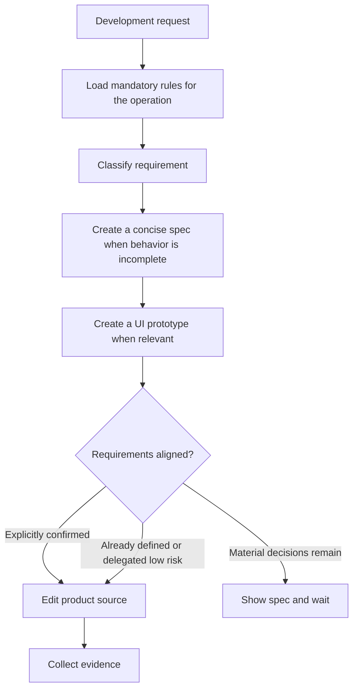

# ddev

> Personal cross-repository development harness workflow for DDev sessions.

## What it does

`ddev` is the workflow owner for DDev. It orients on the repository, grills only
for important ambiguity, manages global `~/.deweyou/dev/` per-repository session
state for real implementation work, maps the available harness, runs bounded
implementation and verification loops, and routes explicit delivery or durable
memory work to the right global module skill.

DDev is manually activated. It starts when the user invokes `$DDev`/`ddev`, or
when project instructions explicitly opt into DDev as the default workflow for
non-trivial development tasks. It does not rely on passive global hooks.

The MVP keeps human-readable `task.md`, `context.md`, `graph.md`, `evidence.md`,
and related notes under `~/.deweyou/dev/repos/<repo-id>/sessions/<branch>/`.
For non-trivial tasks it can also append validated protocol events and generate
`summary.md` without introducing an automatic scheduler.

For concept work, DDev loads `problem-framing` from the global Dewey asset cache
for Grilling, brainstorming, critique, and recommendation, then uses
`deweyou-cli dev demo` to create or serve a branch-session static HTML demo when
seeing the idea would help. When requirement design includes UI, DDev
proactively loads `ui-design` to produce a prototype before implementation.

For coding and architecture work, DDev has two mandatory rule dependencies. It
reads `code-style` before writing, editing, or reviewing code, and reads
`engineering-principles` before module design, boundary refactoring, dependency
changes, or architecturally significant behavior changes. Both come directly
from the global Dewey asset cache, so users do not need to install the rules
globally or in each repository.

For new features or ambiguous behavior, DDev loads `spec-driven-coding` before
product-source edits. An implementation request starts the workflow but does not
approve agent-inferred requirements; material product decisions require a
concise spec and explicit user confirmation.



## When it triggers

- The user invokes `$DDev`, `DDev`, or `ddev`.
- Project instructions such as `AGENTS.md` explicitly make DDev the default
  workflow for non-trivial development tasks.
- The user asks to run the personal harness for a development task.
- The user asks to brainstorm, explore alternatives, sketch a concept, or draw
  an HTML demo before implementation.
- Requirement design affects screens, flows, components, interaction states, or
  visual acceptance and needs a UI prototype before coding.
- The user asks to start, continue, inspect, ship, retrospect, or clean up a
  DDev session.
- The user asks to set up, diagnose, upgrade, or uninstall DDev runtime state.
- A task needs one lifecycle owner across product, UI, coding, delivery, and
  memory modules.

## Installation

```bash
npx skills add https://github.com/deweyou/agents --skill ddev
```

For the full local runtime, install or update `deweyou-cli`, refresh assets, and
install only the `ddev` entry skill in the target repository:

```bash
npm install -g deweyou-cli
deweyou-cli agent update
deweyou-cli agent init --skills ddev --mode link --yes
deweyou-cli dev install
deweyou-cli dev doctor
```

Module skills stay in `~/.deweyou/agents/assets/skills/<skill>/SKILL.md` and
DDev loads them by absolute path when needed. Users may still install module
skills directly for standalone use. If DDev is missing on a machine, tell the
user to install or initialize it instead of silently wiring it during an
unrelated task.

Mandatory rules stay in `~/.deweyou/agents/assets/rules/`. Refreshing the asset
cache with `deweyou-cli agent update` is sufficient; rule installation is
optional for DDev.

## Features

- One lifecycle owner across framing, UI, coding, evidence, delivery, and memory.
- Human-readable, branch-scoped working state outside project source.
- Mandatory cached `code-style` and `engineering-principles` rules for their
  matching operations, independent of global or project rule installation.
- New features and ambiguous behavior route through `spec-driven-coding` before
  product-source edits.
- Implementation intent is distinct from approval of inferred requirements;
  material product decisions require explicit confirmation.
- Mechanical edits, established bugfixes, and explicitly delegated low-risk
  choices proceed without an unnecessary pause.
- UI prototype and live-evidence gates when interface work requires them.
- Versioned `requirement`, `node`, `evidence`, `failure`, `review`, `recovery`,
  and `delivery` events with a generated single-session summary.
- Reviewable `restart_from` hints without automatic retries or DAG execution.
- Explicit delivery only; no silent commit, push, PR, or passive global hooks.

## SOP

1. Activate DDev explicitly or through repository instructions and verify the
   runtime with `deweyou-cli dev doctor`.
2. Classify the request, capture only the state needed, and map the available
   project harness.
3. Before applicable coding or architecture operations, read the mandatory rule
   files from `~/.deweyou/agents/assets/rules/`; refresh the cache or stop if a
   required file is missing.
4. Load `spec-driven-coding` early for new features or ambiguous product work,
   ask only material questions, and produce a concise spec.
5. Wait for explicit confirmation when material behavior was inferred; otherwise
   record why confirmation is not required.
6. Load other capability modules as needed, run bounded implementation and
   verification loops, and record evidence. For non-trivial sessions, use
   `deweyou-cli dev record` and regenerate the view with `deweyou-cli dev summary`.
7. Treat failure classes, review verdicts, and `restart_from` as explicit facts,
   not as an automatic scheduler.
8. Route delivery or durable memory only when the task requires it.

## Source

This skill is maintained in `deweyou/agents` and indexed by `deweyou-cli agent update`.
