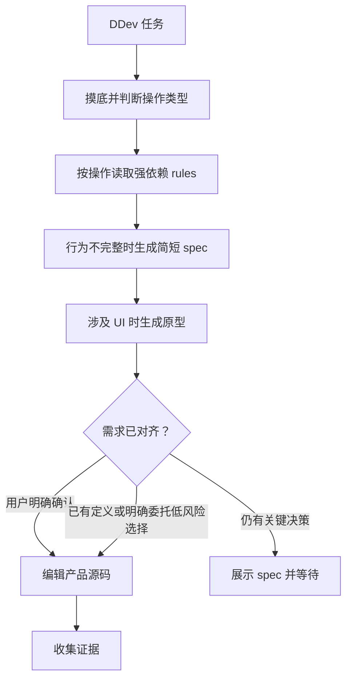

<!-- Chinese reading companion
source: skills/ddev/SKILL.md
source-digest: sha256:e267ac1586e6bf950f7ac991066697811f0e25cd041996da7f64ca4e7a31975a
translation-status: current
description: 面向个人跨仓库开发的 DDev 生命周期工作流。
-->

# ddev

> 面向 DDev 会话的个人跨仓库开发 harness 工作流。

## 它是做什么的

`ddev` 是 DDev 的工作流 owner。它负责仓库摸底、必要歧义澄清、
`~/.deweyou/dev/` 下的全局按仓库 session 状态、harness map、有边界的实现与验证
循环，以及按需路由交付和长期记忆模块。

DDev 默认手动激活：用户显式输入 `$DDev` / `ddev`，或项目指令把它设为非平凡
开发任务的默认工作流。它不依赖全局被动 hooks。

对于有依赖、多个证据或失败恢复的任务，DDev 可以用 `deweyou-cli dev record`
追加经过校验的协议事件，并用 `deweyou-cli dev summary` 生成单 session 摘要；这不会
引入自动调度器。

对于编码和架构工作，DDev 强依赖两个 rule：写、改、审代码前读取
`code-style`；模块设计、边界重构、依赖变更或有架构影响的行为变更前读取
`engineering-principles`。DDev 直接从全局 Dewey asset cache 读取它们，不要求
用户全局安装或逐仓库安装。

对于新功能或模糊行为，DDev 会在编辑产品源码前加载 `spec-driven-coding`。
“请实现”只代表允许启动开发流程，不代表批准 Agent 推断出的需求；关键产品决策必须
先形成简短 spec，并等待用户明确确认。



## 安装

```bash
npx skills add https://github.com/deweyou/agents --skill ddev
```

完整本地 runtime 推荐：

```bash
npm install -g deweyou-cli
deweyou-cli agent update
deweyou-cli agent init --skills ddev --mode link --yes
deweyou-cli dev install
deweyou-cli dev doctor
```

模块 skills 位于 `~/.deweyou/agents/assets/skills/<skill>/SKILL.md`；强依赖 rules
位于 `~/.deweyou/agents/assets/rules/`。对 DDev 来说，刷新 asset cache 即可，不需要
额外安装这两个 rules。

## 特点

- 一个 owner 管理 framing、UI、编码、证据、交付和记忆的完整生命周期。
- 分支级、人可读的临时工作状态放在项目源码之外。
- 按操作强制读取缓存中的 `code-style` 和 `engineering-principles`。
- 新功能、用户可见行为变化和模糊产品请求在源码编辑前进入
  `spec-driven-coding`。
- 区分“允许实现”和“确认 Agent 推断出的需求”；关键产品决策必须明确确认。
- 机械修改、已有预期的窄 bugfix，以及用户明确委托的低风险可逆选择不会被无意义地
  阻塞。
- UI 任务需要时执行原型和现场证据门禁。
- 记录带版本的 requirement、node、evidence、failure、review、recovery 和 delivery
  事件，并生成 `summary.md`。
- `restart_from` 是显式、可审阅的恢复建议，不触发自动重试。
- 只有用户明确要求时才交付，不静默 commit、push、开 PR 或安装被动 hooks。

## SOP

1. 显式触发 DDev 或通过项目指令启用，并运行 `deweyou-cli dev doctor`。
2. 分类请求、捕获必要状态并识别项目 harness。
3. 在对应编码或架构操作前读取强依赖 rules；文件缺失时刷新 cache，仍缺失则停止。
4. 新功能或模糊产品工作提前加载 `spec-driven-coding`，只询问会改变结果的关键问题，
   并形成简短 spec。
5. Agent 推断了关键行为时等待用户明确确认；否则记录不需要等待的原因。
6. 按需加载其他能力 modules，执行有边界的实现和验证循环并记录证据；非平凡任务用
   `deweyou-cli dev record` 记录关键事实，并用 `deweyou-cli dev summary` 汇总。
7. 把失败分类、Review verdict 和 `restart_from` 当作显式事实，不自动调度或重试。
8. 仅在任务需要时路由交付或长期记忆。

## Source

This skill is maintained in `deweyou/agents` and indexed by
`deweyou-cli agent update`.
