# Memory State

```mermaid
flowchart LR
    Design["Product + architecture approved"] --> Slice["Phase 0 vertical slice verified"]
    Slice --> Pointer["S1 Pointer verified"]
    Pointer --> Stroke["S2 freehand transport verified"]
    Stroke --> Sketch["S3 deterministic Sketch verified"]
    Sketch --> Text["S4 text and IME protocol verified"]
    Text --> Patch["S5 ScenePatch verified"]
    Patch --> Scale["S6 SVG budget verified"]
    Scale --> Persistence["S7 atomic persistence verified"]
    Persistence --> Migration["S8 migration verified"]
    Migration --> Lease["S9 single-writer verified"]
    Lease --> Operation["S10 operations verified"]
    Operation --> Lifecycle["S11 host lifecycle verified"]
    Lifecycle --> Tooling["S12 tooling verified"]
    Tooling --> Complete["Phase 0 S0-S12 complete"]
    Complete --> CI["PR and main CI"]
    CI --> Phase1A["Phase 1A local persistence integrated"]
    Phase1A --> Camera["Camera + viewport + fit content integrated"]
    Camera --> Selection["Rust-owned selection + delete integrated"]
    Selection --> Freehand["Rust-owned Select/Draw + product freehand"]
    Freehand --> ProductText["Fixed-font multiline text + IME"]
    ProductText --> StyleProfile["Persistent styles + profile compatibility"]
    StyleProfile --> CleanSurface["Clean-only product surface"]
    CleanSurface --> Phase1B["Phase 1B editor foundation"]
    Phase1B --> Stability["Gesture + Shift + text stability"]
    Stability --> StrokeProjection["Transform-independent stroke projection"]
    StrokeProjection --> InterruptionCommit["DOM interruption-safe transform commit"]
    InterruptionCommit --> SmoothStroke["Deterministic smooth freehand geometry"]
    SmoothStroke --> LeaseTakeover["Explicit verified lease takeover"]
    LeaseTakeover --> BasicShapes["Schema V4 basic shapes"]
    BasicShapes --> ShapeCreation["Rust-owned direct shape creation"]
    ShapeCreation --> VertexEditing["Rust-owned path vertex editing"]
    VertexEditing --> ElementSize["Schema V5 element-level Size"]
    ElementSize --> CurvedPaths["Schema V6 Line/Arrow curves"]
```

- Last reviewed commit: `2131326` plus the current `codex/curved-line-arrow-editing` worktree
- Iteration: `36`
- Last run: `Schema V6 midpoint curve editing with tangent-correct Arrow heads`
- Covered areas: product/architecture decisions, Rust-WASM-Web ownership, package structure, Vite+ and official-registry workflow, GitHub Actions gate, >=90% coverage policy, interaction/rendering spikes, integrated persistence/migration/single-writer startup, Camera/Viewport session state, Rust Editor State selection, Diagram Operation V1, framework-neutral lifecycle, React/Vue/Vanilla hosts, persistent element styles, transform-independent stroke projection, transform-stable Arrow geometry, DOM interruption-safe transform commit, deterministic smooth freehand geometry, internal deterministic Sketch compatibility, the Clean product baseline, the Phase 1B editor foundation, Schema V4 basic shapes, Rust-owned direct shape creation, cross-tool pointer/capture stability, Rust-owned Line/Polyline/Arrow vertex editing, Schema V5 element-level S/M/L/XL Size, and Schema V6 Line/Arrow quadratic curves
- Verification evidence: the full gate passes `pnpm install --frozen-lockfile`, `pnpm check`, 446 Web tests, 149 Rust tests, Web/Rust coverage, the real WASM rebuild, and the production build. Web coverage is 95.32% statements, 91.08% branches, 95.76% functions, and 95.57% lines; Rust coverage is 92.24% regions, 92.21% functions, and 93.16% lines. Real-WASM Vanilla inspection created and bent Line/Arrow elements, verified the circular midpoint handle with square endpoints and no rectangular ring, and round-tripped straight `L` to quadratic `Q` through Undo/Redo. The M curved Arrow kept a 40-unit head length and 36-unit opening; its head direction matched the endpoint tangent to floating-point tolerance. React and Vue restored the same quadratic Scene paths from the verified `r559 / 9 elements / 92%` document without alerts or console warning/error; Vanilla remains open with the curved Arrow selected for acceptance.
- Open risks: P-05 recovery-copy UX, fixed-font bundle size calibration, semantic Text resize specialization, content spans that still exceed the viewport at the absolute 10% Camera floor, low-end SVG calibration, real physical pen/coalescing device behavior, deeper multi-selection accessibility polish, future Connector binding/routing semantics, future multi-control-point/Polyline curve editing, element-level dash/hand-drawn styles, legacy global `renderProfile` migration/removal, and pressure-aware variable-width freehand

---
*Last updated: 2026-07-23 | Reason: record Schema V6 curve editing and real-WASM three-host QA*
