# Memory State

```mermaid
flowchart LR
    Design["Product + architecture approved"] --> Slice["Phase 0 vertical slice verified"]
    Slice --> Pointer["S1 Pointer verified"]
    Pointer --> Stroke["S2 freehand transport verified"]
    Stroke --> Sketch["S3 deterministic Sketch verified"]
    Sketch --> Text["S4 text and IME protocol verified"]
    Text --> Patch["S5 ScenePatch verified"]
    Patch --> Spikes["Scale and persistence spikes"]
```

- Last reviewed commit: `c65a244` plus S5 browser ScenePatch evidence
- Iteration: `7`
- Last run: `incremental repo-memory review after S5 ScenePatch scale and recovery verification`
- Covered areas: product/architecture decisions, Rust-WASM-Web ownership, package structure, Vite+ workflow, >=90% coverage policy, Pointer, Stroke, Sketch, text/IME, stable-ID ScenePatch and revision mismatch recovery
- Open risks: P-02 product font choice, SVG/culling budget, IndexedDB recovery, multi-tab ownership, real pen/coalescing device behavior

---
*Last updated: 2026-07-22 | Reason: record S5 ScenePatch evidence and retire full-Snapshot scale risk*
