# Memory State

```mermaid
flowchart LR
    Design["Product + architecture approved"] --> Slice["Phase 0 vertical slice verified"]
    Slice --> Pointer["S1 Pointer verified"]
    Pointer --> Stroke["S2 freehand transport verified"]
    Stroke --> Sketch["S3 deterministic Sketch verified"]
    Sketch --> Text["S4 text and IME protocol verified"]
    Text --> Patch["S5 ScenePatch verified"]
    Patch --> Scale["S6 SVG budget verified"]
    Scale --> Persistence["S7 atomic persistence verified"]
    Persistence --> Migration["S8 migration verified"]
    Migration --> Lease["S9 single-writer verified"]
    Lease --> Operation["S10 operations verified"]
    Operation --> Lifecycle["S11 host lifecycle verified"]
    Lifecycle --> Tooling["S12 tooling verified"]
    Tooling --> Complete["Phase 0 S0-S12 complete"]
    Complete --> CI["PR and main CI"]
    CI --> Phase1A["Phase 1A local persistence integrated"]
    Phase1A --> Camera["Camera + viewport + fit content integrated"]
    Camera --> Selection["Rust-owned selection + delete integrated"]
    Selection --> Freehand["Rust-owned Select/Draw + product freehand"]
    Freehand --> ProductText["Fixed-font multiline text + IME"]
    ProductText --> StyleProfile["Persistent styles + profile compatibility"]
    StyleProfile --> CleanSurface["Clean-only product surface"]
    CleanSurface --> Phase1B["Phase 1B editor foundation"]
    Phase1B --> Stability["Gesture + Shift + text stability"]
    Stability --> StrokeProjection["Transform-independent stroke projection"]
    StrokeProjection --> InterruptionCommit["DOM interruption-safe transform commit"]
    InterruptionCommit --> SmoothStroke["Deterministic smooth freehand geometry"]
```

- Last reviewed commit: `cb84a5a` plus the current `codex/interaction-stability` worktree
- Iteration: `29`
- Last run: `Resolved three-or-more-point Clean freehand samples into deterministic midpoint quadratic curves while keeping raw Document points and matching selection bounds and hit testing`
- Covered areas: product/architecture decisions, Rust-WASM-Web ownership, package structure, Vite+ and official-registry workflow, GitHub Actions gate, >=90% coverage policy, interaction/rendering spikes, integrated persistence/migration/single-writer startup, Camera/Viewport session state, Rust Editor State selection, Diagram Operation V1, framework-neutral lifecycle, React/Vue/Vanilla hosts, persistent element styles, transform-independent stroke projection, DOM interruption-safe transform commit, deterministic smooth freehand geometry, internal deterministic Sketch compatibility, the Clean product baseline, the Phase 1B editor foundation, and cross-tool pointer/capture stability
- Verification evidence: the interaction-stability, Clean-surface, stroke-projection, DOM-interruption, and freehand-smoothing slices pass `pnpm check`, 389 Web tests, 112 Rust tests, real generated WASM, and the production build. Web coverage is 95.49% statements, 90.08% branches, 95.19% functions, and 95.78% lines; Rust coverage is 92.83% regions, 91.11% functions, and 94.00% lines, with `stroke_geometry.rs` at 98.88% line coverage and every Rust source file above 90% line coverage. Real-WASM inspection confirms existing multi-point strokes reload as midpoint quadratic paths (for example 73 `Q` commands and no `L` commands), while a two-point stroke remains one exact `L`; a temporary live stroke committed as nine `Q` commands without a preview/commit shape jump and was then undone and reloaded back to the original 19-element document. Recording review captures the move preview at its new position around 5.07 seconds and the rollback around 5.20 seconds; adapter regression tests now cover `pointercancel`, `lostpointercapture`, and window blur committing the last visible pointer sample. Explicit Escape and tool-switch cancellation still restore the pre-gesture document. Real-WASM inspection also confirms the persisted 2px rectangle stroke is projected by Camera zoom and carries `non-scaling-stroke`, so element affine scale no longer changes its thickness. React, Vue, and Vanilla mount the canvas without exposing a Render Profile control. Rust and Web bridge tests cover curve preview/commit parity, curve bounds/hit testing, DOM-interruption ink recovery, Shift straight-line, axis-locked move, proportional resize, and absolute 45-degree rotation semantics.
- Open risks: explicit lease takeover and recovery-copy UX, fixed-font bundle size calibration, semantic Text resize specialization, content spans that still exceed the viewport at the absolute 10% Camera floor, low-end SVG calibration, real physical pen/coalescing device behavior, deeper multi-selection accessibility polish, and a coherent style-system/Sketch v2 redesign after core editing capabilities mature

---
*Last updated: 2026-07-23 | Reason: record deterministic Clean freehand smoothing and real-WASM acceptance*
