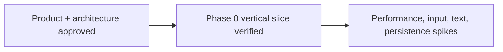

# Memory State

- Last reviewed commit: `e5ba447` plus current high-coverage gate work
- Iteration: `2`
- Last run: `incremental repo-memory review after executable TypeScript and Rust coverage gates`
- Covered areas: product/architecture decisions, Rust-WASM-Web ownership, package structure, Vite+ workflow, Phase 0 UI design contract, verification commands, >=90% Web/Rust coverage policy
- Open risks: pointer latency, freehand transfer format, canvas font determinism, ScenePatch scale, SVG budget, IndexedDB recovery, multi-tab ownership

---
*Last updated: 2026-07-21 | Reason: record the enforced high-coverage workflow and first baseline results*
