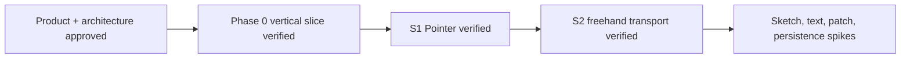

# Memory State

- Last reviewed commit: `d377f1d` plus S2 benchmark and decision evidence
- Iteration: `4`
- Last run: `incremental repo-memory review after S2 release-WASM freehand benchmark`
- Covered areas: product/architecture decisions, Rust-WASM-Web ownership, package structure, Vite+ workflow, Phase 0 UI design contract, >=90% coverage policy, Pointer drag ownership, single-event rectangle transport, Float64Array batch-2 freehand transport, SVG path reuse
- Open risks: Sketch determinism, canvas font determinism, ScenePatch scale, SVG budget, IndexedDB recovery, multi-tab ownership, real pen/coalescing device behavior

---
*Last updated: 2026-07-21 | Reason: record S2 freehand benchmark evidence and close the realtime Stroke transport decision*
