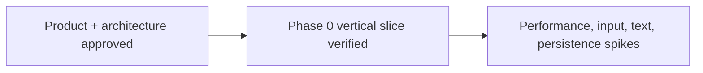

# Memory State

- Last reviewed commit: `25fd841a34fe8640f5a6b8ed3a33607dd25daf51` plus current uncommitted Phase 0 work
- Iteration: `1`
- Last run: `repo-memory initialization after Phase 0 dual-host vertical slice`
- Covered areas: product/architecture decisions, Rust-WASM-Web ownership, package structure, Vite+ workflow, Phase 0 UI design contract, verification commands
- Open risks: pointer latency, freehand transfer format, canvas font determinism, ScenePatch scale, SVG budget, IndexedDB recovery, multi-tab ownership

---
*Last updated: 2026-07-21 | Reason: initialize durable repository memory after the first executable slice*
