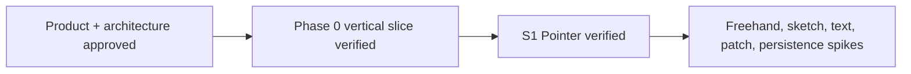

# Memory State

- Last reviewed commit: `bdef2e3` plus S1 benchmark and decision evidence
- Iteration: `3`
- Last run: `incremental repo-memory review after S1 release-WASM browser benchmark`
- Covered areas: product/architecture decisions, Rust-WASM-Web ownership, package structure, Vite+ workflow, Phase 0 UI design contract, >=90% coverage policy, Pointer drag preview/commit ownership, single-event versus batch-8 rectangle transport
- Open risks: freehand transfer format, canvas font determinism, ScenePatch scale, SVG budget, IndexedDB recovery, multi-tab ownership

---
*Last updated: 2026-07-21 | Reason: record S1 Pointer benchmark evidence and close the rectangle drag transport decision*
