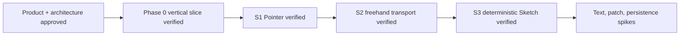

# Memory State

- Last reviewed commit: `1038224` plus S3 Native/WASM hash evidence
- Iteration: `5`
- Last run: `incremental repo-memory review after S3 deterministic Sketch verification`
- Covered areas: product/architecture decisions, Rust-WASM-Web ownership, package structure, Vite+ workflow, >=90% coverage policy, Pointer drag, Float64Array batch-2 Stroke, SVG path reuse, seeded Sketch geometry, algorithm versioning and Native/WASM canonical parity
- Open risks: canvas font determinism, ScenePatch scale, SVG budget, IndexedDB recovery, multi-tab ownership, real pen/coalescing device behavior

---
*Last updated: 2026-07-22 | Reason: record S3 Sketch hash parity and close resolver ownership*
