# Memory State

```mermaid
flowchart LR
    Design["Product + architecture approved"] --> Slice["Phase 0 vertical slice verified"]
    Slice --> Pointer["S1 Pointer verified"]
    Pointer --> Stroke["S2 freehand transport verified"]
    Stroke --> Sketch["S3 deterministic Sketch verified"]
    Sketch --> Text["S4 text and IME protocol verified"]
    Text --> Patch["S5 ScenePatch verified"]
    Patch --> Scale["S6 SVG budget verified"]
    Scale --> Persistence["S7 atomic persistence verified"]
    Persistence --> Migration["S8 migration verified"]
    Migration --> Spikes["Lease and operation spikes"]
```

- Last reviewed commit: `7176979` plus S8 Rust/WASM/Web migration fixture evidence
- Iteration: `10`
- Last run: `incremental repo-memory review after S8 copy-on-write migration and corruption fallback verification`
- Covered areas: product/architecture decisions, Rust-WASM-Web ownership, package structure, Vite+ workflow, >=90% coverage policy, interaction/rendering spikes, atomic persistence, Rust-owned migration, structured corruption diagnostics and deterministic fallback
- Open risks: P-02 product font choice, multi-tab ownership, complete Diagram Operations, low-end SVG calibration, real pen/coalescing device behavior

---
*Last updated: 2026-07-22 | Reason: record S8 migration and corruption recovery evidence*
