# Memory State

```mermaid
flowchart LR
    Design["Product + architecture approved"] --> Slice["Phase 0 vertical slice verified"]
    Slice --> Pointer["S1 Pointer verified"]
    Pointer --> Stroke["S2 freehand transport verified"]
    Stroke --> Sketch["S3 deterministic Sketch verified"]
    Sketch --> Text["S4 text and IME protocol verified"]
    Text --> Patch["S5 ScenePatch verified"]
    Patch --> Scale["S6 SVG budget verified"]
    Scale --> Persistence["S7 atomic persistence verified"]
    Persistence --> Migration["S8 migration verified"]
    Migration --> Lease["S9 single-writer verified"]
    Lease --> Operation["S10 operations verified"]
    Operation --> Lifecycle["S11 host lifecycle verified"]
    Lifecycle --> Tooling["S12 tooling verified"]
    Tooling --> Complete["Phase 0 S0-S12 complete"]
    Complete --> CI["PR and main CI"]
    CI --> Phase1A["Phase 1A local persistence integrated"]
    Phase1A --> Camera["Camera + viewport + fit content integrated"]
    Camera --> Selection["Rust-owned selection + delete integrated"]
    Selection --> Freehand["Rust-owned Select/Draw + product freehand"]
    Freehand --> ProductText["Fixed-font multiline text + IME"]
```

- Last reviewed commit: `8ee57b8` plus the current `codex/editor-tools-phase1b` freehand worktree
- Iteration: `22`
- Last run: `Confirmed P-02 with bundled Noto Sans SC Variable, added Rust-owned Text persistence and semantic editing, connected a framework-neutral multiline/IME overlay, and resolved browser metrics through a revision-neutral two-phase protocol`
- Covered areas: product/architecture decisions, Rust-WASM-Web ownership, package structure, Vite+ and official-registry workflow, GitHub Actions gate, >=90% coverage policy, interaction/rendering spikes, integrated persistence/migration/single-writer startup, Camera/Viewport session state, Rust Editor State selection, Diagram Operation V1, framework-neutral lifecycle, React/Vue/Vanilla hosts and repeatable optimized WASM builds
- Verification evidence: commit-1 gate passed `pnpm check`, 208 Web tests, 55 Rust tests, and `pnpm build`; real regenerated WASM covered all three hosts and freehand Undo/Redo. Product text passes warning-free Web check, 235 Web tests, 60 Rust tests, regenerated WASM, and production build. Real-WASM acceptance confirmed the bundled font loaded in React/Vue/Vanilla, React created and semantically double-click edited multiline CJK/emoji text with one revision each, Vue and Vanilla independently created fixed-font text, and Vanilla reload restored the committed runs.
- Open risks: fixed-font bundle size calibration, Phase 1A persistent style/profile completion, Phase 1B schema/selection/transform breadth, Phase 1B explicit takeover and recovery-copy UX, content spans that still exceed the viewport at the absolute 10% Camera floor, low-end SVG calibration, real physical pen/coalescing device behavior

---
*Last updated: 2026-07-23 | Reason: record fixed-font product text implementation before real-WASM acceptance*
