# Memory State

```mermaid
flowchart LR
    Design["Product + architecture approved"] --> Slice["Phase 0 vertical slice verified"]
    Slice --> Pointer["S1 Pointer verified"]
    Pointer --> Stroke["S2 freehand transport verified"]
    Stroke --> Sketch["S3 deterministic Sketch verified"]
    Sketch --> Text["S4 text and IME protocol verified"]
    Text --> Patch["S5 ScenePatch verified"]
    Patch --> Scale["S6 SVG budget verified"]
    Scale --> Persistence["S7 atomic persistence verified"]
    Persistence --> Migration["S8 migration verified"]
    Migration --> Lease["S9 single-writer verified"]
    Lease --> Operation["S10 operations verified"]
    Operation --> Lifecycle["S11 host lifecycle verified"]
    Lifecycle --> Tooling["S12 tooling verified"]
    Tooling --> Complete["Phase 0 S0-S12 complete"]
    Complete --> CI["PR and main CI"]
    CI --> Phase1A["Phase 1A local persistence integrated"]
    Phase1A --> Camera["Camera + viewport + fit content integrated"]
    Camera --> Selection["Rust-owned selection + delete integrated"]
```

- Last reviewed commit: `890e7cb` plus the current `codex/phase1a-selection-tool` worktree
- Iteration: `20`
- Last run: `Integrated Rust-owned single selection, topmost rectangle/freehand hit testing, straight blue SVG selection frame with a zoom-stable 6px gap outside visible painted bounds, drag preview/commit, Delete/Backspace/Escape, and shared React/Vue/Vanilla controls over real WASM`
- Covered areas: product/architecture decisions, Rust-WASM-Web ownership, package structure, Vite+ and official-registry workflow, GitHub Actions gate, >=90% coverage policy, interaction/rendering spikes, integrated persistence/migration/single-writer startup, Camera/Viewport session state, Rust Editor State selection, Diagram Operation V1, framework-neutral lifecycle, React/Vue/Vanilla hosts and repeatable optimized WASM builds
- Verification evidence: `pnpm install --frozen-lockfile`, `pnpm check`, 194 Web tests, 51 Rust tests, Web coverage 96.07% statements/90.82% branches/95.30% functions/96.44% lines, Rust 98.32% line coverage, and `pnpm build` all passed. Real-WASM React drag kept shape and overlay at identical screen bounds, Delete reduced 4 elements to 3 and Meta-Z restored 4; Vue create/delete and Vanilla Backspace/Escape paths also passed, with Escape keeping revision `r24` unchanged.
- Open risks: P-02 product font choice, Phase 1B multi-select/box-select/resize/rotate/snap behavior, Phase 1B explicit takeover and recovery-copy UX, content spans that still exceed the viewport at the absolute 10% Camera floor, low-end SVG calibration, real pen/coalescing device behavior

---
*Last updated: 2026-07-22 | Reason: record the handle-free selection frame and zoom-stable screen-space spacing*
