# Memory State

```mermaid
flowchart LR
    Design["Product + architecture approved"] --> Slice["Phase 0 vertical slice verified"]
    Slice --> Pointer["S1 Pointer verified"]
    Pointer --> Stroke["S2 freehand transport verified"]
    Stroke --> Sketch["S3 deterministic Sketch verified"]
    Sketch --> Text["S4 text and IME protocol verified"]
    Text --> Patch["S5 ScenePatch verified"]
    Patch --> Scale["S6 SVG budget verified"]
    Scale --> Persistence["S7 atomic persistence verified"]
    Persistence --> Migration["S8 migration verified"]
    Migration --> Lease["S9 single-writer verified"]
    Lease --> Operation["S10 operations verified"]
    Operation --> Lifecycle["S11 host lifecycle verified"]
    Lifecycle --> Spikes["Tooling completion"]
```

- Last reviewed commit: `e70a684` plus S11 real-WASM lifecycle and visible dual-host evidence
- Iteration: `13`
- Last run: `incremental repo-memory review after 25 mount/create/move/undo/dispose cycles and React/Vanilla visible host verification`
- Covered areas: product/architecture decisions, Rust-WASM-Web ownership, package structure, Vite+ workflow, >=90% coverage policy, interaction/rendering spikes, persistence/migration, single-writer coordination, Diagram Operation V1 and framework-neutral lifecycle
- Open risks: P-02 product font choice, repeatable wasm-opt incremental build, low-end SVG calibration, real pen/coalescing device behavior

---
*Last updated: 2026-07-22 | Reason: record S11 dual-host lifecycle evidence*
