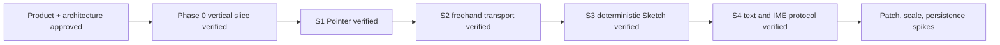

# Memory State

- Last reviewed commit: `c0f7553` plus S4 browser text/IME evidence
- Iteration: `6`
- Last run: `incremental repo-memory review after S4 text metrics and IME verification`
- Covered areas: product/architecture decisions, Rust-WASM-Web ownership, package structure, Vite+ workflow, >=90% coverage policy, Pointer, Stroke, Sketch, two-phase browser text metrics, fingerprint cache invalidation and IME composition ownership
- Open risks: P-02 product font choice, ScenePatch scale, SVG budget, IndexedDB recovery, multi-tab ownership, real pen/coalescing device behavior

---
*Last updated: 2026-07-22 | Reason: record S4 text/IME evidence without guessing the pending font product decision*
