# Memory State

```mermaid
flowchart LR
    Design["Product + architecture approved"] --> Slice["Phase 0 vertical slice verified"]
    Slice --> Pointer["S1 Pointer verified"]
    Pointer --> Stroke["S2 freehand transport verified"]
    Stroke --> Sketch["S3 deterministic Sketch verified"]
    Sketch --> Text["S4 text and IME protocol verified"]
    Text --> Patch["S5 ScenePatch verified"]
    Patch --> Scale["S6 SVG budget verified"]
    Scale --> Persistence["S7 atomic persistence verified"]
    Persistence --> Migration["S8 migration verified"]
    Migration --> Lease["S9 single-writer verified"]
    Lease --> Spikes["Operation and tooling completion"]
```

- Last reviewed commit: `fb5c4e0` plus S9 two-tab Web Locks evidence
- Iteration: `11`
- Last run: `incremental repo-memory review after S9 writer contention, release, close takeover and revision guard verification`
- Covered areas: product/architecture decisions, Rust-WASM-Web ownership, package structure, Vite+ workflow, >=90% coverage policy, interaction/rendering spikes, persistence/migration, Web Locks single-writer and IndexedDB revision guard
- Open risks: P-02 product font choice, complete Diagram Operations, repeatable wasm-opt incremental build, low-end SVG calibration, real pen/coalescing device behavior

---
*Last updated: 2026-07-22 | Reason: record S9 single-writer and takeover evidence*
