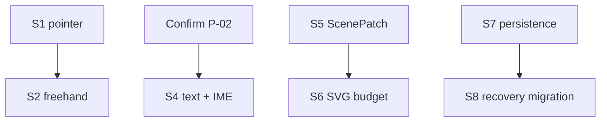

# Memory TODO

- [x] Measure S1 pointer event and state-machine P50/P95/P99; keep single-event JSON for rectangle drag and defer Stroke transport to S2.
- [x] Run S2 freehand JSON versus TypedArray comparison; use Float64Array batch-2 for realtime stroke and carry full-Snapshot payload pressure into S5.
- [x] Verify S3 deterministic Sketch across 1,000 runs and Native/WASM hashes; keep randomness in Rust Scene Resolution.
- [x] Verify S4 two-phase text metrics, cache invalidation and Chinese IME composition without choosing the pending product font.
- [ ] Confirm P-02 canvas font/determinism behavior before implementing S4 text and IME.
- [x] Establish S5 stable-ID ScenePatch, strict revision fallback and 100/1,000/10,000 element scale evidence.
- [ ] Establish S6 SVG/culling budgets for simple path, TextRun and multi-path Sketch fixtures.
- [ ] Validate S7 atomic IndexedDB save/recovery and S8 copy-on-write migrations before Phase 1A persistence.
- [ ] Decide whether the shared DDev `record` documentation should be updated for the installed CLI that lacks that subcommand; dependency skill changes are not edited in-place here.

---
*Last updated: 2026-07-22 | Reason: close S5 ScenePatch evidence and carry SVG scale into S6*
