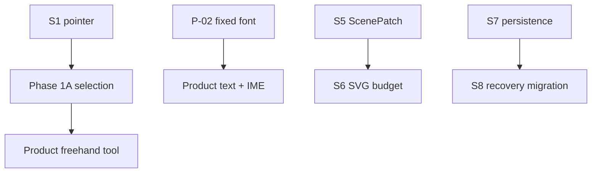

# Memory TODO

- [x] Measure S1 pointer event and state-machine P50/P95/P99; keep single-event JSON for rectangle drag and defer Stroke transport to S2.
- [x] Run S2 freehand JSON versus TypedArray comparison; use Float64Array batch-2 for realtime stroke and carry full-Snapshot payload pressure into S5.
- [x] Verify S3 deterministic Sketch across 1,000 runs and Native/WASM hashes; keep randomness in Rust Scene Resolution.
- [x] Verify S4 two-phase text metrics, cache invalidation and Chinese IME composition without choosing the pending product font.
- [x] Confirm P-02 and productize fixed-font multiline Text editing with IME-safe overlay, Rust Commands, and two-phase metrics.
- [x] Establish S5 stable-ID ScenePatch, strict revision fallback and 100/1,000/10,000 element scale evidence.
- [x] Establish S6 SVG/culling budgets for simple path, TextRun and multi-path Sketch fixtures.
- [x] Validate S7 atomic IndexedDB candidate/head/stable save and previous-stable recovery.
- [x] Validate S8 Rust-owned copy-on-write migration, corruption reports and deterministic fallback.
- [x] Validate S9 Web Locks ownership, readonly fallback, writer release/takeover and revision conflict protection.
- [x] Complete S10 atomic Diagram Operation batch, dry-run, replay, undo and conflict fixtures.
- [x] Complete S11 React/Vanilla visible action loop, repeated lifecycle and framework dependency evidence.
- [x] Complete S12 repeatable Vite+/Cargo/WASM optimization, missing-generated rebuild and Rust failure propagation evidence.
- [x] Add a private Vue adapter and independent Vue playground over the shared framework-neutral Controller.
- [x] Add GitHub Actions CI for Web/Rust unit tests and the real WASM production build.
- [x] Integrate S7/S8/S9 into single-document startup, 750ms autosave, verified refresh recovery, save retry, and second-tab readonly UI across all three hosts.
- [x] Add Phase 1B explicit same-origin lease takeover with writer flush/release, verified page reload, old-writer readonly downgrade, and React/Vue/Vanilla parity.
- [ ] Decide and implement P-05 recovery-copy/diagnostic-package UX without making fallback snapshots writable.
- [x] Add Rust-owned Camera, framework-neutral wheel/drag/zoom input, 10%–800% viewport controls, and independent per-document Camera recovery without persisting selection, hover, active transform, or IME buffer.
- [x] Define fit-content as Camera recenter with 64px screen padding and expose fit-relative `100%` without auto-moving the Camera when Document bounds change.
- [x] Productize Rust-owned single selection with topmost geometry hit testing, framework-neutral overlay, drag alignment, undoable element deletion, and shared React/Vue/Vanilla controls.
- [x] Productize the S2 freehand transport as a visible shared tool with Rust-owned Tool State, batch-2 DOM input, cancel recovery, and React/Vue/Vanilla parity.
- [x] Complete Phase 1A persistent rectangle/stroke/text styles, contextual shared controls, Schema V2 migration, and document-level Clean/Sketch with no-op and Undo/Redo semantics.
- [x] Retire the experimental Clean/Sketch product toggle across React, Vue, and Vanilla; standardize current acceptance and new documents on Clean while keeping Rust snapshot compatibility.
- [x] Complete the Phase 1B editor foundation with Schema V3 multi-selection, resize/rotate, hierarchy, grouping, stable z-order, clipboard paste, alignment, snapping, and shared overlays/actions across React, Vue, and Vanilla.
- [x] Preserve document gesture ownership through PointerUp, commit visible freehand samples after incidental DOM interruption, add Shift straight-line/axis-lock/45-degree constraints, and make text entry caret-first with blank-canvas commit across the shared Controller.
- [x] Keep rectangle and path stroke widths independent from element/Group affine resize while retaining normal Camera zoom projection in the framework-neutral SVG renderer.
- [x] Finalize the last visible transform after DOM pointer cancel, capture loss, or window blur so incidental platform interruption cannot snap rectangle movement back.
- [x] Resolve three-or-more-point Clean freehand samples into deterministic midpoint quadratic curves with matching preview, commit, bounds, and hit-test geometry while preserving the raw Document points.
- [x] Add Schema V4 semantic Ellipse, Diamond, Line, Polyline, and Arrow elements with Rust-owned creation/style/geometry, shared transforms/history, and React/Vue/Vanilla controls.
- [x] Replace default-position shape buttons with Rust-owned direct drag/click creation, transient Scene previews, Shift/Alt constraints, Polyline finish/backtrack controls, and one-Transaction completion across all three hosts.
- [x] Add Rust-owned Line/Polyline/Arrow vertex handles, 45-degree constrained drag preview, Polyline segment insertion/deletion, and one-Transaction Undo/Redo semantics across the shared Controller.
- [x] Add Schema V5 element-level S/M/L/XL Size with M=4px default, Rust-owned Arrow shaft/head metrics, V4 copy-on-write migration, and shared React/Vue/Vanilla controls.
- [ ] Design and implement curved Line/Arrow editing with a midpoint bend handle, persistent curve geometry, tangent-correct arrowheads, matching bounds/hit testing, and one-Transaction Undo/Redo; keep Connector binding and routing separate.
- [ ] Specialize Text resize into product-level width/font-size semantics and complete keyboard/screen-reader access for transform handles.
- [ ] Expose framework-neutral Camera tuning options for toolbar zoom step and wheel sensitivity; keep Rust's absolute 10%–800% safety bounds authoritative.
- [ ] Add element-level solid/dashed/dotted line patterns to Document style, resolved Scene paint, Style panel, export, bounds/hit-test verification, and mixed-style board acceptance.
- [ ] Design element-level hand-drawn/roughness with a stable per-element seed so standard and hand-drawn elements can coexist; keep deterministic geometry in Rust Scene Resolution and do not revive a board-wide Clean/Sketch theme.
- [ ] Migrate and remove the legacy global `renderProfile` field after element-level alternatives cover old snapshot/export requirements; retain an explicit compatibility window and copy-on-write migration.
- [ ] Design pressure-aware/variable-width freehand outlines separately from discrete Size, including pen-device sampling, smoothing, hit testing, export, and fallback behavior.
- [x] Revalidate shared DDev evidence recording; the installed CLI now exposes `deweyou-cli dev record`, so the earlier missing-subcommand documentation concern no longer applies.

---
*Last updated: 2026-07-23 | Reason: track midpoint curve editing after straight-path vertex editing*
