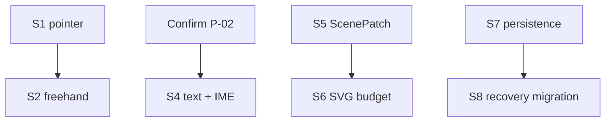

# Memory TODO

- [x] Measure S1 pointer event and state-machine P50/P95/P99; keep single-event JSON for rectangle drag and defer Stroke transport to S2.
- [x] Run S2 freehand JSON versus TypedArray comparison; use Float64Array batch-2 for realtime stroke and carry full-Snapshot payload pressure into S5.
- [x] Verify S3 deterministic Sketch across 1,000 runs and Native/WASM hashes; keep randomness in Rust Scene Resolution.
- [x] Verify S4 two-phase text metrics, cache invalidation and Chinese IME composition without choosing the pending product font.
- [ ] Confirm P-02 canvas font/determinism behavior before Phase 1A product text editing.
- [x] Establish S5 stable-ID ScenePatch, strict revision fallback and 100/1,000/10,000 element scale evidence.
- [x] Establish S6 SVG/culling budgets for simple path, TextRun and multi-path Sketch fixtures.
- [x] Validate S7 atomic IndexedDB candidate/head/stable save and previous-stable recovery.
- [x] Validate S8 Rust-owned copy-on-write migration, corruption reports and deterministic fallback.
- [x] Validate S9 Web Locks ownership, readonly fallback, writer release/takeover and revision conflict protection.
- [x] Complete S10 atomic Diagram Operation batch, dry-run, replay, undo and conflict fixtures.
- [x] Complete S11 React/Vanilla visible action loop, repeated lifecycle and framework dependency evidence.
- [x] Complete S12 repeatable Vite+/Cargo/WASM optimization, missing-generated rebuild and Rust failure propagation evidence.
- [x] Add a private Vue adapter and independent Vue playground over the shared framework-neutral Controller.
- [x] Add GitHub Actions CI for Web/Rust unit tests and the real WASM production build.
- [x] Integrate S7/S8/S9 into single-document startup, 750ms autosave, verified refresh recovery, save retry, and second-tab readonly UI across all three hosts.
- [ ] Add Phase 1B explicit lease takeover and recovery-copy/diagnostic-package UX without making fallback snapshots writable.
- [ ] Persist the last per-document Camera when Camera enters the Controller; do not persist selection, hover, active transform, or IME buffer.
- [ ] Decide whether the shared DDev `record` documentation should be updated for the installed CLI that lacks that subcommand; dependency skill changes are not edited in-place here.

---
*Last updated: 2026-07-22 | Reason: complete the first Phase 1A persistence slice and retain its deferred recovery work*
