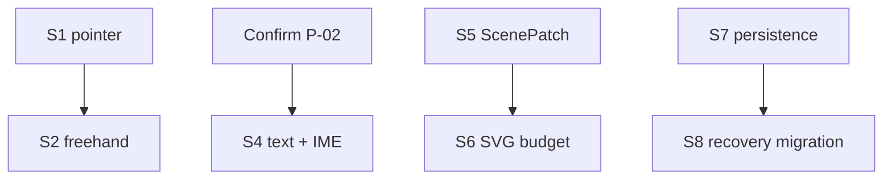

# Memory TODO

- [ ] Measure S1 pointer event and state-machine P50/P95/P99 before choosing single-event or batch transport.
- [ ] Run S2 freehand JSON versus TypedArray batch comparison before expanding stroke protocol.
- [ ] Confirm P-02 canvas font/determinism behavior before implementing S4 text and IME.
- [ ] Establish S5 ScenePatch fallback and S6 SVG/culling budgets with 100/1,000/10,000 element fixtures.
- [ ] Validate S7 atomic IndexedDB save/recovery and S8 copy-on-write migrations before Phase 1A persistence.
- [ ] Decide whether the shared DDev `record` documentation should be updated for the installed CLI that lacks that subcommand; dependency skill changes are not edited in-place here.

---
*Last updated: 2026-07-21 | Reason: record unresolved high-risk Phase 0 evidence and one dependency-skill drift item*
