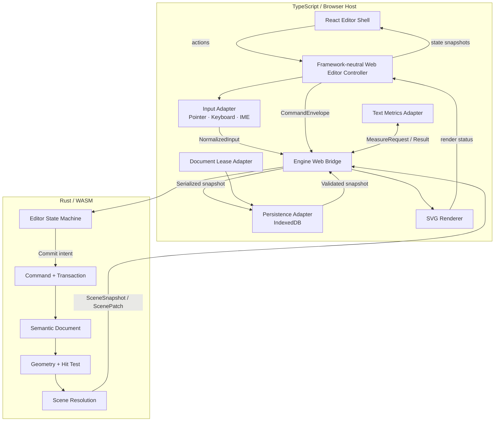
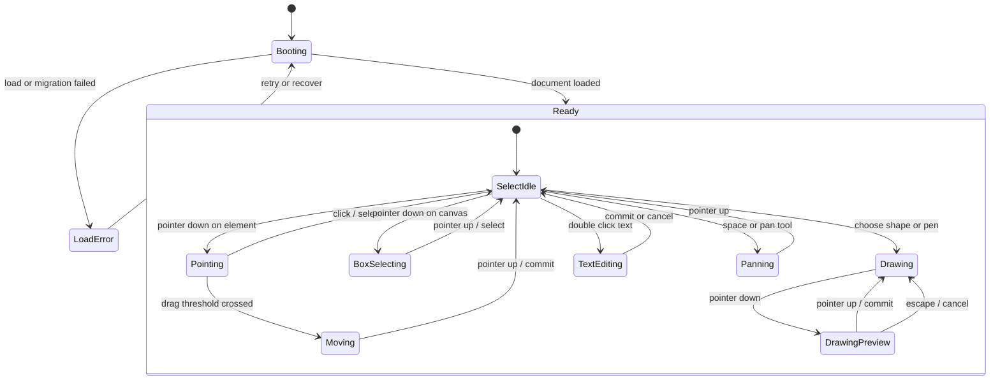
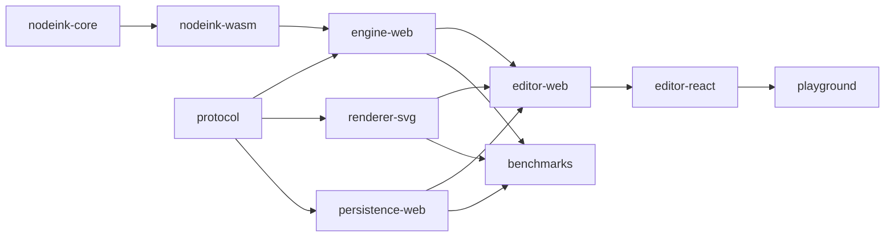

# NodeInk 技术架构

> 状态：Proposal v0.1
> 本文回答交付物 6—17。接口均为协议草案，不构成已发布 API。

## 术语与不变量

- **Semantic Document**：用户内容的唯一持久化真相。
- **Editor State**：工具、选择、手势和输入过程；不是文档内容。
- **Command**：一次经过验证、可能改变 Document 的意图。
- **Transaction**：原子提交、撤销和 revision 递增的最小单位。
- **Resolved Scene**：Document 加上显式解析输入后得到的平台无关绘制场景。
- **Renderer**：把 Scene 投影到 SVG、Canvas 或其他后端，不修改 Document。
- **Host**：TypeScript 编排层，连接浏览器、WASM、Renderer 和 Persistence。

全系统必须保持以下不变量：

1. 只有 Rust Engine 的 Transaction 可以修改 Semantic Document。
2. PointerMove、hover、selection marquee 等瞬时状态不是 Command。
3. `documentRevision` 只在成功提交 Transaction 后递增。
4. ScenePatch 必须声明基于哪个 `sceneRevision`；错序时回退完整 Snapshot。
5. Renderer 不接收 Command，也不反向持有可变 Document。
6. 确定性所需的 seed、Render Profile、字体度量和算法版本都是显式输入。
7. 浏览器 API、存储、时钟、随机源和第三方解析器位于项目自有 adapter 后。
8. `editor-web` 与 `renderer-svg` 不依赖 React、Vue 或任何组件框架；框架适配层只能消费公开的 Controller/Renderer 契约。

## 6. 总体技术架构



### 6.1 主链路

#### 输入与预览

```text
DOM Event
→ TypeScript 规范化、pointer capture、move 合批
→ NormalizedInput
→ Rust Editor State Machine
→ Transient Overlay ScenePatch
→ SVG Renderer
```

#### 持久修改

```text
UI / Internal Operation
→ CommandEnvelope
→ Validation
→ Transaction
→ Semantic Document revision + 1
→ Geometry / Scene Resolution
→ ScenePatch
→ Renderer + Save Scheduler
```

#### 文本

```text
双击文本
→ TypeScript HTML textarea overlay
→ IME composition stays in browser
→ Commit text content
→ Rust UpdateText command
→ MeasureRequest
→ Browser font measurement
→ Scene resolution resumes
```

### 6.2 状态所有权

| 状态 | 唯一所有者 | 观察者 |
| --- | --- | --- |
| Document content/revision | Rust Engine | Host、Persistence、SDK |
| Undo/Redo history | Rust Engine | Web Controller、UI adapter |
| Tool and gesture state | Rust Engine | Web Controller、UI adapter、Renderer overlay |
| Raw DOM event/pointer capture | TypeScript Input Adapter | Rust 只见规范化事件 |
| IME composition buffer | TypeScript Text Overlay | Rust 只接收已提交文本 |
| Camera | Rust platform-neutral state；Host 可持久化最后值 | Renderer、Web Controller、UI adapter |
| Selection | Rust Editor State | Web Controller、UI adapter、Renderer overlay |
| Save/recovery state | TypeScript Persistence Coordinator | Web Controller、UI adapter |
| DOM/SVG nodes | Renderer | 无其他模块依赖其内部结构 |

## 7. Rust 与 TypeScript 职责边界

### 7.1 Rust Engine

Rust 负责跨宿主一致且需要严格不变量的部分：

- Semantic Document、schema validation 和 migration core。
- Command、Transaction、Undo/Redo、expected revision 校验。
- 平台无关 Editor State Machine、Tool State 和 Selection Model。
- Transform、Bounds、Path、Hit Testing、Snapping 和空间索引。
- Scene Resolution、Scene diff 和确定性 Sketch 几何。
- 布局与连接路由的未来接口。
- seeded PRNG、规范化数值与稳定遍历顺序。

Rust 不依赖 DOM、React、SVG、Canvas、PointerEvent、KeyboardEvent、IndexedDB、浏览器字体或文件 API。

### 7.2 TypeScript Host

TypeScript 负责平台能力和用户体验集成：

- `editor-web`：框架无关的 Controller、Action Registry、输入编排和 HTML Text Overlay。
- `renderer-svg`：框架无关的 Scene → SVG DOM；未来 Canvas Renderer 仍位于 Host 侧。
- `persistence-web`：IndexedDB I/O、校验 hash、自动保存调度和文档写入权。
- 官方 React 层只负责 Toolbar、Inspector、文档库、恢复界面和组件状态映射。
- DOM Pointer/Keyboard/Wheel 事件标准化、pointer capture、IME、Clipboard 和 Accessibility。
- 浏览器字体加载、测量和 `fontFingerprint`。
- WASM 生命周期、错误边界和内部 TypeScript Bridge。

### 7.3 边界决策

#### 工具状态放在 Rust，浏览器手势采集放在 TypeScript

- **推荐方案**：Rust 拥有平台无关状态转换；TypeScript 只负责捕获、合批和规范化。
- **理由**：Headless、Native 和未来 Agent 重放可以复用相同工具语义，同时避免 Rust 感知 DOM。
- **替代方案**：全部工具状态放在 TypeScript，只把最终 Command 交给 Rust。
- **适用边界**：如果 Phase 0 证明高频往返无法达到输入延迟目标，可将“自由笔预览采样”临时下沉到 TS adapter，但最终提交仍由 Rust 校验。
- **当前实施**：Phase 0 验证，Phase 1A 按推荐方案实现。
- **未来切换成本**：中等；NormalizedInput 和 Command 边界稳定时，可移动局部 preview owner。

#### 主线程优先，Worker 由指标触发

- **推荐方案**：Phase 1A 先在主线程运行 WASM，减少异步编排和输入延迟变量。
- **替代方案**：WASM 从第一天运行在 Worker。
- **适用边界**：Scene Resolution 或命令执行持续占用明显帧预算时再引入 Worker。
- **当前实施**：不引入 Worker，只保留 `EngineTransport` adapter。
- **未来切换成本**：中等；接口已异步化且消息是版本化数据时，切换不影响业务模型。

#### Web Controller 与 Renderer 保持框架无关

- **推荐方案**：`editor-web` 组合 Engine、Renderer、Persistence 和浏览器输入，并通过 `dispatch / getSnapshot / subscribe / dispose` 暴露能力；React、未来 Vue 或 Vanilla host 都只做 UI 适配。
- **理由**：渲染、命令和生命周期不被 React hook、Context 或 Vue reactivity 绑定，既可嵌入其他技术栈，也能用最小 DOM fixture 独立验证。
- **替代方案**：由 React 组件直接持有 Engine、Renderer 和 Persistence，再按需抽象其他框架版本。
- **适用边界**：框架无关不等于无 DOM；`editor-web` 和 `renderer-svg` 可以依赖浏览器标准 API，但不能依赖具体 UI 框架。
- **当前实施**：Phase 0 用 Vanilla TypeScript host 验证契约，Phase 1A 同一 Controller 同时供官方 React Shell 使用。
- **未来切换成本**：低；新增框架只需新增 adapter，不复制编辑器内核与 Renderer。

## 8. Semantic Document Model

### 8.1 文档根模型

下面使用 TypeScript 形式描述序列化协议；Rust 是运行时真相，类型由同一 schema 生成或校验。

```ts
type DocumentId = string;
type ElementId = string;

interface NodeInkDocumentV1 {
  schemaVersion: 1;
  documentId: DocumentId;
  revision: number;
  title: string;
  createdAt: string;
  updatedAt: string;
  renderProfile: RenderProfile;
  rootOrder: ElementId[];
  elements: Record<ElementId, ElementRecordV1>;
  metadata: Record<string, JsonValue>;
}

type RenderProfile =
  | { kind: 'clean'; version: 1 }
  | {
      kind: 'sketch';
      version: 1;
      roughness: number;
      bowing: number;
      fillStyle: 'solid' | 'hachure';
    };
```

`rootOrder` 是根层级唯一顺序真相。Group 自己持有 `childOrder`；元素不能同时出现在多个 order 中。加载和每次 Transaction 都验证引用完整性、无环和唯一父级。

时间字段用于产品展示，不参与几何确定性；重放测试比较规范化内容与 Scene hash，不比较 `updatedAt`。

### 8.2 元素公共字段

```ts
interface ElementBaseV1 {
  id: ElementId;
  kind: string;
  transform: Transform2D;
  opacity: number;
  isLocked: boolean;
  seed: number;
  metadata: Record<string, JsonValue>;
}

interface Transform2D {
  x: number;
  y: number;
  rotation: number;
  scaleX: number;
  scaleY: number;
}

interface ShapeStyleV1 {
  stroke: Paint;
  fill: Paint;
  strokeWidth: number;
  dash: 'solid' | 'dashed' | 'dotted';
}
```

持久化时对浮点值执行明确的 finite 检查和规范化舍入，拒绝 `NaN`、`Infinity` 和超出安全边界的坐标。渲染阶段可以保留更高内部精度。

### 8.3 Phase 1 元素

```ts
type ElementRecordV1 =
  | RectElementV1
  | EllipseElementV1
  | DiamondElementV1
  | LineElementV1
  | PolylineElementV1
  | ArrowElementV1
  | StrokeElementV1
  | TextElementV1
  | GroupElementV1;

interface RectElementV1 extends ElementBaseV1 {
  kind: 'rect';
  size: { width: number; height: number };
  cornerRadius: number;
  style: ShapeStyleV1;
}

interface StrokeElementV1 extends ElementBaseV1 {
  kind: 'stroke';
  points: Array<{ x: number; y: number; pressure?: number }>;
  style: Pick<ShapeStyleV1, 'stroke' | 'strokeWidth'>;
}

interface TextElementV1 extends ElementBaseV1 {
  kind: 'text';
  content: string;
  box: { mode: 'auto-width' | 'fixed'; width?: number };
  style: {
    fontFamily: string;
    fontSize: number;
    fontWeight: 400 | 500;
    color: Paint;
    align: 'start' | 'center' | 'end';
  };
}

interface GroupElementV1 extends ElementBaseV1 {
  kind: 'group';
  childOrder: ElementId[];
}
```

`Ellipse`、`Diamond` 和线类元素使用相同公共字段但保持独立 kind，避免 Renderer 反推用户语义。普通 `Arrow` 是自由几何；未来 `Connector` 有 source/target binding、port 和 route，是不同领域对象。

### 8.4 语义扩展策略

Phase 1 不把 `MindMapTree`、`FlowGraph`、`Frame`、`Interaction` 或 `Animation` 写入 V1 联合类型。未来增加能力时遵循：

1. 在新 schemaVersion 中增加真实领域 record。
2. 领域 record 通过 resolver 生成一个或多个 SceneNode。
3. 布局结果写回明确的布局字段或用户 override，不把最终坐标当成唯一语义。
4. 旧引擎遇到未知 schemaVersion 返回 `unsupported_schema`，不静默丢弃未知对象。
5. 插件自定义对象和 opaque payload 留到公共 SDK 需求明确后设计。

### 8.5 Document 与 Scene 的确定性契约

完整输入定义为：

```text
DocumentSnapshot
+ EngineAlgorithmVersion
+ RenderProfile
+ FontMetricsSnapshot(fontFingerprint)
+ SeededRandomVersion
= Resolved Scene
```

因此原需求中的“相同文档、参数和 seed”需要补充字体度量与算法版本。否则不同系统字体、字体加载状态或测量实现会使 TextRun bounds 不一致。

## 9. Command 与 Transaction

### 9.1 Command Envelope

```ts
interface CommandEnvelope<C extends CommandV1 = CommandV1> {
  protocolVersion: 1;
  commandId: string;
  documentId: DocumentId;
  expectedRevision: number;
  issuedBy: 'ui' | 'sdk' | 'cli' | 'mcp' | 'agent' | 'test';
  command: C;
}

type CommandV1 =
  | { type: 'create_elements'; elements: ElementRecordV1[]; placement: Placement }
  | { type: 'update_elements'; updates: ElementUpdateV1[] }
  | { type: 'delete_elements'; elementIds: ElementId[] }
  | { type: 'move_elements'; elementIds: ElementId[]; delta: Vec2 }
  | { type: 'set_render_profile'; profile: RenderProfile }
  | { type: 'group_elements'; groupId: ElementId; elementIds: ElementId[] }
  | { type: 'ungroup_elements'; groupId: ElementId };
```

创建命令必须携带最终 ID 和 seed。生成器可以帮助调用方创建它们，但被记录和重放的是完整 Envelope，不能在执行时依赖隐式随机数。

### 9.2 Operation Result 与错误

```ts
type OperationResultV1 =
  | {
      ok: true;
      commandId: string;
      previousRevision: number;
      revision: number;
      changedElementIds: ElementId[];
      sceneRevision: number;
      warnings: OperationWarning[];
    }
  | {
      ok: false;
      commandId: string;
      error: OperationErrorV1;
    };

type OperationErrorV1 =
  | { code: 'revision_conflict'; expected: number; actual: number }
  | { code: 'schema_invalid'; path: string; reason: string }
  | { code: 'element_not_found'; elementId: ElementId }
  | { code: 'constraint_violation'; rule: string; elementIds: ElementId[] }
  | { code: 'unsupported_command'; type: string }
  | { code: 'engine_unavailable'; retryable: boolean };
```

错误跨边界时转换为项目领域错误，不暴露 Rust panic、JS stack 或底层存储异常作为公共契约。

### 9.3 Transaction 语义

- 一个 Envelope 默认对应一个原子 Transaction。
- Batch 可以包含多个 Command，但只产生一次 revision 递增和一个 Undo entry。
- 任何子命令失败，Batch 不产生 Document 变化。
- Transaction 提交后生成 document diff；Undo 记录可逆 diff，不重新猜测用户意图。
- Undo/Redo 自身产生新的 scene revision，但 document revision 的具体策略必须始终单调；建议 Undo 也提交新 revision，而不是把 revision 倒退。
- `expectedRevision` 防止 UI、第二标签页和 AI 在过期文档上静默覆盖。

### 9.4 手势与 Undo 分组

```text
PointerDown
→ Rust tool enters dragging/drawing
→ PointerMove batches update transient preview only
→ PointerUp creates one CommandEnvelope
→ validate + commit Transaction
→ one Undo entry
```

- Escape、pointer cancel 或失焦在提交前撤销 transient state。
- 自由笔在拖动过程中产生 preview points；PointerUp 后创建一个 `StrokeElement`。
- 文本 composition 期间不修改 Document；composition end/blur/快捷键确认时提交一个文本 Transaction。
- Inspector 连续拖动数值可使用 preview + commit，或显式 merge key 合并为一个 Undo entry；不能产生数百个用户不可理解的撤销步骤。

### 9.5 Command 与高层 Operation 的关系

Command 是引擎最小语义变更；Diagram Operation 是面向 SDK/AI 的更高层意图。Operation 在 Rust operation layer 中解析、补全和 `dry_run`，再映射为一个原子 Command Batch；Host 只转发版本化 payload。UI 也不能绕过 Command 直接写 Document。

## 10. Editor State Machine

### 10.1 状态草案



Phase 1B 在 `SelectIdle` 下增加 `Resizing`、`Rotating` 和多选变换子状态。

### 10.2 输入协议

```ts
type NormalizedInputV1 =
  | { type: 'pointer_down'; pointer: PointerSample; modifiers: Modifiers }
  | { type: 'pointer_move_batch'; samples: PointerSample[]; modifiers: Modifiers }
  | { type: 'pointer_up'; pointer: PointerSample; modifiers: Modifiers }
  | { type: 'pointer_cancel'; pointerId: number }
  | { type: 'key_down'; code: string; modifiers: Modifiers; isRepeat: boolean }
  | { type: 'key_up'; code: string; modifiers: Modifiers }
  | { type: 'wheel'; deltaX: number; deltaY: number; ctrlKey: boolean }
  | { type: 'gesture'; scaleDelta: number; center: Vec2 };

interface PointerSample {
  pointerId: number;
  pointerType: 'mouse' | 'pen' | 'touch';
  screenX: number;
  screenY: number;
  pressure?: number;
  buttons: number;
  sequence: number;
}
```

时间戳只用于性能诊断和采样，不参与最终 Stroke 几何的确定性输入。每个 pointer 的 `sequence` 用于丢弃错序 batch。

### 10.3 取消、失焦和异常

- `pointercancel`：放弃未提交手势并释放 capture。
- `Escape`：从最深子状态退回稳定状态；不自动提交。
- 浏览器失焦：若是拖拽则取消；若是文本编辑则按明确产品策略提交或提示，不能静默丢字。
- WASM error：冻结新写入，保留当前可渲染 Scene，显示可恢复错误。
- 文档写入权丢失：结束当前 transient 手势，不提交过期 revision，进入只读冲突状态。

## 11. Geometry 与 Layout

### 11.1 几何职责

`nodeink-core` 的 geometry 模块负责：

- 2D Transform、local/world/screen 坐标转换。
- 几何 bounds、visual bounds 和 selection bounds。
- 路径标准化、Stroke outline 和 Sketch path 生成。
- 基于 zoom 的 hit tolerance。
- 基础形状 hit test、selection handles 和 resize/rotate 约束。
- snapping candidates、guide 计算和空间查询。
- Scene culling 所需的 world-space bounds。

Renderer 可以做 DOM 层面的事件代理和 SVG 属性更新，但不能自行定义命中、吸附或变换规则。

### 11.2 坐标与精度

- Document 使用无界 world coordinates；Camera 将其映射到 screen coordinates。
- Hit tolerance 以屏幕像素定义，再按 zoom 转为 world tolerance。
- 所有输入先验证 finite 数值和合理上限。
- 序列化时使用规范化舍入，避免无意义浮点漂移。
- 确定性算法不得依赖 Rust `HashMap` 的遍历顺序；所有影响输出的集合先按稳定 ID/order 排序。

### 11.3 文本测量协议

Rust 不直接测量浏览器字体。Scene Resolution 可以发出缺失度量请求：

```ts
interface TextMeasureRequestV1 {
  requestId: string;
  fontFingerprint: string;
  runs: Array<{
    key: string;
    text: string;
    fontFamily: string;
    fontSize: number;
    fontWeight: 400 | 500;
    maxWidth?: number;
  }>;
}

interface TextMeasureResultV1 {
  requestId: string;
  fontFingerprint: string;
  metrics: Array<{
    key: string;
    width: number;
    height: number;
    baseline: number;
    lineBreaks: number[];
  }>;
}
```

流程是 `resolve → missing metrics → host measure → resume resolve`。Engine 按 `fontFingerprint + run key` 缓存，字体加载变化时整体失效。若首期要求跨设备 Scene hash 完全一致，画布内容必须使用随应用提供并等待加载完成的固定字体；否则确定性只保证在相同字体度量输入下成立。

### 11.4 Layout 边界

未来 Mind Map / Flow Layout 作为纯计算模块：

```text
Semantic subgraph + LayoutSpec + Seed + FontMetrics
→ LayoutResult(node transforms, connector routes, diagnostics)
```

- Layout 不直接修改 Document；调用方审阅结果后以 Command Batch 应用。
- 人工位置调整是显式 override，不覆盖树/图语义。
- Connector Routing 消费 Port 与障碍物 bounds，返回平台无关 path。
- Phase 1 不建立空 `diagram-layout` crate；先在 core 内定义测试用输入/输出，Phase 2 实现出现后再按依赖拆分。

## 12. Resolved Scene Model

### 12.1 Scene Snapshot

```ts
interface SceneSnapshotV1 {
  protocolVersion: 1;
  documentId: DocumentId;
  documentRevision: number;
  sceneRevision: number;
  engineAlgorithmVersion: string;
  renderProfile: RenderProfile;
  fontFingerprint: string;
  rootNodeIds: SceneNodeId[];
  nodes: Record<SceneNodeId, SceneNodeV1>;
}

type SceneNodeV1 =
  | SceneGroupV1
  | ScenePathV1
  | SceneTextV1;

interface SceneNodeBaseV1 {
  id: SceneNodeId;
  sourceElementId: ElementId;
  transform: Matrix2D;
  bounds: Rect;
  opacity: number;
  isVisible: boolean;
  accessibility?: { role: string; label: string };
}
```

一个 Semantic Element 可以解析为多个 SceneNode，例如 Sketch 矩形的轮廓、填充排线和选中装饰。SceneNode ID 必须由 element ID、resolver version 和稳定子路径导出，不能每帧随机生成。

### 12.2 Path 与 Text

```ts
interface ScenePathV1 extends SceneNodeBaseV1 {
  kind: 'path';
  path: PathCommand[];
  paint: { stroke: Paint; fill: Paint; strokeWidth: number; dash: number[] };
}

interface SceneTextV1 extends SceneNodeBaseV1 {
  kind: 'text';
  runs: Array<{
    text: string;
    x: number;
    y: number;
    fontFamily: string;
    fontSize: number;
    fontWeight: 400 | 500;
    color: Paint;
  }>;
}
```

Scene 中不出现 SVG path string、DOMMatrix、CSSColorValue 或 Canvas 指令。`PathCommand`、`Matrix2D` 和 `Paint` 是 NodeInk 自有数据结构。

### 12.3 Scene Patch

```ts
interface ScenePatchV1 {
  protocolVersion: 1;
  documentRevision: number;
  baseSceneRevision: number;
  sceneRevision: number;
  addedNodes: Record<SceneNodeId, SceneNodeV1>;
  updatedNodes: Record<SceneNodeId, SceneNodeV1>;
  removedNodeIds: SceneNodeId[];
  rootNodeIds: SceneNodeId[] | null;
}
```

- Renderer 只在 `baseSceneRevision === currentSceneRevision` 时应用 Patch。
- 不匹配时返回 `snapshot_required`，Host 请求完整 Snapshot。
- 同一 SceneNode 不能同时位于 added/updated/removed。
- Patch 顺序由 Host 串行化；旧请求完成后不得覆盖新 revision。
- Camera 改变通常不增加 document revision；它可以触发独立的 viewport/culling patch。

### 12.4 Sketch 所有权

- **推荐方案**：Render Profile 是 Scene Resolution 输入，Rust 生成最终 Sketch path。
- **理由**：SVG、Canvas、Headless 和导出共享确定性几何；Renderer 保持简单。
- **替代方案**：Renderer 根据 roughness/seed 各自生成路径。
- **适用边界**：若未来 GPU Renderer 需要专用 tessellation，可在 Scene 中携带规范化 path/segment，而不是重做随机几何。
- **当前实施**：Phase 0 验证同 seed Scene hash，Phase 1A 实施。
- **未来切换成本**：若从 Renderer 后移回 Scene，成本高；因此从第一天固定在 Scene 层。

## 13. Renderer 接口

### 13.1 公共形状

```ts
interface RendererV1 {
  readonly kind: 'svg' | 'test' | string;

  mount(target: HTMLElement, context: RenderContextV1): void;
  applySnapshot(snapshot: SceneSnapshotV1): RenderApplyResult;
  applyPatch(patch: ScenePatchV1): RenderApplyResult;
  setCamera(camera: CameraV1): void;
  setOverlay(overlay: EditorOverlaySceneV1): void;
  unmount(): void;
}

interface RenderContextV1 {
  devicePixelRatio: number;
  requestFrame(callback: FrameRequestCallback): () => void;
  reportError(error: RendererErrorV1): void;
}

type RenderApplyResult =
  | { ok: true; sceneRevision: number }
  | { ok: false; reason: 'snapshot_required' | 'unsupported_scene' };
```

`HTMLElement` 只出现在 TypeScript Renderer 宿主接口，不进入 Scene 协议或 Rust。未来 Native/Headless Renderer 使用等价宿主接口，不要求复用这一 TS mount 签名。

该接口只使用浏览器标准类型与 NodeInk 协议类型，不暴露 React hook、Context、Vue ref 或组件生命周期。`renderer-svg` 可以被 React、Vue、Vanilla TypeScript 或测试 host 直接挂载，但所有调用都应由 Web Controller 串行化。

### 13.2 SVG Renderer 内部边界

- 维护 `SceneNodeId → SVGElement` 的私有索引。
- Patch 只更新 changed nodes，不重新创建整个 SVG tree。
- Camera 使用根 `<g>` transform 或等价 view transform；不回写元素 world coordinates。
- 文本编辑时实际输入由 HTML overlay 负责，SVG Text 只显示已提交内容。
- Selection handles、hover 和 snapping guides 来自 Editor Overlay Scene，不进入 Semantic Document。
- ARIA label 来自 Scene accessibility 字段或 Host 映射，不从 SVG path 猜测语义。
- DOM event 只转交 Input Adapter，不直接修改 Scene 或 Document。

### 13.3 Renderer 能力与降级

Phase 1 不引入复杂 capability negotiation。遇到不支持的 SceneNode，Renderer 返回 `unsupported_scene` 并上报结构化错误；不能静默跳过用户内容。未来多 Renderer 出现后再增加版本化 capabilities。

### 13.4 Web Editor Controller

```ts
interface EditorWebControllerV1 {
  mount(target: HTMLElement): Promise<void>;
  getSnapshot(): EditorUiSnapshotV1;
  subscribe(listener: (snapshot: EditorUiSnapshotV1) => void): () => void;
  dispatch(action: EditorActionV1): Promise<EditorActionResultV1>;
  dispose(): void;
}
```

- `EditorActionV1` 是 UI 意图，例如切换工具、撤销、删除或设置样式；Controller 再把它映射为 NormalizedInput 或 Command。
- `EditorUiSnapshotV1` 只包含 UI 需要的只读派生状态，例如 active tool、selection summary、undo/redo availability 和 save status。
- React adapter 把 `subscribe` 映射为框架状态订阅；未来 Vue/Vanilla host 使用相同契约，不新增第二套 Engine 或 Renderer API。
- `dispose` 是唯一宿主销毁入口，负责释放 DOM listener、Text Overlay、Renderer、保存调度器和 Engine handle。
- UI adapter 不直接调用 Renderer 私有方法，也不直接访问 wasm-bindgen glue 或 IndexedDB。
- Phase 0 的 React 与 Vanilla host 已用同一 Controller/EnginePort/Renderer 完成 create/move/undo；25 轮真实 WASM mount/dispose 中 100 次 Pointer listener add/remove 完全配对，25 个 Engine handle 与 Renderer DOM 全部释放。
- 根 `pnpm check` 执行 framework boundary gate，禁止 `protocol`、`engine-web`、`editor-web`、`renderer-svg`、`persistence-web` 导入 React/Vue；框架代码只能存在于 adapter 或 host。

### 13.5 Renderer 分歧决策

- **推荐方案**：Snapshot + Patch 两级接口，Patch 有严格 base revision。
- **理由**：增量性能与错序恢复都可验证，Renderer 无需读取 Document。
- **替代方案**：每次传完整 Scene；实现简单但规模增大后序列化和 DOM diff 成本不可控。
- **适用边界**：Phase 0 可以先实现完整 Snapshot 作为正确性基线，再加入最小 Patch。
- **当前实施**：Phase 0 同时比较 Snapshot 与单节点 Patch。
- **未来切换成本**：低；Snapshot 永远保留为恢复协议。

## 14. WASM 通信方案

### 14.1 分层接口

WASM 导出保持少量、粗粒度、版本化：

```ts
interface EngineTransportV1 {
  openDocument(snapshot: Uint8Array): Promise<EngineOpenResultV1>;
  executeCommand(command: Uint8Array): Promise<Uint8Array>;
  dispatchInput(input: Uint8Array): Promise<Uint8Array>;
  provideTextMetrics(metrics: Uint8Array): Promise<Uint8Array>;
  getSceneSnapshot(): Promise<Uint8Array>;
  serializeDocument(): Promise<Uint8Array>;
  dispose(): void;
}
```

这里的 `Uint8Array` 是传输载体，内部 Phase 1A 可先承载 UTF-8 JSON。TypeScript `engine-web` 负责序列化、运行时校验和领域错误映射，UI adapter、Renderer 与 Persistence 不直接调用 wasm-bindgen 生成 API。

### 14.2 冷路径

以下路径优先使用 JSON，便于检查和 fixture 测试：

- 打开/序列化 Document。
- Command Envelope 与 Operation Result。
- SceneSnapshot 正确性基线。
- Schema validation 和 migration report。
- Text Measure Request/Result。

JSON 协议仍必须有 `protocolVersion`，并在边界执行大小限制、深度限制和有限数值校验。

### 14.3 高频路径

以下路径在 Phase 0 对比 JSON 与紧凑数值 buffer：

- `pointer_move_batch`。
- 自由笔 sampled points。
- 大 ScenePatch 的 path coordinates。

只有当序列化或复制消耗达到显著帧预算时，才采用 `Float32Array`/`Uint32Array` 的结构化布局。数值切片通过 wasm-bindgen 映射到 TypedArray 是可行传输手段，但 buffer layout 必须由 NodeInk protocol version 定义，不能暴露 Rust struct 内存布局。

### 14.4 内存与生命周期

- JS 不长期保存 WASM memory view；WASM memory growth 后旧 view 可能失效。
- Engine handle 有明确 `dispose`；宿主卸载时由 `EditorWebController.dispose` 释放监听器、定时器和 WASM 引用。
- 大 Snapshot/Patch 设置上限并记录传输字节数。
- Rust panic 在边界转换为 `engine_unavailable` 并使实例停止接收写命令；不尝试在未知状态继续编辑。
- Host 对异步响应按 engine instance ID 和 revision 去旧，避免重建实例后的旧结果落地。

### 14.5 JSON、二进制与 Worker 决策

#### JSON 优先，binary 按热点切换

- **推荐方案**：冷路径 JSON，高频采样按 benchmark 切换紧凑 buffer。
- **理由**：协议可读、迁移易测，同时不给高频数据永久背上 JSON 成本。
- **替代方案**：从第一天使用 FlatBuffers/Protobuf 或自定义二进制。
- **适用边界**：只有明确的带宽、复制或解析瓶颈才值得引入 schema toolchain。
- **当前实施**：Phase 0 双轨 benchmark；Phase 1A 允许 pointer batch 使用紧凑 buffer。
- **未来切换成本**：低到中；Transport 隐藏编码实现。

#### Worker 后置

- **推荐方案**：主线程 WASM，Transport API 从开始返回 Promise。
- **理由**：先测真实瓶颈，避免把文本测量、pointer capture 和 ScenePatch 都变成跨线程协议。
- **替代方案**：Worker + OffscreenCanvas/消息总线优先。
- **适用边界**：当 Engine 计算 P95 持续超过单帧预算或阻塞 IME/UI frame 时切换。
- **当前实施**：不启用 Worker，Phase 0 记录 long task。
- **未来切换成本**：中等；异步 Transport 降低调用方改动，但 buffer ownership 和调度仍需实现。

## 15. IndexedDB 数据结构和恢复方案

### 15.1 存储边界

IndexedDB 只由 `persistence-web` 访问。Rust 输出版本化序列化文档并负责 schema validation/migration；TypeScript 负责事务、hash、catalog、写入调度和恢复编排。

建议数据库名 `nodeink-local-v1`，对象仓库如下：

```ts
interface DocumentCatalogRecordV1 {
  documentId: DocumentId;
  title: string;
  headRevision: number;
  headSnapshotKey: string;
  stableSnapshotKey?: string;
  schemaVersion: number;
  createdAt: string;
  updatedAt: string;
  lastOpenedAt?: string;
  deletedAt?: string;
}

interface SnapshotRecordV1 {
  snapshotKey: string;
  documentId: DocumentId;
  revision: number;
  schemaVersion: number;
  engineAlgorithmVersion: string;
  payload: Uint8Array;
  integrity: { algorithm: 'sha-256'; digest: string };
  createdAt: string;
  status: 'candidate' | 'stable' | 'rejected';
}
```

| Object store | Key | 内容 |
| --- | --- | --- |
| `documents` | `documentId` | Catalog、head/stable 指针、删除状态 |
| `snapshots` | `snapshotKey` | 当前候选与稳定快照 payload |
| `migrationReports` | `reportId` | 失败阶段、源/目标 schema、可恢复诊断 |

`assets` 在图片等真实资产进入范围后再创建。主题、语言和最近文档 ID 等少量偏好放 localStorage；Document、Snapshot 和恢复诊断不得放 localStorage。

### 15.2 原子保存

```text
1. Engine transaction commits revision N
2. Save scheduler marks dirty(N)
3. Debounce collapses intermediate committed revisions
4. Engine serializes snapshot N
5. Host validates size and computes digest
6. One IndexedDB readwrite transaction:
   - insert candidate snapshot N
   - read document head; require headRevision == expected previous revision
   - point catalog head to N
7. Read back, verify digest, open with validator
8. Mark N stable and retain previous stable snapshot
9. Garbage-collect older non-diagnostic snapshots
```

IndexedDB transaction的 durability 选项只是浏览器 hint。若环境支持，关键文档提交请求 `strict`；无论是否支持，都不能跳过 read-back 与 schema/hash 验证。

自动保存初始 debounce 建议 750ms，并在实际输入测试后调整。页面 `visibilitychange` 时尝试刷新已序列化候选，但正确性不能依赖 `beforeunload` 完成异步写入。

### 15.3 打开与迁移

```text
load catalog
→ load head snapshot
→ verify digest
→ validate schema
→ migrate copy in memory if needed
→ validate migrated copy
→ open engine
→ persist migrated copy as a new revision only after success
```

- Migration 使用 copy-on-write，不覆盖源快照。
- 每次迁移是 `(fromVersion, toVersion)` 的确定性函数并有 fixture。
- 迁移失败时保留原 payload 与报告，尝试稳定快照或进入只读恢复。
- Phase 1 只保证向上迁移，不提供 down migration。

### 15.4 恢复策略

| 故障 | 自动动作 | 用户动作 | 禁止行为 |
| --- | --- | --- | --- |
| 保存失败 | 保留 dirty 内存状态并重试 | 重试、返回编辑 | 显示“已保存” |
| Head hash 失败 | 尝试 previous stable | 以副本恢复、返回列表 | 覆盖坏快照 |
| Schema validation 失败 | 记录精确 path/reason | 恢复稳定快照 | 跳过无效字段继续写 |
| Migration 失败 | 保留源与报告 | 只读打开可恢复版本 | 半迁移状态落盘 |
| Quota/空间不足 | 停止标记保存成功 | 清理回收站后重试 | 静默丢弃旧文档 |
| Revision conflict | 终止写事务 | 刷新、只读、接管 | last-write-wins |

恢复副本获得新 `documentId`，原始记录保持不变。通用文件导出仍不在 MVP；诊断恢复包是否作为异常路径例外由产品负责人决定。

### 15.5 多标签页单写者

`DocumentLease` 是项目自有 adapter：

```ts
interface DocumentLease {
  acquire(documentId: DocumentId): Promise<
    | { kind: 'writer'; release(): Promise<void> }
    | { kind: 'readonly'; reason: 'held_elsewhere' | 'unsupported' }
  >;
}
```

- Web Locks 是首选实现，并用 BroadcastChannel 传播“文档已更新/写入者关闭”等非权威提示。
- Web Locks 仍是 Working Draft，因此必须有 capability probe，不能让调用方依赖原生 API。
- 无锁能力时使用 `expectedRevision` + IndexedDB 事务作为最终保护；无法证明单写者时第二标签页保持只读。
- “接管”先重新加载最新稳定 revision，再获取新 lease；不能在旧内存 Document 上继续写。

### 15.6 快照与操作日志决策

- **推荐方案**：当前快照 + 上一个稳定快照，Document revision 作为并发与恢复边界。
- **理由**：满足首期恢复目标，复杂度远低于持久操作日志、压缩和重放治理。
- **替代方案**：每个 Transaction 追加 event log，定期 compact snapshot。
- **适用边界**：文档序列化成本、保存体积或更细历史恢复成为真实瓶颈时引入 event log。
- **当前实施**：Phase 1A snapshot-first；Phase 0 测 1MB/10MB 样本保存成本。
- **未来切换成本**：中等；Command 和 revision 已可序列化，但需新增日志保留/压缩/迁移策略。

## 16. AI Diagram Operation 协议

### 16.1 定位

Diagram Operation 是 SDK、CLI、MCP、Skill 与未来 Copilot 共用的高层语义协议。它不等于 Rust 内部 Command，也不等于自由 JSON；Rust Operation Layer 负责把领域意图解析成经过验证的 Command Batch，Web Host 只转发版本化 payload。

### 16.2 Batch V1

```ts
interface DiagramOperationBatchV1 {
  protocolVersion: 1;
  batchId: string;
  documentId: DocumentId;
  expectedRevision: number;
  mode: 'apply' | 'dry_run';
  atomic: true;
  operations: DiagramOperationV1[];
}

type DiagramOperationV1 =
  | { opId: string; type: 'create_rectangle'; rectangle: RectElementV1 }
  | { opId: string; type: 'move_elements'; elementIds: ElementId[]; delta: Vec2 }
  | { opId: string; type: 'update_rectangle'; elementId: ElementId; patch: RectanglePatchV1 }
  | { opId: string; type: 'delete_elements'; elementIds: ElementId[] };
```

Phase 0 的 V1 只开放矩形 create/move/update/delete，单批最多 256 个 Operation。Phase 2/3 才增加 `create_mind_map`、`connect_flow_nodes`、`apply_auto_layout` 和 `import_mermaid`。协议版本中不存在的 Operation 在 schema 边界拒绝，不会转成任意 metadata。

### 16.3 结果与可验证性

```ts
interface DiagramOperationBatchResultV1 {
  batchId: string;
  mode: 'apply' | 'dry_run';
  previousRevision: number;
  revision?: number;
  results: Array<{
    opId: string;
    status: 'applied' | 'planned';
    affectedElementIds: ElementId[];
  }>;
  scenePatch: ScenePatchV1;
}
```

- `dry_run` 在 Rust 候选 Document 上执行与 apply 相同的 Command、validation 和 Scene Resolution，但不提交 revision、history 或 Document。
- `atomic: true` 是 V1 唯一模式；部分成功会让 AI 难以推理。
- 任一子操作失败或 `expectedRevision` 冲突时，整个调用以结构化 Engine Error 拒绝，不返回伪造的部分结果。
- Phase 0 已实施操作数上限；坐标范围、文本长度和总 payload 上限随对应元素协议进入后补齐。
- AI 不能直接提交 SVG DOM、Canvas command、Renderer state 或不受约束 path data。
- apply 和 `dry_run` 都只向 Renderer 侧暴露来源无关的 `ScenePatchV1`；Renderer 不读取 Operation。
- Operation 日志记录结构化意图、调用来源和 revision，不记录自然语言隐私内容作为核心协议字段。

### 16.4 Mermaid 输入兼容层

Mermaid 语法导入是长期一等兼容目标，但采用“按图表类型逐步扩展覆盖率”，不承诺一次支持全部语法。导入链路固定为：

```text
Mermaid Source
→ pinned Mermaid parser adapter
→ normalized Mermaid AST
→ NodeInk FlowGraph command batch
→ layout
→ Resolved Scene
```

第三方 parser 被 `MermaidAdapter` 隔离、固定版本并按需加载；NodeInk 不直接嵌入 Mermaid 生成的 SVG，也不让 Mermaid AST 成为持久化真相。Phase 2 从 Flowchart 子集开始，随后按真实需求扩展 Sequence 等语法族。

每个版本发布明确的兼容描述：

```ts
interface MermaidCompatibilityProfileV1 {
  parserVersion: string;
  diagramTypes: Array<{
    type: 'flowchart' | 'sequence' | string;
    coverage: 'supported' | 'partial';
    supportedFeatures: string[];
    unsupportedFeatures: string[];
  }>;
}
```

- Mermaid Source、parser version、compatibility profile 和导入诊断作为 provenance metadata 保存。
- 解析或转换错误必须包含稳定错误码与 source range；不支持的语法不能被静默丢弃或栅格化。
- 导入成功后得到 NodeInk 原生语义对象，可继续编辑、布局和通过 Operation 修改。
- 编辑生成的原生 FlowGraph 后标记 `source_diverged`；不承诺无损回写或保持 Mermaid 源码格式。
- parser 升级需要运行官方/项目 fixture 兼容测试并产出覆盖差异；未通过前不能只改依赖版本。

## 17. Monorepo 目录和依赖方向

### 17.1 Phase 0/1 建议结构

```text
node-ink/
├── .npmrc
├── package.json
├── pnpm-workspace.yaml
├── pnpm-lock.yaml
├── vite.config.ts
├── Cargo.toml
├── rust-toolchain.toml
├── crates/
│   ├── nodeink-core/
│   │   └── src/
│   │       ├── document/
│   │       ├── command/
│   │       ├── editor/
│   │       ├── geometry/
│   │       ├── scene/
│   │       └── migration/
│   └── nodeink-wasm/
├── packages/
│   ├── protocol/
│   ├── engine-web/
│   ├── renderer-svg/
│   ├── editor-web/
│   ├── editor-react/
│   └── persistence-web/
├── apps/
│   ├── playground/
│   └── benchmarks/
└── docs/
```

这只是批准后的工程蓝图，当前设计阶段不创建这些空目录。

### 17.2 职责

| 模块 | 职责 | Phase 1 发布状态 |
| --- | --- | --- |
| `nodeink-core` | Document、Command、Editor State、Geometry、Scene、Migration | Rust 内部 library，不承诺稳定 API |
| `nodeink-wasm` | wasm-bindgen 粗粒度导出和错误转换 | 内部构建产物 |
| `protocol` | 生成的 Command/Scene/错误 TS 类型和 validators | `private: true` |
| `engine-web` | WASM lifecycle、Transport、序列化和 Host-facing engine API | `private: true` |
| `renderer-svg` | 框架无关的 Scene → SVG DOM | `private: true` |
| `editor-web` | 框架无关的 Controller、Action Registry、输入、Text Overlay 与生命周期编排 | `private: true` |
| `editor-react` | 可选的官方 React UI adapter、Toolbar、Inspector 与文档界面 | `private: true` |
| `persistence-web` | IndexedDB、save scheduler、recovery、lease | `private: true` |
| `playground` | 产品闭环与手工验收 | 内部 app |
| `benchmarks` | WASM/Scene/SVG/Text/Storage 指标 | 内部 app/runner |

公共包名和 npm scope 在 Phase 3 决策；当前不假设 `@nodeink` 可用。

### 17.3 依赖方向



补充约束：

- `nodeink-core` 不依赖任何 TS package 或浏览器库。
- `protocol` 由权威 schema 生成/校验，不手工维护两套冲突类型。
- `renderer-svg` 不依赖 React、Vue、`editor-web`、`editor-react`、`persistence-web` 或 WASM glue。
- `persistence-web` 只理解版本化 snapshot bytes/catalog，不读取 Document 内部字段执行业务逻辑。
- `editor-web` 只使用浏览器标准 API 和 NodeInk package contracts，不依赖 React、Vue 或其他组件框架；它拥有 Controller 生命周期。
- `editor-react` 只消费 `editor-web` 的 action/state subscription，不重新实现引擎语义、Renderer 规则或持久化内部逻辑。
- 未来只有出现真实消费者时才新增 `editor-vue` 或 Vanilla 示例；它们同样依赖 `editor-web`，不复制核心编排。
- `apps` 可以组装所有包，不能成为共享代码来源。

### 17.4 未来拆分条件

- `diagram-layout`：Phase 2 有两个以上真实布局实现、共享输入模型和独立 benchmark 后拆 crate。
- `animation`：Phase 5 确定时间模型与 Scene evaluation 调用方后拆。
- `renderer-canvas`：SVG 性能数据证明需要且 Scene 接口已稳定后建立。
- `sdk`：Phase 3 冻结一组公共 Operation/Editor API、兼容策略和示例后建立。
- `cli`、`mcp`、`skills/nodeink`：共享 SDK 已可发布后建立，不直接依赖 wasm-bindgen 私有 API。

### 17.5 粗粒度 crate 决策

- **推荐方案**：初期 `core + wasm`，core 内部用 Rust modules 隔离职责。
- **理由**：Document、Command、Geometry 和 Scene 在早期会共同演化，过早多 crate 会制造循环抽象和发布负担。
- **替代方案**：按原需求立即拆八个 crate。
- **适用边界**：当模块有独立消费者、编译边界或明确稳定契约时再拆。
- **当前实施**：Phase 0/1 使用两个 crate。
- **未来切换成本**：低；Rust module 边界和依赖规则清楚时，物理拆 crate 是机械变化。

### 17.6 WASM Bindings 稳定性

- Phase 1 的 wasm-bindgen 生成函数和 JS glue 全部私有。
- 稳定目标是 `protocolVersion`、schemaVersion、错误 code 和 Transport 语义，不是生成符号名。
- `engine-web` 是唯一允许依赖生成 glue 的 package。
- breaking protocol change 增加 version 并提供迁移/兼容窗口；不通过 optional fields 模糊改变旧语义。
- Phase 3 发布 SDK 前再定义 SemVer、弃用周期和多版本文档兼容范围。

### 17.7 Vite+ 工具链边界

Vite+ 是仓库统一的 Web 工具链与任务入口，不是 NodeInk 的运行时架构依赖：

- `vp dev` / `vp build`：运行和构建 `apps/playground`。
- `vp check` / `vp test`：TypeScript 格式、Lint、类型检查和 Web 测试。
- `vp pack`：构建 TypeScript library package；Phase 1 产物仍为 private。
- `vp run rust:*` / `vp run wasm:*`：编排项目自有 Cargo 与 WASM 脚本。
- `cargo fmt` / `cargo clippy` / `cargo test`：始终是 Rust 检查与测试的权威命令，不能被 `vp check` 的成功替代。

根 `vite.config.ts` 只定义共享 Web 规则与跨栈任务；应用或 package 有真实差异时保留就近配置。建议任务关系如下：

```text
vp run rust:check ──→ cargo fmt + cargo clippy + cargo test
vp run wasm:build ──→ project-owned WASM build script ──→ engine-web generated artifact
vp test             ──→ TypeScript unit/browser tests
vp build apps/playground ──→ production web bundle
```

约束与回滚策略：

1. 根 `package.json` 精确锁定本地 `vite-plus`，并按其兼容要求精确锁定 Vite/Vitest override；CI 不依赖开发者机器上的浮动全局版本。
2. pnpm 版本在 `packageManager` 中精确声明，提交 `pnpm-lock.yaml` 与 `pnpm-workspace.yaml`；`vp install` 是统一入口，但 lockfile 仍是依赖真相源。
3. 仓库根 `.npmrc` 固定为 `registry=https://registry.npmjs.org/`。该文件不写认证 token，不配置公司或私有 registry fallback；公共源缺失的依赖必须显式更换或重新决策。
4. Cargo 自己管理增量编译。Phase 0 的 Rust/WASM task 默认 `cache: false`，并通过项目脚本把临时构建产物放在 `NODEINK_CARGO_TARGET_DIR`（未指定时使用系统临时目录），避免 Vite Task 重复归档大型构建产物；只在测得收益并明确 input/output 后启用跨任务缓存。
5. WASM 构建细节放在项目自有脚本后：wasm-pack 负责 Cargo release 与 wasm-bindgen，lockfile 固定的 Binaryen 117 负责 `-Oz`。优化写入 generated 同文件系统临时文件后再替换，规避 macOS provenance 下 wasm-pack 内置替换的 `Operation not permitted`；Web package 不散布底层命令。
6. Vite+ 配置类型、插件 API 和生成目录不得进入 `protocol`、Document、Scene、Controller 或 Renderer 公共契约。移除 Vite+ 时只替换根任务与构建配置。

## 技术决策摘要

| 决策 | 当前推荐 | 当前阶段 | 切换成本 |
| --- | --- | --- | --- |
| 工具状态 | Rust 状态机 + TS 输入采集 | Phase 0 验证，1A 实施 | 中 |
| Sketch | Scene Resolution 生成路径 | Phase 0/1A | 高，故需早定 |
| Scene 更新 | Snapshot 基线 + revisioned Patch | Phase 0/1A | 低 |
| WASM 编码 | 冷路径 JSON，热点 TypedArray | benchmark 决定 | 低—中 |
| Worker | 主线程优先 | 指标触发 | 中 |
| Web 集成 | `editor-web` / Renderer 框架无关，React 为可选适配层 | Phase 0/1A | 低 |
| 持久化 | 当前 + 前一稳定快照 | Phase 1A | 中 |
| 多标签页 | Lease adapter + expected revision | Phase 1B | 中 |
| Rust 物理边界 | `core + wasm` | Phase 0/1 | 低 |
| 公共 SDK | Phase 3 再稳定 | Phase 1 仅内部 | 中，避免现在变高 |
| Mermaid 导入 | 版本化 adapter + 明示兼容覆盖 | Phase 2 起逐步扩展 | 中 |
| Web 工具链 | Vite+ 统一入口，Cargo 保持 Rust 真相源 | Phase 0 起 | 低—中 |
