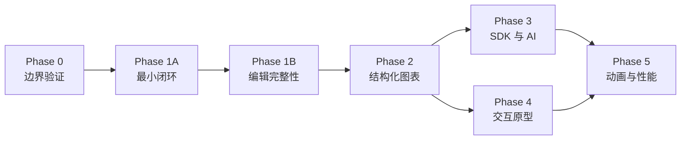

# NodeInk 技术验证与实施计划

> 状态：Proposal v0.1
> 本文回答交付物 18—21。所有指标都要求记录基线设备、操作系统、浏览器、刷新率、构建模式和样本规模。

## 18. Phase 0 技术 Spike

Phase 0 只产生可删除的验证代码、benchmark、fixture 和决策记录，不追求产品完整度。每个 Spike 必须回答一个会改变架构的具体问题。

### 18.1 Spike 清单

#### S0：Rust/WASM 最小闭环

- **问题**：`Document → Command → SceneSnapshot → TypeScript` 是否可稳定运行和测试？
- **最小实现**：一个矩形、一条 move command、JSON Snapshot、测试 Renderer。
- **证据**：Rust unit test、WASM browser test、同 fixture 的 Scene hash。
- **退出条件**：Native Rust 与 WASM 对非文本场景产生相同规范化 Scene。

#### S1：Pointer Event 与状态机

- **问题**：DOM 规范化事件进入 Rust 状态机是否满足拖拽延迟？
- **最小实现**：选择一个矩形并拖动，PointerMove 支持单事件和 batch 两种传输。
- **记录**：事件采集→Engine preview→Patch apply 的 P50/P95/P99，丢弃/错序数量，主线程 long task。
- **目标**：P95 不超过一个 60Hz frame budget（16.7ms），且 30 秒 120Hz 合成输入无错序提交。

#### S2：自由笔迹

- **问题**：采样、WASM 往返、路径生成和 SVG 更新的主要瓶颈在哪里？
- **最小实现**：30 秒连续笔迹，比较 JSON point、TypedArray batch 和不同 batch size。
- **记录**：输入到可见路径延迟、points/s、复制字节、ScenePatch 大小、DOM 更新耗时。
- **目标**：P95 可见延迟不超过一个 frame budget；PointerUp 后只生成一个 Undo entry。

#### S3：确定性 Sketch

- **问题**：同 Document、Profile、seed 和算法版本能否稳定生成相同 path？
- **最小实现**：矩形、自由笔和一种填充；连续运行 1,000 次并跨 Rust native/WASM 比较。
- **记录**：canonical Scene hash、不同 seed 的碰撞检查、算法版本字段。
- **退出条件**：相同输入 hash 100% 一致；seed 或 Profile 变化可解释地改变 Scene。

#### S4：文本测量与 IME

- **问题**：两阶段 text measure 是否会造成明显闪烁或过多往返？
- **最小实现**：固定字体、中英文多行、emoji、中文输入法 composition。
- **记录**：MeasureRequest 数量、cache hit、首次与缓存后 resolve 时间、字体加载前后 fingerprint。
- **退出条件**：composition 不被 Command 打断；相同 metrics fixture 的 Scene hash 一致；字体变更能正确失效。

#### S5：SceneSnapshot 与 ScenePatch

- **问题**：增量 Patch 是否明显优于全量 Snapshot，revision 失配能否恢复？
- **样本**：100、1,000、10,000 个简单元素；移动单个和移动 100 个。
- **记录**：序列化、传输、解析、SVG apply 时间和 payload bytes。
- **退出条件**：错序 Patch 始终触发 Snapshot；1,000 元素的单元素移动 P95 保持在一个 frame budget 内。

#### S6：SVG DOM 与裁剪

- **问题**：SVG 在 Phase 1 目标规模内的交互上限是什么？
- **样本**：简单 path、TextRun、Sketch 多 path 三类节点。
- **记录**：首次 mount、camera pan、单节点 patch、视口内 DOM node count。
- **退出条件**：给出“无需裁剪/需要裁剪/需要 Canvas”的数量区间，不凭经验拍板。

#### S7：IndexedDB 原子保存与恢复

- **问题**：1MB、10MB 文档的序列化、hash、事务和 read-back 成本是否可接受？
- **最小实现**：candidate → head → verified stable，模拟事务前、中、后的关闭/异常。
- **记录**：保存时延、主线程耗时、恢复结果、durability capability。
- **退出条件**：任何中断只会打开新稳定快照或前一稳定快照，不出现半快照。

#### S8：Migration 与损坏检测

- **问题**：copy-on-write migration 和 fallback 是否完整？
- **fixture**：合法 V1、旧 schema、未知 schema、字段损坏、hash 不匹配、迁移函数失败。
- **退出条件**：源 payload 永不被覆盖；每个失败有结构化报告和确定恢复路径。

#### S9：多标签页写入权

- **问题**：目标浏览器能否使用 Web Locks；不支持时 revision guard 是否阻止覆盖？
- **最小实现**：两个标签页同时打开、关闭 writer、接管、模拟 writer crash。
- **记录**：capability matrix、获取/释放时延、冲突次数、接管后的 revision。
- **退出条件**：任何路径都不发生无提示 last-write-wins；不支持可靠协调时第二标签页只读。

#### S10：内部 Diagram Operation

- **问题**：UI 与结构化调用能否共享 Command/Transaction？
- **最小实现**：dry-run + atomic batch 创建、移动、修改、删除矩形。
- **退出条件**：同一 batch 可重放、可撤销、revision conflict 可验证，Renderer 不知道调用来源。

#### S11：框架无关 Web 嵌入

- **问题**：同一套 Controller 与 SVG Renderer 能否同时服务 Vanilla TypeScript host 和官方 React UI？
- **最小实现**：Vanilla DOM fixture 挂载/销毁 Controller；React adapter 使用同一 action、snapshot 与 subscription 契约。
- **验证**：依赖规则检查 `engine-web`、`editor-web`、`renderer-svg`、`persistence-web` 不出现 React/Vue import；重复 mount/dispose 不残留 listener、timer 或 Engine handle。
- **退出条件**：Vanilla 与 React 两个 host 完成相同的创建/移动/撤销闭环，Renderer 和 Engine 代码无需分叉。

#### S12：Vite+、Cargo 与 WASM 工具链闭环

- **问题**：Vite+ 能否作为唯一日常入口，同时不模糊 Cargo 的权威边界或制造重复缓存？
- **最小实现**：精确锁定 Vite+ 与 pnpm；根 `.npmrc` 固定 npm 官方 registry；配置 Web check/test/build、`rust:check` 和 `wasm:build`；Playground 加载真实 WASM 产物。
- **验证**：确认 pnpm/Vite+ 解析到 `https://registry.npmjs.org/`，再在 clean checkout 和 CI 分别运行 `vp install --frozen-lockfile`、`vp check`、`vp test`、`vp run rust:check`、`vp run wasm:build` 与 `vp build apps/playground`。
- **记录**：工具版本、首次/增量耗时、`target/` 与 Web 产物大小、缓存命中、WASM 产物来源和失败诊断。
- **退出条件**：上述命令可重复执行；Rust 失败不能被 Web check 掩盖；关闭 Vite Task 的 Rust 产物缓存后仍可复用 Cargo 增量结果；移除生成产物后能完整重建。

### 18.2 Benchmark 记录格式

每次 benchmark 至少记录：

```json
{
  "commit": "<git-sha>",
  "build": "release",
  "engineAlgorithmVersion": "<version>",
  "browser": "<name and version>",
  "os": "<name and version>",
  "hardware": "<cpu / memory / display refresh>",
  "sample": { "elements": 1000, "sceneNodes": 2400, "inputHz": 120 },
  "metrics": { "p50Ms": 0, "p95Ms": 0, "p99Ms": 0, "bytes": 0 }
}
```

不允许只报告平均值；输入和渲染抖动至少报告 P95。Debug 构建结果不能用作发布门槛。

### 18.3 Phase 0 决策门

Phase 0 结束时必须明确：

- 工具 preview 是否继续由 Rust 状态机持有。
- Pointer/Stroke 是否使用 TypedArray batch。
- 主线程是否足够，是否进入 Worker 设计。
- ScenePatch 的最小粒度与全量 fallback。
- 固定画布字体是否是确定性要求。
- SVG 的目标元素/SceneNode 预算。
- IndexedDB strict durability、Web Locks 的实际能力矩阵。
- 框架无关 Controller/Renderer API 是否通过 Vanilla host 验证。
- Vite+ 精确版本、WASM 构建脚本、Cargo/Vite Task 缓存边界和降级命令是否验证。

任一项没有数据时写“未验证”，不能用“理论上可行”替代。

## 19. 分阶段路线图

### Phase 0：技术验证

**目标**：用最小纵向切片证实关键边界，允许推翻方案。
**交付**：上述 Spike、benchmark 数据、fixture、ADR 和 go/no-go 结论。
**不交付**：可日常使用的编辑器、公共 package。

### Phase 1A：端到端最小闭环

**目标**：做出可信、可持续编辑的单文档本地画板。

- Camera、矩形、文本、自由笔。
- 创建、选择、移动、删除、样式修改。
- Transaction、Undo/Redo、Editor State Machine。
- Clean/Sketch Scene Resolution。
- 框架无关的 `editor-web`、SVG Renderer、HTML text overlay、IME，以及可选的官方 React Shell。
- 当前快照 + 前一稳定快照、自动保存和恢复。
- 内部 typed bridge 与 test renderer。

**退出信号**：第 21.1 节全部通过，关键性能未超过 Phase 0 决定的预算。

### Phase 1B：基础编辑器完整性

**目标**：从架构证明升级为可持续使用的基础白板。

- 完整基础图形、框选/多选、resize/rotate。
- group、z-order、clipboard、align、snap、guides。
- 多文档库、回收站、稳定恢复 UI。
- 多标签页单写者和冲突处理。
- 规模基线、视口裁剪和空间索引。

**退出信号**：第 21.2 节全部通过，且真实文档恢复演练成功。

### Phase 2：结构化图表

- MindMapTree 与 FlowGraph 真实领域模型。
- Port、semantic Connector、routing。
- 自动布局与人工 override。
- Mermaid 版本化兼容层：先支持明确的 Flowchart 子集，发布 compatibility profile 与 parser fixture；导入后成为可编辑原生对象。
- 此时再决定是否拆 `diagram-layout` crate。

### Phase 3：可编程与 AI

- 稳定 TypeScript SDK 和包名/scope。
- Diagram Operation Protocol V1。
- Headless engine、CLI、MCP Server、Agent Skill。
- AI dry-run、批量事务、结构化解释和权限/资源上限。

### Phase 4：交互原型

- Frame、Screen、Navigation、Overlay、状态切换和演示模式。
- Interaction 是语义对象，和画布元素分层。

### Phase 5：动画与性能

- Animation Model、关键帧、缓动、Timeline、Scene evaluation。
- Canvas Renderer 与大规模场景优化。
- 是否使用 Worker、SharedArrayBuffer 或 GPU 路径重新由数据决定。

### 阶段依赖



## 20. 技术风险及验证方法

| 风险 | 影响 | 早期信号 | 验证/缓解 |
| --- | --- | --- | --- |
| WASM 高频往返过慢 | 笔迹和拖拽卡顿 | input→patch P95 超帧预算 | S1/S2 比较单事件、batch、TypedArray；Transport 隔离编码 |
| Rust 工具状态与浏览器行为割裂 | pointer cancel、IME、focus bug | 取消后仍提交、输入丢字 | 状态机 fixture + 真实浏览器事件矩阵；TS 保留平台职责 |
| 字体使 Scene 不确定 | bounds、换行和布局漂移 | 同文档跨环境 hash 不同 | S4；显式 `fontFingerprint`；必要时固定画布字体 |
| Sketch 路径跨 Renderer 漂移 | 导出/Canvas 结果不同 | 相同 seed path 不同 | Sketch 在 Scene Resolution；S3 native/WASM hash |
| ScenePatch 错序或漏更新 | 画面与文档不一致 | renderer revision 落后 | base revision 校验 + Snapshot fallback + fuzz test |
| SVG DOM 上限低于目标 | 大文档交互不可用 | pan/patch 出现 long task | S5/S6；culling；Scene 保持 renderer-independent |
| Undo 粒度不符合用户预期 | 拖一下需撤销数百次 | history entry 暴涨 | 手势 preview/commit 分离；merge key 测试 |
| Snapshot 保存阻塞或过大 | 输入卡顿、保存失败 | serialize/hash/IDB P95 高 | S7 按 1MB/10MB；异步调度；必要时再引入 op log |
| 迁移破坏唯一副本 | 本地数据不可恢复 | migration 后原数据消失 | copy-on-write、fixture、前一稳定快照 |
| 多标签页覆盖 | 用户内容静默丢失 | revision 倒退或两个 writer | S9；lease adapter + expected revision；只读降级 |
| 公共 API 过早冻结 | 后续语义模型受阻 | 内部改动需兼容未发布接口 | Phase 1 packages `private`; Phase 3 才定义 SemVer |
| 未来类型污染 V1 | 空抽象和迁移负担 | 未实现对象已进入 schema | 只定义 resolver/layout 边界；真实能力出现再加类型 |
| UI 框架泄漏到 Controller/Renderer | Vue/Vanilla 嵌入需要重写核心 | 通用 package 出现 React/Vue import | S11 依赖规则 + Vanilla fixture；框架代码只进 adapter |
| Mermaid grammar/parser 漂移 | 同一源码跨版本导入结果变化 | 升级后 fixture 或覆盖率变化 | 固定 parser、兼容清单、source range diagnostics 与升级差异测试 |
| Vite+ 0.x 工具链变化 | 升级导致构建或测试配置漂移 | `vp migrate` 改写 pin/override 或 CI 与本地不一致 | 精确锁版本、提交 lockfile、S12 clean checkout 验证、运行时契约不依赖 Vite+ |
| 本地优先却无法带走数据 | 信任与恢复不足 | 损坏后无可用快照 | 决策是否允许 recovery bundle；明确本地存储提示 |
| 可访问性被 SVG 交互拖累 | 键盘/读屏不可用 | 只能 pointer 操作 | Host/Renderer accessibility contract；键盘与 focus 验收 |

### 20.1 风险处置优先级

1. 数据损坏、revision conflict 和 silent overwrite 是阻断级风险。
2. 输入延迟、文本测量和 ScenePatch 正确性是 Phase 1A 阻断级风险。
3. SVG 大规模性能是 Phase 1B/Canvas 路线决策依据，不要求 Phase 1A 支持无限节点。
4. 公共 SDK、Mermaid、自动布局风险在相应阶段前只验证边界，不提前实现。

### 20.2 可回滚设计

- Input encoding、Worker、Web Locks、IndexedDB 实现和 Mermaid parser 都位于 adapter 后，可单独替换。
- Snapshot 永远是恢复基线，即使未来增加 operation log。
- SceneSnapshot 永远是 Renderer 的正确性 fallback，即使 Patch 协议优化。
- 第三方 rough/path 库如被采用，只能位于 Scene resolver 内部并固定版本；Document 不持久化其私有对象。

## 21. 首期验收标准

### 21.1 Phase 1A

#### 产品闭环

1. 用户无需账号即可打开单文档画布。
2. 可以创建矩形、文本和自由笔迹，并继续选择、移动、修改样式和删除。
3. 中文 IME composition 不丢字、不重复提交，文本支持多行。
4. Clean/Sketch 可切换并可撤销；切换不改变元素语义类型。
5. UI 明确显示 dirty、saving、saved 和 save failed。

#### 引擎与协议

6. 所有 Document 修改通过 Command/Transaction；直接 mutation 在 API 层不可达。
7. 一次创建、移动、删除、样式变更或文本提交对应一个可理解的 Undo entry。
8. Undo/Redo 不依赖 Renderer，并保持 document revision 单调。
9. Rust crate 不引用 DOM、SVG、Canvas、PointerEvent、IndexedDB 或浏览器字体类型。
10. Semantic Document、Editor State 和 Resolved Scene 有独立 schema/生命周期。
11. Renderer interface 不包含 SVG 专属类型，也不能返回 Document mutation。
12. test renderer 与 SVG renderer 能消费同一 SceneSnapshot。
13. ScenePatch revision 错序时拒绝应用并请求 Snapshot。
14. Vanilla DOM fixture 与 React adapter 使用同一 Controller/Renderer 契约；`editor-web` 和 `renderer-svg` 不含 React/Vue import。

#### 确定性

15. 相同 Document、Profile、seed、font metrics 和 engine algorithm version 产生相同 canonical Scene hash。
16. Rust native 与 WASM 对非文本 fixture 产生相同 hash。
17. Sketch path 连续 1,000 次生成一致；改变 seed 会改变路径但不改变元素语义。

#### 持久化

18. 页面刷新和浏览器重启后恢复最后验证通过的快照。
19. Snapshot 包含 schemaVersion、revision、algorithm version 和 integrity digest。
20. 模拟保存中断后只能打开当前稳定或前一稳定快照，不出现半写入 Document。
21. Migration 使用副本；失败不覆盖源快照，并返回结构化报告。
22. Head 损坏时能发现并进入恢复流程，不能显示为正常已保存。

#### 可编程与性能

23. 内部 Operation Batch 可以 dry-run、原子创建/移动/更新/删除基础元素并返回受影响 ID。
24. `expectedRevision` 不匹配时整个 Batch 失败且 Document 不变。
25. Pointer、Stroke、Scene 和 IndexedDB benchmark 产出带环境信息的 P50/P95/P99 与字节基线。
26. Phase 0 确认的核心交互规模内，拖拽/笔迹 input→visible P95 不超过一个 60Hz frame budget。
27. 精确锁定的 Vite+ 能在 clean checkout 完成 Web check/test/build、Cargo check/test 与 WASM 重建，且 Rust 失败会使统一任务失败。

### 21.2 Phase 1B

1. 支持椭圆、菱形、直线、折线、箭头及其继续编辑。
2. 支持框选、多选、resize、rotate，变换取消不污染 Document。
3. 支持 z-order、group/ungroup、内部 clipboard、align、snap 和 guides。
4. 多文档列表支持创建、打开、移入回收站、恢复和明确永久删除。
5. 第二标签页不能静默成为 writer；接管前加载最新稳定 revision。
6. Quota、save failure、corruption、migration failure 和 revision conflict 都有用户可执行恢复路径。
7. 视口裁剪使 SVG DOM node count 受可见内容约束，并报告目标规模基线。
8. 架构中没有为了 Phase 2—5 创建的空实现 package 或空 domain record。

### 21.3 明确不作为验收依据

- README 中宣称支持但没有自动测试或浏览器证据。
- 只验证图形创建，不验证后续编辑。
- 只比较代码结构，不比较 Scene/Document fixture。
- 只跑平均性能，不提供 P95 和测试环境。
- 只调用 IndexedDB API 成功，不执行中断、损坏和迁移失败演练。
