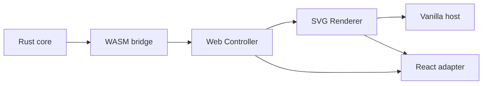

# Phase 0 首条纵向切片



> 日期：2026-07-21
> 状态：已实现并验证
> 覆盖 Spike：S0、S10 的最小事务边界、S11、S12

## 结论

首条纵向切片证明以下依赖方向可以工作：

```text
Rust nodeink-core
  → nodeink-wasm
  → engine-web
  → editor-web
  → renderer-svg
  → Vanilla host / React adapter
```

- Document、Command、Undo/Redo、revision guard 和确定性 Scene Resolution 由 Rust 持有。
- 浏览器通过真实 `wasm-bindgen` 产物调用引擎；UI 不维护第二份文档真相源。
- `editor-web` 与 `renderer-svg` 只依赖 TypeScript 和标准 DOM，不导入 React/Vue。
- React adapter 和 Vanilla TypeScript host 使用同一 Controller、Action、EnginePort 与 Renderer。
- Web 日常入口统一为 Vite+；Rust 检查和 WASM 构建由 `vp run` 编排，底层仍直接执行 Cargo/wasm-pack。

## 已实现范围

- 创建一个矩形。
- 移动已有矩形。
- Undo/Redo，并保持 revision 单调递增。
- expected revision 冲突拒绝且不修改文档。
- 原子命令校验失败时不产生部分写入。
- 同一 Document 产生稳定排序、可重复序列化的 Scene。
- SVG Renderer 根据 SceneSnapshot 协调 DOM。
- React 与 Vanilla 两个桌面 Web 演示入口。

这不是日常可用的编辑器，也不包含持久化、Camera、选择框、文本/IME、自由笔、
Mermaid 导入或公共 SDK。

## 验证证据

| 验证 | 结果 |
| --- | --- |
| `pnpm install --frozen-lockfile` | lockfile 可重复安装；workspace 已是最新状态 |
| `pnpm config get registry` | `https://registry.npmjs.org/` |
| `pnpm exec vp check` | 39 个文件格式正确；14 个文件无 lint/type error |
| `pnpm exec vp test` | 3 个 test file、4 个 Web test 通过 |
| `pnpm exec vp run rust:check` | fmt、Clippy、5 个 Rust test、doc-test 通过 |
| `pnpm exec vp run wasm:build` | release WASM 重新生成成功 |
| `pnpm exec vp build apps/playground` | React/Vanilla 双入口和 WASM 生产包构建成功 |
| framework dependency scan | `protocol`、`engine-web`、`editor-web`、`renderer-svg` 无 React/Vue import |
| `git diff --check` | 通过 |

真实浏览器中分别验证了 React 和 Vanilla 两个入口：

1. 初始 revision 为 0。
2. 创建矩形后 revision 为 1，坐标为 `(80, 72)`。
3. 移动后 revision 为 2，坐标为 `(112, 88)`。
4. Undo 后 revision 为 3，坐标恢复为 `(80, 72)`。

验证过程中发现 Rust serde 默认把 `elementIds` 解析为 `element_ids`，导致浏览器 Move
失败。Command wire schema 已统一为 camelCase，并新增 Rust 回归测试；双宿主随后重新通过。

## 工具链说明

- Node：`24.15.0`
- pnpm：`11.1.3`
- Vite+：`0.2.5`
- Rust：`1.96.0`
- wasm-pack：`0.15.0`
- wasm-bindgen CLI/crate：`0.2.126`

macOS 在仓库内 Cargo `target/` 上触发过扩展属性相关的 `Operation not permitted`。
脚本因此默认把 Cargo target 放在系统临时目录；可通过
`NODEINK_CARGO_TARGET_DIR` 显式覆盖。此调整不改变 Cargo 作为 Rust 构建真相源的边界。

## 下一步

按风险顺序继续 Phase 0，而不是直接铺开完整 UI：

1. S1 Pointer Event 与状态机，测量拖拽 P50/P95/P99。
2. S2 自由笔迹，比较 JSON、TypedArray 与 batch size。
3. S4 文本测量与 IME，并在实现文本前确认 P-02 字体决策。
4. S5/S6 ScenePatch、SVG 更新与裁剪预算。
5. S7/S8 持久化、原子恢复与 migration fixture。

---
*Last updated: 2026-07-21 | Reason: record implementation and verification of the first Phase 0 vertical slice*
