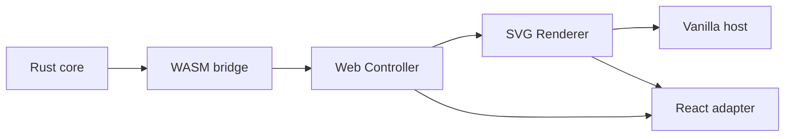

# Phase 0 首条纵向切片



> 日期：2026-07-21
> 状态：已实现并验证
> 覆盖 Spike：S0、S1、S2、S3、S4、S5、S6、S7、S8、S10 的最小事务边界、S11、S12

## 结论

首条纵向切片证明以下依赖方向可以工作：

```text
Rust nodeink-core
  → nodeink-wasm
  → engine-web
  → editor-web
  → renderer-svg
  → Vanilla host / React adapter
```

- Document、Command、Undo/Redo、revision guard 和确定性 Scene Resolution 由 Rust 持有。
- 浏览器通过真实 `wasm-bindgen` 产物调用引擎；UI 不维护第二份文档真相源。
- `editor-web` 与 `renderer-svg` 只依赖 TypeScript 和标准 DOM，不导入 React/Vue。
- React adapter 和 Vanilla TypeScript host 使用同一 Controller、Action、EnginePort 与 Renderer。
- Web 日常入口统一为 Vite+；Rust 检查和 WASM 构建由 `vp run` 编排，底层仍直接执行 Cargo/wasm-pack。
- DOM 只规范化 Pointer Event；Rust 状态机持有 drag session、preview、顺序过滤与一次性 commit。

## 已实现范围

- 创建一个矩形。
- 移动已有矩形。
- Undo/Redo，并保持 revision 单调递增。
- expected revision 冲突拒绝且不修改文档。
- 原子命令校验失败时不产生部分写入。
- 同一 Document 产生稳定排序、可重复序列化的 Scene。
- SVG Renderer 根据 SceneSnapshot 协调 DOM。
- React 与 Vanilla 两个桌面 Web 演示入口。
- 矩形 Pointer drag：Move 只更新 Scene preview，PointerUp 才生成一个可撤销的 Document command。
- 自由笔 Stroke：Rust 累积点并解析 SVG path，支持 JSON point 与 Float64Array batch，PointerUp 只提交一个 Undo entry。
- 确定性 Sketch：Rust 使用显式 profile、seed 与算法版本生成矩形轮廓、hachure fill 和自由笔 path。
- 文本与 IME：Rust 发出缺失 metrics request；TypeScript 测量固定 fixture 字体并按 fingerprint 缓存；composition buffer 不进入 Command。
- ScenePatch：Rust 生成带 base revision 的稳定节点增量，Renderer 原地更新 DOM，revision 失配时要求完整 Snapshot。
- SVG scale：Renderer 支持 TextRun 与独立 viewport；可见集合由 Scene/Host 裁剪后再传入 Renderer。
- IndexedDB persistence：candidate/head transaction、SHA-256 read-back、stable/previous-stable 恢复均由 framework-neutral adapter 编排。
- Migration：Rust 验证/迁移版本化 payload，Web 仅做 hash、候选顺序和 copy-on-write 持久化编排。

这不是日常可用的编辑器，也不包含持久化、Camera、选择框、产品级文本编辑、
Mermaid 导入或公共 SDK；自由笔与 IME 仅覆盖 Spike fixture。

## 验证证据

| 验证 | 结果 |
| --- | --- |
| `pnpm install --frozen-lockfile` | lockfile 可重复安装；workspace 已是最新状态 |
| `pnpm config get registry` | `https://registry.npmjs.org/` |
| `pnpm exec vp check` | 21 个源码入口无格式、lint 或 type error |
| `pnpm exec vp test` | 7 个 test file、38 个 Web test 通过 |
| `pnpm coverage` | Web statements 98.86%、branches 92.50%、functions 97.05%、lines 98.83%；Rust lines 99.61% |
| `pnpm exec vp run rust:check` | fmt、Clippy、13 个 Rust test、doc-test 通过 |
| `pnpm exec vp run wasm:build` | release WASM 重新生成成功 |
| `pnpm exec vp build apps/playground` | React/Vanilla 双入口和 WASM 生产包构建成功 |
| framework dependency scan | `protocol`、`engine-web`、`editor-web`、`renderer-svg` 无 React/Vue import |
| S1 release WASM browser benchmark | 单事件和 batch-8 均 P95 约 0.1ms、0 ignored、1 commit、0 long task |
| S2 release WASM browser benchmark | JSON point 与 TypedArray batch-2/8/32 均 0 ignored、1 commit、0 long task；batch-2 首点估算 P95 13.03ms |
| S3 Native/WASM canonical hash | 4 组 hash 逐项一致；同输入 WASM 连续解析 1,000 次只有 1 个 hash |
| S4 text/IME browser benchmark | 3 个 run 首次测量、缓存后 3/3 命中；1,000 次 hash 稳定；font/IME 失效与提交边界正确 |
| S5 ScenePatch browser benchmark | 100/1,000/10,000 节点 × move 1/100；1,000 move-1 Patch P95 0.8ms；错序 Patch 返回 `snapshot_required` |
| S6 SVG scale browser benchmark | simple path/TextRun/Sketch multi-path × 1,000/5,000/10,000；裁剪到 1,000 源元素后首挂 P95 1.3–4.5ms |
| S7 IndexedDB browser benchmark | 1MB/10MB × 5 次；保存 P95 12.3/34.4ms；4 个中断点均只恢复 verified stable snapshot |
| S8 migration browser fixture | V1/V0/未知 schema/字段损坏/migration failure/hash mismatch；源 bytes 不变，fallback/只读诊断确定 |
| `git diff --check` | 通过 |

真实浏览器中分别验证了 React 和 Vanilla 两个入口：

1. 初始 revision 为 0。
2. 创建矩形后 revision 为 1，坐标为 `(80, 72)`。
3. 移动后 revision 为 2，坐标为 `(112, 88)`。
4. Undo 后 revision 为 3，坐标恢复为 `(80, 72)`。

验证过程中发现 Rust serde 默认把 `elementIds` 解析为 `element_ids`，导致浏览器 Move
失败。Command wire schema 已统一为 camelCase，并新增 Rust 回归测试；双宿主随后重新通过。

## S1 Pointer Event 决策

浏览器基准原始数据见
[`phase0-s1-pointer.json`](../benchmarks/phase0-s1-pointer.json)，测试源代码锚定提交
`bdef2e3`。每种传输处理 3,600 个 PointerMove 样本，等价于 30 秒 120Hz 输入；
采样覆盖 normalized event、Controller queue、release WASM、Rust preview/commit 和 SVG
Snapshot apply。它不包含操作系统事件调度与 DOM 规范化耗时，不能替代真实设备 pen 测试。

- Rust 继续持有工具 preview 和 drag 状态；Move 不修改 Document，Up 只提交一个 Undo entry。
- 矩形拖拽暂用单事件 JSON：batch-8 没有降低 P95，只减少约 0.8% 传输字节，复杂度收益不足。
- 主线程满足 S1 矩形拖拽预算；是否引入 TypedArray batch 或 Worker 留给数据量更高的 S2 自由笔迹。

## S2 自由笔迹决策

浏览器基准原始数据见
[`phase0-s2-stroke.json`](../benchmarks/phase0-s2-stroke.json)，测试源代码锚定提交
`d377f1d`。每组处理 3,600 个 move point；service latency 覆盖 Controller、release
WASM、Rust preview/commit、全量 SceneSnapshot 和 SVG path 更新。首点估算延迟额外计入 batch
填充等待，因此不会把更大 batch 的吞吐优势误当成交互延迟优势。

- Stroke 采用 `Float64Array` batch-2：复制字节从 JSON point 的 442,662 降至 57,632，约减少 87%。
- batch-2 在 120Hz 下最多等待 8.33ms，加上 4.70ms service P95 后首点估算 P95 为 13.03ms，仍在 16.7ms 内。
- batch-8/32 的首点估算 P95 为 62.93/262.43ms，因此不用于实时笔迹；它们只证明大 batch 的离线吞吐上限。
- S2 主线程路径可继续；当前 P95 SceneSnapshot 已约 128KB，S5 必须验证增量 ScenePatch，不能把全量快照当长期方案。
- 该合成基准不包含真实 pen pressure、浏览器 coalescing 与 OS 调度，P-07 设备范围仍待后续真实硬件确认。

## S3 确定性 Sketch 决策

跨运行时证据见 [`phase0-s3-sketch.json`](../benchmarks/phase0-s3-sketch.json)，测试源代码
锚定提交 `1038224`。fixture 同时包含矩形、hachure fill 和自由笔，Native Rust 与 release
WASM 对 clean、seed-42、seed-43、roughness-2 产生完全一致的 canonical hash。

- Sketch 几何继续由 Rust Scene Resolution 持有；Renderer 不接收 seed，也不执行随机算法。
- `nodeink-scene-v1` 是显式算法版本；节点 ID 包含稳定 resolver 子路径与版本。
- 相同 Document/Profile/seed 连续 1,000 次解析 100% 一致；换 seed 或 roughness 会稳定改变 hash。
- FNV-1a 仅作为快速 canonical fixture hash，不作为安全完整性校验；S7 持久化仍使用 SHA-256 类完整性摘要。
- Phase 0 的 seed 是显式 resolver 输入；进入 Phase 1A 时按架构草案落入元素公共字段并通过 Command 修改。

## S4 文本测量与 IME 决策

真实浏览器证据见 [`phase0-s4-text-ime.json`](../benchmarks/phase0-s4-text-ime.json)，测试源代码
锚定提交 `c0f7553`。fixture 覆盖英文多行、中文和 emoji；Rust 两阶段 resolver 与浏览器
Canvas metrics adapter 通过 fingerprint 交换数据，不让 Rust 读取 DOM 或浏览器字体 API。

- 首次 3 个 run 测量 7.5ms，缓存后 3/3 命中且本次记录为 0ms；resolve 分别约 0.4ms/0ms。
- 同一 metrics fixture 连续解析 1,000 次只有一个 hash；font epoch 改变后 fingerprint 与 hash 都变化。
- 中文 composition 期间不提交，也拒绝外部 snapshot 覆盖 buffer；compositionend 只提交一次。
- S4 证明两阶段协议可行，但 Arial 只是本机 Spike fixture，不是产品字体决定。P-02 仍需产品确认是否随应用捆绑固定画布字体。

## S5 ScenePatch 决策

真实浏览器证据见 [`phase0-s5-scene-patch.json`](../benchmarks/phase0-s5-scene-patch.json)，测试源代码
锚定提交 `c65a244`。每组运行 20 次，分别记录 release WASM 的 Scene 构造/序列化/传输、
JSON parse、SVG apply 和端到端 P50/P95/P99。

- 最小粒度采用稳定 SceneNode ID map；移动 1 个节点时 payload 固定为 325B，移动 100 个时约 17KB。
- 1,000 节点移动 1 个的全量 Snapshot/Patch P95 分别为 3.3/0.8ms，Patch payload 约为全量的 0.2%。
- 10,000 节点全量 Snapshot P95 为 31.4ms，已超过帧预算；单节点 Patch 为 7.9ms，仍在预算内。
- 重复或错序 Patch 100% 返回 `snapshot_required` 且保持 DOM/revision 不变；Host 必须请求完整 Snapshot，不能猜测合并。
- Spike 的 Patch 构造仍通过 O(N) Scene diff；Phase 1A 从 Transaction changed IDs 直接构造，Renderer 不感知 Command 来源。

## S6 SVG 与裁剪决策

真实浏览器证据见 [`phase0-s6-svg-scale.json`](../benchmarks/phase0-s6-svg-scale.json)，测试源代码
锚定提交 `65c56e7`。fixture 覆盖 simple path、单 TextRun 与每元素三 path Sketch；首挂各 10 次，
camera pan 与单节点 Patch 各 20 次。

- simple path 在 10,000 个可见 DOM 节点时首挂 P95 15.5ms，仍处在 16.7ms 帧预算内。
- TextRun 在 5,000 元素/10,000 DOM 节点时首挂 P95 25ms；Sketch 在 5,000 元素/15,000 DOM 节点时为 54.8ms，均需裁剪。
- 三类 10,000 源元素在可见集合裁到 1,000 元素后，首挂 P95 分别为 1.3/1.9/4.5ms；camera pan P95 不超过 0.1ms。
- Phase 1A 采用保守的 2,000 可见 SVG DOM 节点软门：超过时先减少可见 cap，并评估 Canvas；不按源文档总元素数自动切换 Renderer。
- 这些结论来自单台桌面 Chrome 150 与合成 Scene；低端设备和真实字体/复杂 path 必须重新校准。

## S7 IndexedDB 原子恢复决策

真实浏览器证据见 [`phase0-s7-indexeddb.json`](../benchmarks/phase0-s7-indexeddb.json)，测试源代码
锚定提交 `785c22e`。浏览器使用原生 IndexedDB、Web Crypto SHA-256 与 strict durability probe；
单测使用同一事务 API 的兼容实现覆盖 revision conflict、abort、corruption 和 fallback。

- 1MB payload 总保存 P95 为 12.3ms，10MB 为 34.4ms；10MB JSON validation 主线程 P95 4.6ms，0 long task。
- 保存完成前的四个 fault point 都不会打开 candidate；恢复保持前一稳定 revision，stable transaction 完成后才打开新 revision。
- Catalog 保留 current stable 与 previous stable 两个指针；head 可以暂时指向 candidate，但 open path 不把 candidate 当稳定文档。
- `strict` 仅在 capability probe 成功时请求；无论 hint 是否可用，read-back、digest 和 schema validation 都是硬门。
- 10MB 总保存超过一帧但主要为异步事务；Phase 1A 自动保存仍需 debounce，不能在 UI 上同步宣称“已保存”。

## S8 Migration 与损坏恢复决策

跨 Rust/WASM/Web 证据见 [`phase0-s8-migration.json`](../benchmarks/phase0-s8-migration.json)，测试源代码
锚定提交 `7176979`。Rust fixture 覆盖 V1、V0、未知 schema、字段损坏、非法旧元素和迁移后 invariant；
Web fixture 额外覆盖 hash mismatch、stable fallback 与全部候选失败。

- 合法 V1 直接打开；合法 V0 在 0.6ms 内产生 V1 canonical copy，原始 bytes 逐项未变。
- `unknown_schema`、`document_invalid`、`migration_failed` 均返回结构化 code；Rust migration 文件覆盖率为 100%。
- head hash/schema 失败都回退 stable；unknown+migration failure 穷尽候选时返回 `readonly_diagnostic` 和完整 report 列表。
- Migration 函数不写 IndexedDB；成功 payload 必须作为新 revision 重新经过 S7 candidate/read-back/stable 流程。
- Phase 1 只承诺向上 migration；未知未来 schema 保持只读诊断，不能尝试降级解释。

## 工具链说明

- Node：`24.15.0`
- pnpm：`11.1.3`
- Vite+：`0.2.5`
- Rust：`1.96.0`
- wasm-pack：`0.15.0`
- wasm-bindgen CLI/crate：`0.2.126`

macOS 在仓库内 Cargo `target/` 上触发过扩展属性相关的 `Operation not permitted`。
脚本因此默认把 Cargo target 放在系统临时目录；可通过
`NODEINK_CARGO_TARGET_DIR` 显式覆盖。此调整不改变 Cargo 作为 Rust 构建真相源的边界。

## 下一步

按风险顺序继续 Phase 0，而不是直接铺开完整 UI：

1. S9 多标签页写入权与只读降级。
2. 补齐 S10/S11/S12 的完整退出证据。
3. Phase 1A 文本实现前确认 P-02 固定画布字体产品决策。

---
*Last updated: 2026-07-22 | Reason: record S8 copy-on-write migration and corruption recovery evidence*
