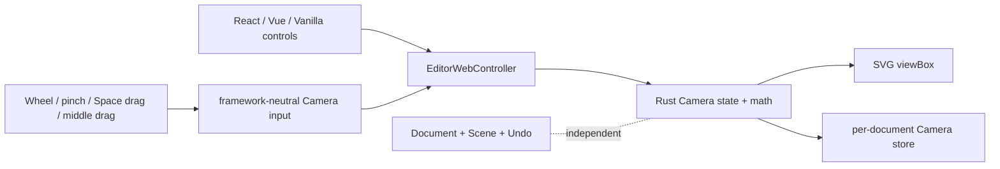

# Phase 1A Camera 与无限画布 Viewport



> 日期：2026-07-22
> 状态：已实现并通过真实 WASM 浏览器验证
> 边界：桌面 Web Camera 与 fit content；不包含惯性平移、小地图、移动端触摸 UI 或公开 SDK 稳定性

## 用户可见行为

- Space + 主键拖拽和鼠标中键拖拽可平移画布；普通 wheel/触控板滚动也可平移。
- `Ctrl/Cmd + wheel` 按当前鼠标位置连续缩放；工具栏每次放大/缩小使用 `1.5` 倍及其精确倒数，底层绝对 zoom 固定 clamp 到 10%–800%。
- 左下角提供缩小、当前相对缩放值/回正、放大三个低干扰控件；只读页面仍可浏览 Camera。
- “回正并适应全部内容”由 Rust 计算完整 Document bounds，在 viewport 四周保留 `64px` 屏幕留白并居中；此时 UI 定义为 `100%`，不要求底层 `zoom === 1`。
- UI 缩放值是 `camera.zoom / fitZoom`。Document bounds 或 viewport 改变会重算 fitZoom 和标签，但不会自动移动 Camera；只有用户点击百分比按钮才回正，避免编辑过程中画面跳动。
- 空文档回正为 `{ x: 0, y: 0, zoom: 1 }`；内容跨度大到绝对 10% 仍放不下时停在安全下限，不越过现有 Camera 数值契约。
- Camera 改变不增加 Document 或 Scene revision，也不进入 Undo/Redo。
- 每个文档恢复最后 Camera；selection、hover、active transform 与 IME composition 不持久化。

## 状态与坐标契约

```ts
interface CameraV1 {
  x: number;
  y: number;
  zoom: number;
}

type CameraActionV1 =
  | { type: 'pan_by'; delta: Vec2 }
  | { type: 'zoom_at'; factor: number; anchor: Vec2 }
  | {
      type: 'fit_content';
      viewport: { width: number; height: number };
      padding: number;
    };
```

- `x/y` 是 Viewport 左上角的 world coordinates；渲染尺寸为 `screenSize / zoom`。
- `pan_by` 的 delta 是屏幕像素中“内容随手移动”的位移；Rust 按当前 zoom 换算 world delta。
- `zoom_at` 保持 anchor 对应的 world point 不变，再把 zoom clamp 到 `[0.1, 8]`。
- `fit_content` 使用 Rust 持有的矩形语义 bounds 与包含 stroke width 的自由笔 bounds；Renderer 不读取 DOM/SVG bounds 反推内容范围。
- DOM/Wheel 只负责归一化输入；Camera 数学、有限数校验和边界归 Rust Engine。

## 持久化与失败边界

- Camera 使用独立的 `nodeink-playground-v1-camera` IndexedDB，不写入 Document snapshot catalog。
- Controller 在 Camera 改变后 150ms 合并保存，并在页面隐藏或 dispose 时 flush。
- Camera 保存状态与 Document 保存状态分离；失败显示“视图位置保存失败”并可重试，但不把已保存的 Document 标成 dirty。
- Camera store 不使用 Document writer lease；因此只读页面可以独立浏览并保存最后视图。
- fitZoom 是当前 Document bounds 与 viewport 的派生值，不写入 Document 或 Camera store；持久化的仍只有绝对 Camera。

## 验证证据

- Rust 单测证明 anchor zoom、矩形/笔迹 fit bounds、配置的屏幕留白、空文档 fallback、10%–800% clamp、非法值拒绝，以及 Camera 前后 Document/Scene/history 完全不变。
- Web 单测覆盖 wheel、Space drag、中键 drag、fit-relative 100%、Document bounds 改变不自动移动 Camera、Controller readonly Camera、独立持久化、失败重试和三个 adapter 的控件一致性。
- React 真实 WASM：恢复的绝对 Camera 显示为 fit-relative `117%`，点击回正后变为 `100%`；内容左右各 `64px`、上下各约 `174.6px` 留白，随后 `100%→150%→100%`，Document 保持 `r15`。
- 既有光标锚点验证中缩放前后 world point 均为 `(683.5, 795.6)`；wheel 与中键平移不增加 Document revision。
- Vanilla 真实 WASM：122% 下图形屏幕位移为 `100 × 50`，world delta 正确换算为约 `81.87 × 40.94`，Document 从 r8 正常提交到 r9。
- Vue 与 Vanilla 真实 WASM：只读页面均可回正到 `100%`；内容上下各 `64px`、左右各约 `303.7px` 留白，全部元素位于 viewport 内。Vanilla 的 hidden 空错误提示不会再被 flex 样式错误显示。

## 后续边界

- 惯性平移、触摸手势、小地图、zoom-to-selection、低于绝对 10% 的超大内容 fit 与 camera-aware culling 留到后续性能和交互迭代。
- Phase 1B 的显式 writer takeover 与恢复包 UX 与 Camera session store 保持独立。

---
*Last updated: 2026-07-22 | Reason: define Rust-owned fit content and fit-relative 100% Camera behavior*
