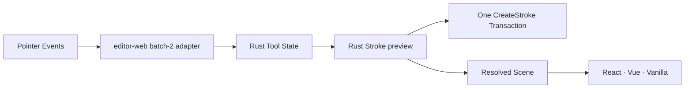

# Phase 1A Freehand Tool

This slice turns the Phase 0 stroke transport into a visible product tool while preserving one semantic owner. React, Vue, and Vanilla expose the same Select and Draw actions; Rust decides which input state machine may run.

## Interaction Contract

- The editor starts in Select. `V` activates Select and `P` activates Draw; toolbar buttons expose the same state with `aria-pressed`.
- Entering Draw cancels any in-progress selection drag, clears selection, and changes the canvas cursor to a crosshair without changing Document revision or history.
- PointerDown shows a Rust preview, coalesced PointerMove samples use the verified Float64Array batch-2 transport, and PointerUp commits one `create_stroke` Transaction.
- Draw remains active after a stroke so consecutive marks are fast. Creating a rectangle explicitly returns to Select.
- `Escape`, pointer cancel, capture loss, window blur, and tool switching remove an unfinished preview without changing the Document.
- A click without movement commits a stable 3px round dot. Mouse, trackpad, and pen position are supported; pressure and variable-width outlines remain outside this slice.
- Existing Select behavior continues to hit-test, move, delete, Undo, and Redo committed strokes through Rust-owned geometry and Commands.

## Ownership

- `crates/nodeink-core/src/tool.rs` owns non-persistent Tool State. It is returned in every `EngineUpdateV1` but is excluded from Document serialization, persistence, Camera state, and Undo/Redo.
- `packages/editor-web/src/freehand-input.ts` only converts normalized DOM batches into the stroke transport. It does not choose the active tool or mutate document objects.
- Rust rejects pointer input routed to Draw and stroke input routed to Select, preventing a stale browser snapshot from creating a second semantic path.
- `renderer-svg` remains unchanged: it draws resolved Scene paths and does not know how strokes were captured.

## Acceptance

- Tool changes are visible and accessible in all three hosts and never change Document revision.
- A freehand preview is visible before commit; PointerUp creates exactly one revision and one Undo entry.
- Consecutive strokes remain in Draw; each Undo removes one complete stroke and Redo restores it.
- Click-only dots, cancel paths, tool mismatch rejection, batch ordering, and framework-neutral host parity have automated coverage.
- Real generated WASM is exercised through `/`, `/vue.html`, and `/vanilla.html` before delivery.

---
*Last updated: 2026-07-23 | Reason: productize the verified S2 transport as a shared Rust-owned tool*
