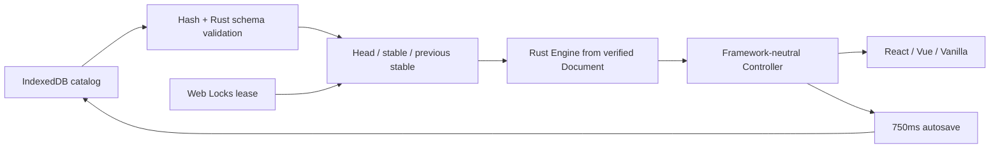
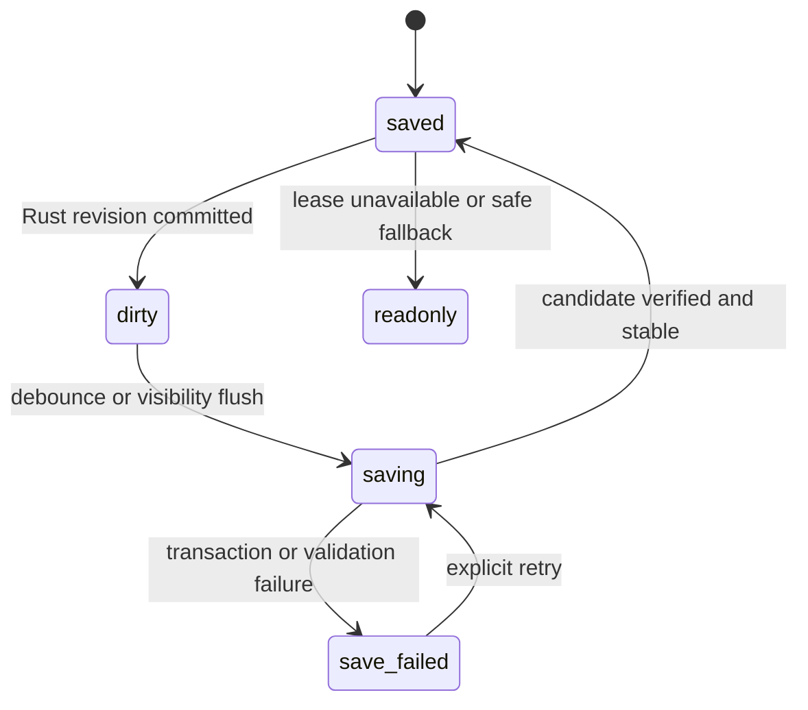

# Phase 1A 单文档持久化与恢复

> 日期：2026-07-22
> 状态：已实现并通过真实 WASM 浏览器验证
> 边界：一个固定本地文档；不包含多文档库、显式接管、恢复包导出或公共 SDK

## 用户可见行为

- 首次打开创建空白文档；Rust Transaction 每次推进 revision 后进入 `未保存`，750ms debounce 后依次显示 `保存中` 与 `已保存`。
- 保存失败保留内存中的 dirty revision，显示原因与 `重试`，不得声称已保存。
- 刷新从 SHA-256、schema 与 migration 全部验证通过的 snapshot 重建新 Engine。
- Head 损坏时保留原始 bytes，稳定 fallback 只读打开；候选全部失败时进入只读诊断，不生成半迁移文档。
- 同文档第二标签页立即只读并提示关闭其他页面后刷新。显式接管留到 Phase 1B。

## 状态机

- `serializeDocument()` 在异步保存开始前同步取得 Rust canonical Document；浏览器层不拼装持久语义。
- 保存中的新 revision 保持 dirty，当前保存结束后重新 debounce；并发 flush 加入失败保存后停在 `save_failed`，不会自旋重试。
- `visibilitychange` 尝试 flush 已提交 revision，但正确性不依赖 `beforeunload`。

## 所有权与关键文件

- [packages/persistence-web/src/local-document.ts#L1](../../packages/persistence-web/src/local-document.ts#L1) 选择恢复候选、管理迁移 copy-on-write、lease 与 autosave 状态机。
- [apps/playground/src/create-controller.ts#L1](../../apps/playground/src/create-controller.ts#L1) 是组合根：打开 `nodeink-playground-v1`、创建 migration runtime，再从恢复文档创建编辑 Engine。
- [packages/engine-web/src/index.ts#L197](../../packages/engine-web/src/index.ts#L197) 暴露 Rust migration、算法版本与 canonical Document 序列化。
- [packages/editor-web/src/index.ts#L1](../../packages/editor-web/src/index.ts#L1) 只订阅持久化状态并派生统一 UI 文案；不保存 Document 副本。
- [packages/editor-react/src/index.tsx#L1](../../packages/editor-react/src/index.tsx#L1)、[packages/editor-vue/src/index.ts#L1](../../packages/editor-vue/src/index.ts#L1) 与 [apps/playground/src/vanilla.ts#L1](../../apps/playground/src/vanilla.ts#L1) 只渲染共享状态。

## 验证

- 单测覆盖 blank/head/fallback/migration/diagnostic、750ms 合并保存、失败重试与并发 flush 失败边界。
- Vue 真实页面完成 r0→r1 自动保存与刷新恢复；持有 writer 时第二 Vue 标签页显示只读且所有编辑动作禁用。
- 关闭 Vue writer 后 React 从 r1 恢复并保存到 r2；关闭 React 后 Vanilla 从 r2 恢复并保存到 r3。
- 三个入口均使用真实 generated WASM，浏览器控制台无 warn/error。

## 后续边界

- P-02 固定画布字体仍待确认，与本切片分离。
- Camera 已在独立纵向切片进入 Controller，并使用独立 session database；详见 [phase1a-camera-viewport.md](phase1a-camera-viewport.md)。Document snapshot 仍不包含 Camera、selection、hover、active transform 或 IME buffer。
- Phase 1B 增加显式接管、多文档库、恢复副本/诊断包体验；在此之前不允许写入 fallback 或损坏源。

---
*Last updated: 2026-07-22 | Reason: record the first integrated Phase 1A persistence and recovery slice*
