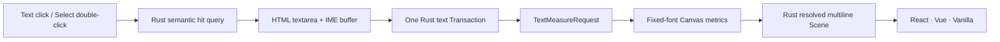

# Phase 1A Product Text

This slice turns the Phase 0 text/IME experiment into a persisted product path. The browser still owns DOM input and font measurement, while Rust remains the only owner of text elements, semantic hit testing, history, and Scene resolution.

## Product Contract

- Canvas text uses bundled `Noto Sans SC Variable` from `@fontsource-variable/noto-sans-sc@5.3.0` (OFL-1.1). Hosts wait for the 400 and 500 weights before creating an engine; UI chrome keeps its existing system-font stack.
- `T` activates Text and a primary click starts a new draft. In Select, double-clicking existing text asks Rust for the semantic target; the host never infers identity from an SVG node.
- The textarea overlay is positioned in world space and follows Camera changes. Enter inserts a newline, `Cmd/Ctrl+Enter` or blur commits, and `Escape` cancels.
- IME composition and every intermediate input value stay outside the Document. A non-empty create or changed edit produces one Command and one Undo entry; an empty new draft is a no-op, while clearing existing text invokes `delete_elements`.
- New text defaults to 24px/400 with auto width (`maxWidth: null`). The persisted `fontFingerprint` is supplied by the host and includes the fixed font epoch/status/family.

## Deterministic Measurement

- A committed or loaded text run without cached metrics makes `EngineUpdateV1.textMeasureRequest` non-null. `editor-web` measures it with Canvas 2D and calls `provideTextMetrics` until resolution converges.
- Metrics are cached by fingerprint and the complete stable run key. Providing metrics only advances Scene revision; it does not change Document revision, persistence state, or Undo/Redo.
- `lineBreaks` use Unicode code-point indices on both sides of the WASM boundary, so surrogate pairs such as emoji cannot shift later line boundaries.
- SVG receives already resolved `SceneTextRunV1` lines and only creates `<text>/<tspan>` nodes. It does not measure, wrap, or interpret persisted text.

## Acceptance

- Create, edit, multiline input, Chinese IME, cancel, empty-create no-op, clear-to-delete, move, Delete, Undo, Redo, persistence, and reload are covered through the Rust Command path.
- Text tool and fixed-font presentation remain identical across React, Vue, and Vanilla adapters; the framework-neutral packages keep no React/Vue imports.
- Real generated WASM verifies the fixed font is loaded and that each visible host can commit multiline text before delivery.

---
*Last updated: 2026-07-23 | Reason: productize fixed-font multiline text editing and two-phase metrics*
