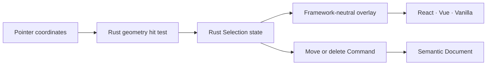

# Phase 1A Selection Tool

This slice turns the earlier rectangle-drag proof into an explicit single-selection editing model without creating a browser-side document or selection truth source.

## Interaction Contract

- A primary click selects the topmost semantic element under the world-space point; an empty-canvas click clears selection.
- Pointer drag previews in Rust and commits one `move_elements` Transaction on PointerUp. A click without movement does not change Document revision or history.
- `Delete` and `Backspace` delete the current selection through one Rust `delete_elements` Transaction; the toolbar exposes the same action for discoverability. `Escape` clears selection without changing Document revision.
- A newly created rectangle becomes selected. Undo/Redo restore Document content while Selection remains transient and is cleared if its element no longer exists.
- Phase 1A remains single-selection. Box selection, multi-select, resize, rotate, handles, snap and guides stay in Phase 1B.

## Ownership And Geometry

- [crates/nodeink-core/src/selection.rs#L1](../../crates/nodeink-core/src/selection.rs#L1) owns selection state, bounds and topmost rectangle/freehand hit testing. Stroke tolerance starts at `6px` in screen space and is converted through Camera zoom.
- [packages/editor-web/src/pointer-input.ts#L1](../../packages/editor-web/src/pointer-input.ts#L1) sends normalized world coordinates only. It does not send an SVG-derived element ID.
- Selection is returned beside Scene and history in the internal Engine update. It is not part of `NodeInkDocumentV1`, serialized snapshots, Camera storage or Undo history.
- [packages/renderer-svg/src/index.ts#L1](../../packages/renderer-svg/src/index.ts#L1) draws the Rust-provided visible painted bounds through `setOverlay`; a straight solid-blue ring sits 6px outside the element in screen space. The ring stays non-scaling, never receives pointer events, and exposes no misleading transform handles before those capabilities exist.
- [packages/editor-web/src/index.ts#L1](../../packages/editor-web/src/index.ts#L1) maps pointer and keyboard input to the shared engine contract. React, Vue and Vanilla hosts only expose the same actions and state.

## Verification

- Rust tests cover topmost rectangle hit testing, zoom-aware stroke tolerance, blank-canvas clearing, drag preview/commit, serialized-Document stability, and undoable deletion.
- Web tests cover protocol validation, DOM coordinate normalization without target IDs, overlay rendering, keyboard shortcuts, Controller actions, and React/Vue action parity.
- The full gate and real-WASM browser evidence are recorded in [docs/.state.md](../.state.md) when the slice completes.

---
*Last updated: 2026-07-22 | Reason: record the handle-free blue selection frame and zoom-stable gap*
