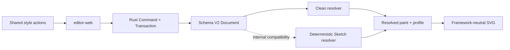

# Phase 1A Styles and Render Profile

> Current product status (2026-07-23): this slice originally proved the dual-profile engine boundary. React, Vue, and Vanilla now hide the profile toggle and use Clean as the product baseline. Rust keeps the persisted field and deterministic Sketch resolver for snapshot compatibility and tests until a later style-system/Sketch v2 redesign.

This slice completed the Phase 1A appearance and compatibility boundary without moving semantic state into a framework or renderer. The UI still exposes a deliberately small set of durable element-style presets; Rust validates and persists the exact values, owns Undo/Redo, and can resolve both Clean and legacy Sketch Scene nodes.

## Product Contract

- The top bar no longer exposes a Render Profile control. Current product acceptance and new documents use Clean; the versioned Sketch preset remains internal compatibility data.
- A compact contextual panel appears only for a writable Rust-owned selection. Rectangles expose fill, stroke, and width; strokes expose color and width; text exposes color, size, and alignment.
- Presets are finite and named in the UI. Fill uses mint, blue, amber, or none; stroke/text uses ink, emerald, blue, or rose; widths are 1/2/4px; text sizes are 18/24/32px; alignment is start/center/end.
- Each actual style change is one Command, one Document revision, and one Undo entry. Re-selecting the current preset is a no-op; invalid paint or a patch for the wrong element kind is atomically rejected. Internal profile commands retain their previous transactional semantics.

## Ownership and Determinism

- Schema V2 persists `renderProfile` and element paint. V1 snapshots migrate copy-on-write to Clean and the exact previous visual defaults, so refresh does not silently recolor existing content.
- `SelectionStateV1` carries a Rust-derived style presentation. UI adapters never inspect SVG attributes or deserialize a Document copy to determine active controls.
- Scene snapshots identify their resolved profile. Clean and Sketch both consume persistent element paint; Renderer only applies resolved attributes and never receives a random source.
- Text alignment changes semantic bounds and resolved `text-anchor`; font size changes reuse the existing two-phase fixed-font metrics protocol.

## Acceptance

- Rectangle, stroke, and text style changes round-trip through persistence, Undo, Redo, and reload.
- Internal Clean↔Sketch compatibility checks keep element IDs, kinds, geometry, and content unchanged; the same Document/Profile/font metrics/algorithm produces the same Scene hash across native Rust and WASM.
- React, Vue, and Vanilla show the same Clean product surface, active element-style presets, readonly gating, labels, and contextual visibility through one Controller contract.
- Real generated WASM verifies all three visible hosts before delivery.

---
*Last updated: 2026-07-23 | Reason: retire the experimental profile UI while preserving the engine compatibility boundary*
