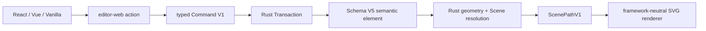

# Phase 1B 基础图形

> 日期：2026-07-23
> 状态：已实现并通过完整 gate 与真实 WASM 三宿主验收
> 边界：直接拖拽/点选创建、整元素编辑与有限样式；不包含持久顶点编辑、Connector 绑定/路由或 Sketch v2

## 用户可见行为

- React、Vue 与 Vanilla 工具栏提供 Rectangle、Ellipse、Diamond、Line、Polyline、Arrow；点击只进入创建工具，不再自动生成默认位置图形。
- Rectangle/Ellipse/Diamond/Line/Arrow 有效拖拽后一次提交、选中新元素并回到 Select；3px 以下拖拽不创建。框形支持 `Shift` 等边与 `Alt` 中心展开，Line/Arrow 支持 `Shift` 45° 吸附。
- Polyline 点选顶点，双击或 `Enter` 完成，`Backspace` 退点，`Escape` 取消；至少三个固定点前不会提交。
- 新图形创建后与 Rectangle 共用选择框、移动、缩放、旋转、Group、层级、剪贴板、对齐、吸附、删除与 Undo/Redo。
- Ellipse 与 Diamond 的上下文样式面板提供 fill、stroke 与 Size；Line、Polyline 与 Arrow 提供 stroke 与 Size。
- 本切片最初只编辑完整图形；完成后的 Line/Polyline/Arrow 顶点手柄、Polyline 插入/删除顶点与端点拖动现由独立的 [形状顶点编辑切片](phase1b-shape-vertex-editing.md) 承接。

## 持久语义

| kind | local geometry | style | minimum points |
| --- | --- | --- | --- |
| `ellipse` | `x/y/width/height` | fill/stroke/size | — |
| `diamond` | `x/y/width/height` | fill/stroke/size | — |
| `line` | `points` | stroke/size | exactly 2 |
| `polyline` | `points` | stroke/size | 3 |
| `arrow` | `points` + resolved arrowhead | stroke/size | 2 |

- 所有元素持有与其他 Phase 1B 元素相同的 affine transform；resize 不改写 Size。
- 连续重复点、非 finite 坐标、非法尺寸、非法颜色和非法 Size 在 Rust 与 TS 协议边界被拒绝。
- Arrow 是普通自由几何；未来 Connector 必须拥有独立的 source/target binding、port 与 route 语义。

## Scene 与 Renderer

- Rust 为 Ellipse、Diamond、Line、Polyline、Arrow 生成确定性的 SVG-compatible path data，并以稳定 `sourceElementId` 输出 `ScenePathV1`。
- Arrow 的箭头在最终 world space 解析并以 identity-transform Scene path 输出，使非等比元素/Group affine 不会按轴拉伸箭头；渲染、visual bounds 与 hit-test 使用同一几何。
- hit-test、visual bounds 与箭头头部范围使用同一 Rust 几何模块；选择不依赖 SVG DOM target。
- Renderer 继续只负责 Scene 投影、DOM patch 与 transform-independent document stroke，不认识新的 Document kind。
- 产品不暴露整板 Clean/Sketch 主题。旧 Sketch v1 profile 仍可读取，但不会成为基础图形的产品样式入口。

## Schema V4/V5 migration

- V3 文档先获得 V4 基础图形语义；V4 的数值 strokeWidth 再 copy-on-write 映射为 V5 `S/M/L/XL` Size，revision 只增加一次。
- V0/V1/V2 继续通过 Rust 迁移到当前 V5；未知 schema 与损坏 payload 返回结构化诊断。
- 源 payload 不被原地修改，迁移后的 canonical payload 必须先持久化为新 revision，才能授予 writer。

## 验收

- `pnpm check`：83 files 格式、lint、类型与 framework boundary 通过。
- `pnpm test`：20 个 Web test files、426 tests 通过。
- `pnpm coverage`：Web statements 95.34%、branches 90.73%、functions 95.70%、lines 95.60%；Rust 128 tests，regions 92.17%、functions 91.52%、lines 93.25%，所有逐文件门禁通过。
- `pnpm exec vp run rust:check`：fmt、Clippy、Rust tests 与 doc tests 通过。
- `pnpm build`：重新生成真实 WASM，并完成 React、Vue、Vanilla 三入口生产构建。
- 真实 WASM 直接创建验收：
  - Vanilla 在 `r458 / 22 elements` 上验证工具激活零提交、Shift 等边框形、Alt 中心椭圆、Shift 45° Line/Arrow、3px 以下 no-op，以及 Polyline 的退点/显式完成；六次有效创建到 `r464 / 28 elements`。
  - 六次 Undo 恢复为 `r470 / 22 elements`，自动保存与刷新后仍为原文档，不残留验收图形。
  - React 与 Vue 在同一 verified `r470 / 22 elements` 上分别验证 Shape 按钮只切换工具而不修改 Document；三宿主控制台均无错误。
  - Schema V5 之前的 Vanilla 回归在 `r508 / 9 elements` 验证两个不同方向、不同非等比 transform 的 2px Arrow 具有相同 12 world-unit 箭头长度、10.8 world-unit 开口宽度和相等翼长；Scene transform 为 identity，控制台无错误。V5 由新的 Size 单测与三宿主验收接续。

---

_Last updated: 2026-07-23 | Reason: migrate basic-shape paint to element-level Size_
