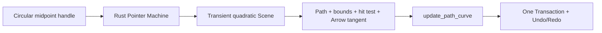

# Phase 1B Line/Arrow 曲线编辑



> 日期：2026-07-23
>
> 状态：已实现并通过完整 gate 与真实 WASM 三宿主验收
>
> 边界：Line 与两点 Arrow 的单段 quadratic curve；不包含 Polyline 曲线、多控制点、Connector binding、ports 或 routing

## 产品契约

- 单选 Line 或两点 Arrow 时显示两个方形 endpoint handle 和一个圆形 midpoint bend handle，不绘制矩形 bounds ring。
- 圆点位于 quadratic 的实际 `t=0.5` 曲线中点。拖动圆点实时弯曲路径；拖回首尾 chord midpoint 会恢复直线，而不是保存一个退化 curve。
- Endpoint 拖动、path 本体移动与现有 Shift 约束不变。Polyline 继续只显示持久顶点，不获得 curve handle。
- Arrow head 固定在持久 endpoint，并跟随曲线终点切线。S/M/L/XL 决定的 head length/opening 保持不变，不因 control 靠近 endpoint 而缩水。

## 持久语义与迁移

```ts
type PathCurveV1 = {
  kind: 'quadratic';
  control: Vec2;
};

interface CurvedPathFieldsV1 {
  points: [Vec2, Vec2];
  curve: PathCurveV1 | null;
}
```

- `curve` 属于 Rust Document；浏览器与 Renderer 不保存第二份曲线真相。
- `update_path_curve` 只接受 Line/Arrow，要求恰好两个有限且不重复的 points 以及有限 control。
- Schema V5→V6 copy-on-write 为 Line/Arrow 补 `curve: null`，revision 增加 1，源 payload 不修改；当前 V6 直接打开不迁移。
- 旧多点 Arrow 保持 `curve: null`，避免把已有折线语义静默改成单段曲线。

## 几何与交互

- Rust 将 world-space pointer 通过 resolved ancestor affine 的逆矩阵变回 element local midpoint。
- 对起点 `P0`、终点 `P2` 和拖动中点 `M`，control 为 `P1 = 2M - (P0 + P2) / 2`。
- Scene path 使用 `M P0 Q P1 P2`；精确 visual bounds 包含 quadratic 极值与 stroke expansion。
- Hit test 对同一 quadratic 做有界误差自适应展开；selection midpoint、paint、bounds 与 hit-test 不使用不同近似。
- Arrow 方向使用 `P2 - P1` 的 endpoint tangent；head 尺寸仍按首尾 chord 可用长度做短箭头保护。
- Pointer move 只产生 transient preview，PointerUp 只提交一个 Command/Transaction；DOM interruption 走现有最后可见 preview 提交路径，显式 `Escape`/工具切换取消。

## 框架边界

- `nodeink-core`：Document、Schema V6 migration、Command/Transaction、Pointer State、geometry、Scene、bounds 与 hit-test。
- `protocol` / `engine-web`：严格验证并桥接 `curve`、`update_path_curve` 与 `curve` selection handle。
- `renderer-svg`：只绘制 resolved quadratic path 和 screen-space 稳定的圆形 handle；endpoint 仍是方形，path editing 不显示 bounds ring。
- `editor-web`、React、Vue 与 Vanilla：继续复用同一个 Controller/Renderer/Engine Port，不新增框架专属曲线状态。

## 验收

- Rust：149 tests，覆盖 V5→V6 migration、显式 curve validation、midpoint/control 往返、曲线极值 bounds、自适应 hit-test、Arrow tangent/尺寸、preview、单次提交与 Undo/Redo。
- Web：20 files / 446 tests；Protocol 覆盖 curve element/command/handle 的正反边界，Renderer 覆盖圆形 handle、稳定 screen size 与无 bounds ring。
- Coverage：Web 95.32% statements、91.08% branches、95.76% functions、95.57% lines；Rust 92.24% regions、92.21% functions、93.16% lines。
- 完整 gate：`pnpm install --frozen-lockfile`、`pnpm check`、`pnpm test`、`pnpm coverage`、`pnpm exec vp run rust:check` 与 `pnpm build`。
- 真实 WASM Vanilla：创建 Line/Arrow 后均显示两方形 endpoint + 一圆形 midpoint handle；弯曲后 Scene 使用 `Q`，没有矩形 bounds ring，Undo 恢复 `L`，Redo 恢复 `Q`。M Arrow head 实测 length `40`、opening `36`，head direction 与 endpoint tangent 的叉积约为 `-7.3e-12`。
- React/Vue：同一 verified `r559 / 9 elements / 92%` 文档均恢复两条 quadratic path，无 alert 或 console warning/error；最后保留 Vanilla 选中曲线 Arrow 供人工验收。

---

_Last updated: 2026-07-23 | Reason: record the completed Schema V6 midpoint curve-editing slice_
