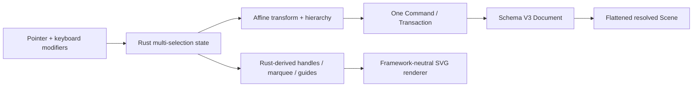

# Phase 1B Editor Foundation

This slice completes the minimum direct-manipulation foundation shared by React, Vue, Vanilla, and future SDK hosts. Persistent mutations remain Rust-owned; selection, active gestures, marquee, snap candidates, and guides are transient Editor State and never enter persistence or Undo history.

## Product Contract

- Click selects the topmost semantic element. `Shift` toggles click or marquee results. Marquee selects elements whose painted visual bounds intersect the box.
- A normal click on grouped content selects its outermost group; `Cmd/Ctrl+click` pierces to the leaf. Nested groups are valid, while grouping only accepts siblings under one parent.
- The overlay exposes eight resize handles and one rotate handle for compatible selections. Resize clamps before zero instead of flipping; `Shift` preserves aspect ratio, `Alt` resizes about center, `Shift` move locks to the dominant horizontal/vertical axis, and `Shift` rotation snaps the final world orientation to absolute 45° increments.
- Rectangle, Stroke, Group, and mixed multi-selection use full affine composition. Stroke width remains a style width: element/Group resize does not stretch it, while Camera zoom still changes its screen projection. Text has left/right width handles and corner size handles; no standalone top/bottom text handles.
- Group inserts at the highest selected draw position and preserves child order. Ungroup is explicit; deleting a group deletes its subtree.
- Bring forward/backward/front/back only reorders siblings and preserves selected relative order. A boundary action is a no-op without revision/history.
- Copy exports a versioned Rust-validated opaque payload; browser code stores but does not interpret it. Copy has no revision, Cut/Paste each commit once, Paste remaps IDs and offsets the subtree by 24 screen pixels per cascade.
- Align exposes left/center/right/top/middle/bottom over painted visual bounds. Distribute is not part of this slice.
- Moving snaps to unselected element edges and centers within 6 screen pixels. `Cmd/Ctrl` temporarily disables snapping; a stable tie-break chooses smallest correction, draw order, then ID. Guides exist only while an actual snap is active.

## Schema and Ownership

- Schema V3 adds an affine matrix to every element and Group `childOrder`. V2 migrates copy-on-write with identity transforms so resolved visuals remain unchanged.
- `rootOrder` contains only roots. Every non-root has exactly one parent; the hierarchy is acyclic and all element IDs appear exactly once in a root or child order.
- Scene resolution flattens hierarchy in draw order and emits final element/world transforms. Renderer only applies resolved matrices and paints Rust-provided overlays.
- Pointer up emits at most one Transform Command. Document gesture ownership is decided on PointerDown and preserved through PointerUp. DOM `pointercancel`, lost capture, or focus loss finalizes the last visible transform; `Escape` and tool switching remain explicit cancellation paths that restore the pre-gesture document.
- Text metrics stay non-persistent. Transforming text reuses local metrics; editing overlays consume the selected text world transform.

## Acceptance

- Marquee, toggle multi-select, move, resize, rotate, group/ungroup, four z-order actions, copy/cut/paste, six align actions, snapping, and guides work through the same Controller on all three hosts.
- Every persistent action is one Undo entry; no-op, Copy, selection, marquee, preview, guide, and cancel do not increment Document revision.
- V2 migration preserves geometry, paint, text, Profile, and canonical ordering; malformed affine/hierarchy/clipboard payloads are rejected atomically.
- Overlay stroke, gaps, handles, hit regions, and snap thresholds remain screen-space stable from 10% to 800% Camera zoom.
- Full Web/Rust gates and real generated WASM cover the complete workflow before delivery.

---
*Last updated: 2026-07-23 | Reason: make incidental DOM interruption preserve the last visible transform*
