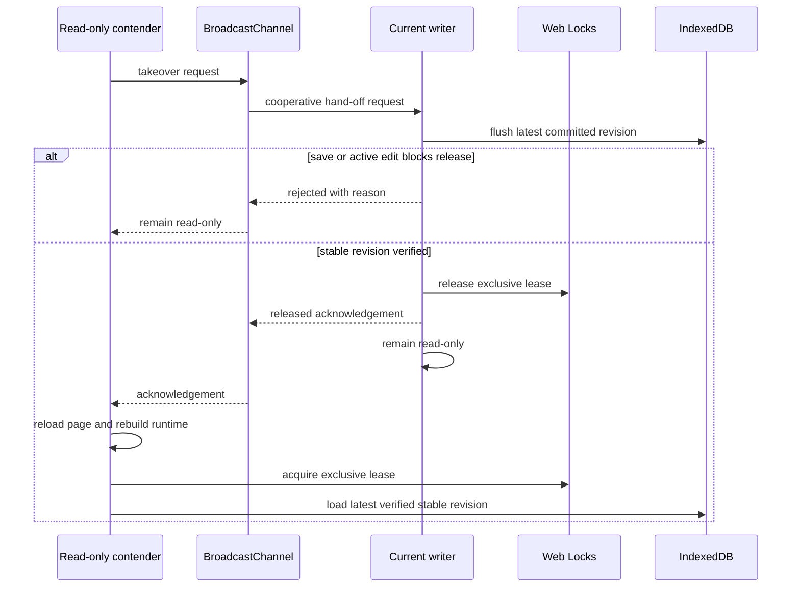

# Phase 1B 显式编辑权接管

> 日期：2026-07-23
> 状态：已实现并通过真实 WASM 三宿主验证
> 边界：同一浏览器存储分区、同一 origin 的单文档显式接管；不包含共同编辑、跨浏览器接管、多文档库或 P-05 恢复包导出

## 用户可见行为

- 第二页面仍以只读方式打开，但会显示明确的 `接管编辑权` 操作；编辑工具保持禁用，Camera 仍可独立浏览。
- 发起接管后，当前 writer 先保存最新已提交 revision，再释放 Web Lock。旧页面显示“编辑权已转移到另一页面”，并保持只读。
- 新页面只在收到释放确认后重新加载；重新加载会创建新的 Rust Engine，并重新执行 Web Lock 获取、snapshot hash/schema/migration 校验和 IndexedDB revision 恢复。
- 保存失败、仍有未持久化 revision、正在进行指针手势或文本输入时，writer 拒绝释放。发起页面保持只读并显示可重试原因。
- writer 未响应时请求超时；超时和 BroadcastChannel 消息都不会被解释为已经取得写入权。

## 安全不变量

1. BroadcastChannel 只传输接管请求与成功/失败回执，不证明 lease 所有权。
2. Web Lock 仍是浏览器内单 writer 的直接授权，IndexedDB expected revision 仍是最终事务护栏。
3. writer 只有在持久化 coordinator 报告 `pendingRevision === persistedRevision` 且无 `save_failed` 后才释放。
4. 发起页面不能把已经打开的只读 Document 切成可写；它必须重载并从 verified stable snapshot 构造新 Engine。
5. 每个 writer 只确认一个成功接管请求；并发请求不能让多个页面同时收到成功回执。
6. 不支持 BroadcastChannel 时不显示接管操作，原有“关闭其他页面后刷新”的 Web Lock 安全边界不变。

## 所有权与关键文件

- [packages/persistence-web/src/document-takeover.ts](../../packages/persistence-web/src/document-takeover.ts) 定义一次性 request/released/rejected 握手、超时和并发请求边界。
- [packages/editor-web/src/index.ts](../../packages/editor-web/src/index.ts) 统一接管 action/state/presentation，并在 flush 成功后把旧 writer 降级为 `readonly/taken_over`。
- [apps/playground/src/create-controller.ts](../../apps/playground/src/create-controller.ts) 组合 BroadcastChannel、Web Lock lease、页面重载与资源释放；框架 adapter 不持有 lease 语义。
- [packages/editor-react/src/index.tsx](../../packages/editor-react/src/index.tsx)、[packages/editor-vue/src/index.ts](../../packages/editor-vue/src/index.ts) 与 [apps/playground/src/vanilla.ts](../../apps/playground/src/vanilla.ts) 只渲染共享接管 presentation 和 action。

## 验证

- 单测覆盖成功回执顺序、writer 拒绝后重试、超时不猜测所有权、跨文档隔离、dispose、保存失败、活动手势、旧 writer 降级、重载顺序和三宿主 action 映射。
- 真实 generated WASM 在同一 origin 完成：
  - Vanilla writer 保存 `r1`，第二 Vanilla 页面从 `r1` 只读接管后成为 writer，并保存到 `r2`。
  - React 从 `r2` 只读接管，旧 Vanilla 立即保持只读；React 保存到 `r3`。
  - Vue 从 `r3` 只读接管，旧 React 立即保持只读；Vue 保存到 `r4`。
- 每次新 writer 都显示接管前最后一个 stable revision 和 element count，再允许下一次 Rust Transaction；旧 writer 的全部文档编辑操作保持禁用。

## 后续边界

- 不同浏览器、不同 profile 或不同设备不共享 Web Locks、BroadcastChannel 与 IndexedDB；本切片不声称能够跨这些边界发现或接管 writer。
- 多文档列表、回收站和永久删除仍受 P-04 决策约束。
- 损坏数据的恢复副本/诊断包仍受 P-05 决策约束，本切片没有新增导出能力，也没有让 fallback snapshot 可写。

---

_Last updated: 2026-07-23 | Reason: record cooperative same-origin lease takeover and real-WASM host parity_
