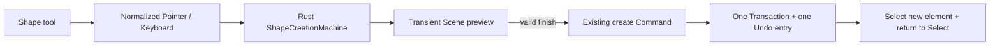

# Phase 1B 形状直接创建

> 日期：2026-07-23
> 状态：已实现并通过完整 gate 与真实 WASM 三宿主验收
> 边界：创建阶段的直接操作；完成后的顶点编辑与 Connector 语义另行设计

## 交互契约

| 工具 | 输入 | 约束 | 完成 |
| --- | --- | --- | --- |
| Rectangle / Ellipse / Diamond | 拖拽 bounds | `Shift` 等边，`Alt` 中心展开 | 有效 PointerUp |
| Line / Arrow | 拖拽起终点 | `Shift` 吸附绝对 45° 增量 | 有效 PointerUp |
| Polyline | 逐点点击 | `Shift` 约束新线段到 45° | 双击或 `Enter`，至少 3 点 |

- 点击工具按钮只切换 active tool，不创建默认位置元素。
- 小于 3px screen-space 的拖拽是 no-op，工具保持激活，便于立即重试。
- Polyline 的 `Backspace` 删除最后一个固定点；删空、`Escape` 或工具切换会取消 preview。
- 有效完成只产生一个既有 create Command/Transaction，随后选中新元素并回到 Select。
- DOM capture loss、`pointercancel` 与窗口失焦沿用输入层的 interruption finalization，提交最后已显示的有效拖拽；显式编辑器取消才丢弃 preview。

## 所有权

- `editor-web` 负责 DOM capture、screen/world 坐标规范化、double-click 与键盘动作映射。
- `nodeink-core` 持有创建状态、阈值、修饰键约束、瞬态几何、命令 ID、expected revision 与单次 commit。
- preview 通过 resolved Scene 输出，但不进入 serialized Document、元素计数、Undo history 或 IndexedDB。
- Renderer 继续只画 Scene；React、Vue 与 Vanilla 只组合同一个 framework-neutral Controller。
- 内部 programmatic `create_*` action 继续服务 SDK/自动化调用，不再绑定产品工具栏点击。

## 验收

- `pnpm check`、`pnpm test`、`pnpm exec vp run rust:check` 与 `pnpm build` 通过。
- Web：20 files、426 tests；coverage 95.34% statements、90.73% branches、95.70% functions、95.60% lines。
- Rust：128 tests；coverage 92.17% regions、91.52% functions、93.25% lines，逐文件门禁通过。
- Vanilla 真实 WASM 从 `r458 / 22 elements` 验证六类创建、约束、no-op 与 Polyline 生命周期，再经六次 Undo 恢复并持久化为 `r470 / 22 elements`。
- React 与 Vue 在相同 verified 文档上验证按钮只进入创建工具且保持零提交；三宿主控制台无错误。

---

_Last updated: 2026-07-23 | Reason: record the Rust-owned direct shape-creation contract_
