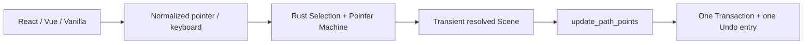

# Phase 1B 形状顶点编辑

> 日期：2026-07-23
> 状态：已实现并通过完整 gate 与真实 WASM 三宿主验收
> 边界：Line/Polyline/Arrow 既有 points 的直接编辑；不包含 Connector binding、ports 或 routing

## 交互契约

| 形状 | 手柄 | 可编辑动作 |
| --- | --- | --- |
| Line | 两个端点 | 拖动任一端点 |
| Arrow | 首尾两个端点 | 拖动任一端点，本期不增删点 |
| Polyline | 每个持久 point | 拖动；双击线段插点；删除已选点 |

- 单选线类元素时只显示顶点手柄，不绘制矩形 bounds ring，也不显示八向 resize/rotate 手柄；拖动 path 本体仍移动完整元素。
- 手柄尺寸、描边和命中半径使用 screen-space，Camera 缩放不会让它们难以操作。
- 拖动中的 points 只进入 Rust preview Scene；PointerUp 形成一个 `update_path_points` Command/Transaction 和一个 Undo entry。
- `Shift` 把当前编辑点与相邻点形成的线段约束到 45° 增量；Polyline 内部顶点选择所需修正最小且稳定的相邻段。
- 双击选中 Polyline 的线段时，Rust 在 10px screen-space 范围内选择最近线段并插入投影点；插入后新点保持选中。
- `Delete`/`Backspace` 优先删除已选 Polyline 顶点，至少保留三个点；Line/Arrow 顶点删除是 no-op。没有顶点选择时仍删除整个元素 subtree。
- DOM capture loss、`pointercancel` 与窗口失焦提交最后可见 preview；`Escape`、清空选择或工具切换取消并恢复原 Document。

## 所有权

- `nodeink-core` 持有 path points、顶点选择、handle hit target、world/local affine 换算、45° 约束、preview 与原子 Command。
- `nodeink-wasm` 和 `engine-web` 只桥接插点/删点 API 及版本化 JSON，不解释几何。
- `editor-web` 只把 double-click、Delete/Backspace 与规范化 Pointer 路由到 Engine Port；React、Vue 与 Vanilla 不各自实现编辑逻辑。
- `renderer-svg` 只消费 Selection overlay，使用 `vertexIndex` 生成稳定 handle 标识，在纯顶点手柄态省略 bounds ring，并保持 non-scaling stroke。
- 持久 Document 仍是唯一真相；未完成 preview、当前顶点和 handle paint 不进入 IndexedDB。

## 不变量

- Line 始终恰好两个有限且不重复的点；Polyline 至少三个点；Arrow 至少两个点。
- 嵌套 Group、旋转、缩放与平移下，handle 使用 resolved world position，提交 points 仍保持 element local space。
- Stroke width 是持久样式，不因顶点编辑、元素 transform 或 Group transform 被写入几何。
- 每次有效拖动、插点或删点只增加一次 revision；no-op、取消与 preview 不增加 revision/history。
- 普通 Arrow 仍是自由几何。未来 Connector 必须使用独立领域对象表达 source/target binding、port 与 route。

## 验收

- 单元测试覆盖 Line/Arrow/Polyline 手柄、Rust preview、Shift 45°、嵌套 affine、Arrow world-space 箭头稳定性、插点、删点、三点下限、取消、单次提交与 Undo/Redo。
- 协议测试覆盖 `update_path_points`、indexed vertex handles 与 vertex edit update 边界；Renderer 测试覆盖稳定 handle 尺寸、已选样式和顶点编辑态无矩形外框。
- `pnpm install --frozen-lockfile`、`pnpm check`、`pnpm test`、`pnpm coverage`、`pnpm exec vp run rust:check` 与 `pnpm build` 通过。
- Web：20 files、436 tests；coverage 95.31% statements、90.95% branches、95.75% functions、95.56% lines。
- Rust：139 tests；coverage 92.01% regions、91.45% functions、93.01% lines。
- Vanilla 真实 WASM 从 `r484 / 9 elements` 验证 Line/Arrow 两端点、Polyline 七顶点、自由拖动、Shift 垂直吸附、双击投影插点、Backspace 删点、Undo/Redo 与 path 本体移动；后续可见检查确认 Line、Arrow、Polyline 无矩形 bounds ring，而 Rectangle 仍有 oriented ring 和九个变换手柄。两个方向与非等比 transform 不同的 2px Arrow 均解析为 12 world-unit 箭头长度、10.8 world-unit 开口宽度和相等翼长，Scene 使用 identity transform，bounds/hit-test 与画面一致。全部临时改动恢复原几何并保存、重载一致。
- React 与 Vue 在同一 verified 文档上各自解析并绘制两个 Line 端点手柄；三个宿主控制台无 warning/error。

---

_Last updated: 2026-07-23 | Reason: keep Arrow heads stable across affine transforms_
