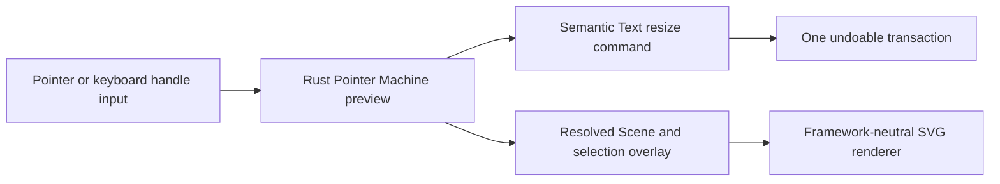

# Phase 1B Text Resize and Accessible Handles

## Product contract

- A singly selected Text element exposes left/right width handles, four proportional corner
  handles, and the existing rotate handle. It does not expose standalone top/bottom handles.
- Dragging a width handle changes persistent `maxWidth` and live text reflow without changing
  `fontSize`. Auto-width text becomes fixed-width. The browser text-metrics adapter returns soft
  break positions for unbroken Latin, numeric, CJK, and emoji content instead of merely clipping
  the measured width.
- Dragging a corner always performs semantic proportional scaling: persistent `fontSize` changes,
  fixed `maxWidth` scales with it, and auto-width remains auto-width. Text glyphs are never
  stretched by a resize affine. The dragged corner follows the closest point on its original
  corner-to-pivot proportional axis, so a short Text dimension cannot make the handle jump far
  past the pointer.
- Mixed selection, Group, and multi-selection keep the generic affine transform behavior.

## Ownership and transaction boundary

- Rust hit testing identifies the single-Text specialization and the Pointer Machine owns its
  preview state.
- Preview text geometry is applied to a transient Document clone so the existing two-phase browser
  measurement can resolve live reflow without incrementing Document revision.
- PointerUp emits one `resize_text` Command and one undo entry. Explicit cancel discards the
  transient preview.
- `renderer-svg` only renders resolved Text and selection controls. It does not infer text layout
  or resize semantics.

## Keyboard and screen-reader contract

- Every visible selection handle is a named, focusable SVG button with a visible focus treatment.
- `Enter` or `Space` grabs and commits a handle. Arrow keys adjust by one screen pixel;
  `Shift+Arrow` adjusts by ten screen pixels and preserves Rust modifier constraints. `Escape`
  cancels.
- Rotate arrows use one-degree steps; `Shift` uses the existing absolute 45-degree constraint.
- Instructions and grab/preview/commit/cancel state are announced through a framework-neutral live
  region.
- A keyboard grab uses the same normalized pointer stream as pointer input, so one grab session
  produces at most one undoable transaction across React, Vue, and Vanilla.

## Acceptance evidence

- Rust tests cover auto-to-fixed side reflow, fixed and auto proportional corner scaling,
  closest-point pointer coupling, non-distorted Scene transforms, preview metric round trips,
  cancel/history behavior, and Undo.
- Protocol tests strictly parse `resize_text` and reject invalid font/width values.
- Renderer and Controller tests cover roles, labels, focus restoration, screen-pixel movement,
  Shift steps, rotation, announcements, commit, and cancel.
- Text-metrics tests cover explicit newlines and fixed-width soft wrapping without splitting
  Unicode code points.
- Final verification uses the full repository gate and real generated WASM on `/`, `/vue.html`, and
  `/vanilla.html`.

---
*Last updated: 2026-07-23 | Reason: document semantic Text resize and accessible selection-handle delivery*
