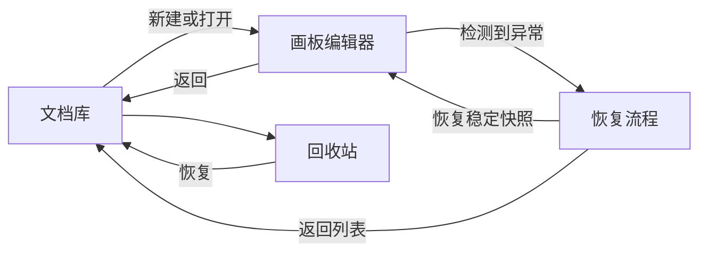

# NodeInk 产品规格

> 状态：Proposal v0.1
> 本文回答交付物 1—5，并定义后续架构文档使用的产品边界。

## 1. 一页式产品定义

### 产品定位

NodeInk 是一个本地优先、AI Native、可编程的视觉画板。它允许用户先自由落笔，再逐步把内容组织成可编辑、可连接、可布局、可由程序操作的语义对象。

品牌表达保持不变：

- 英文 Slogan：Ink freely. Connect ideas.
- 中文 Slogan：自由落笔，连接想法。
- 产品理念：From ink to structure. / 从自由表达，到结构化理解。

### 要解决的问题

现有工具通常在两端分裂：白板擅长自由表达但语义弱，图表工具结构清晰但表达成本高；AI 如果只能生成 SVG 或像素，就难以安全、可验证地继续编辑。NodeInk 的核心主张不是“再做一个白板”，而是让自由图形、结构化关系和程序化操作共享同一个稳定文档模型。

### Phase 1 产品承诺

用户无需登录即可创建画板，完成绘制、选择、编辑和撤销；内容会可靠保存在本地，刷新或重启浏览器后可以恢复。当前产品以 Clean 作为统一视觉基线，内容可以通过内部结构化操作创建和修改；完整风格系统在核心编辑能力成熟后再设计。

Phase 1 验证的是三件事：

1. Rust/WASM 语义引擎能否支撑低延迟编辑体验。
2. Semantic Document → Resolved Scene → SVG Renderer 的边界是否成立。
3. 本地快照、迁移与恢复是否足以建立“数据不会轻易丢失”的信任。

Phase 1 不验证 AI 自动制图的市场需求，也不验证公共 SDK 的 API 稳定性。

### 核心原则

- **Local First**：无账号、无后端也能完成首期全部工作。
- **Semantic First**：持久化的是用户意图和领域对象，不是 SVG DOM 或 Canvas 指令。
- **Renderer Independent**：Renderer 消费平台无关 Scene，不拥有文档真相。
- **Framework Neutral**：渲染器与 Web Editor Controller 不依赖 React/Vue；UI 框架只是可替换宿主。
- **AI Native**：人、SDK、CLI、MCP 和 Agent 最终共享版本化语义操作。
- **Deterministic by explicit inputs**：随机种子、字体度量、Profile 和引擎版本都是显式输入。
- **Progressive Complexity**：未来边界先定义，未来模块按真实调用关系再拆分。

### 成功定义

首期成功不是“功能数量多”，而是以下闭环成立：

- 用户能在桌面浏览器快速进入画布并持续编辑已有元素。
- 一次手势对应一个清晰的撤销单元，取消操作不会污染文档。
- 保存失败、快照损坏和第二标签页冲突都有可理解的恢复路径。
- 同一份 Semantic Document 可以被 SVG Renderer 和最小测试 Renderer 消费。
- 基础结构化操作可以在不触碰 Renderer 的情况下创建、移动和修改元素。

### 产品体验方向

NodeInk 的 UI 体验以 tldraw 和 Excalidraw 为参考系，但不是界面复刻：

- 借鉴 tldraw：画布优先、低干扰 chrome、直接操作、单一活动工具、上下文属性和一致的 action/shortcut 入口。
- 借鉴 Excalidraw：无需学习即可落笔、工具可发现、手绘风格亲和、常用图形创建路径短。
- NodeInk 自己强化：本地保存状态、快照恢复、语义对象类型和未来程序化操作必须可见、可解释。
- 不借入首期：协作、分享、素材库、模板、导出中心及复杂账户入口。

默认编辑器采用“必要时出现”的界面：未选择对象时让画布占主导，选中对象后只展示相关属性；高级语义能力以后通过上下文工具加入，不把未来入口预埋成空按钮。

## 2. 目标用户与核心场景

### 2.1 用户优先级

#### P0：普通创作者

首期唯一需要完整体验闭环的用户。他们用鼠标、触控板或桌面手写笔快速记录、画草图、组织想法，并期望下次打开仍能继续编辑。

#### P1：引擎与嵌入开发者

Phase 1 的内部协议需要可测试、可调用，但不承诺公共 npm API。Phase 3 再把验证过的 Command、Scene 和宿主生命周期整理为公共 SDK。

#### P2：AI Agent

首期只验证少量基础 Diagram Operation 能映射到同一 Command 入口。自然语言规划、MCP Transport、Agent Skill 和生产级批量制图不属于 Phase 1。

### 2.2 核心场景

#### 场景 A：快速创建并继续编辑

1. 用户从文档列表创建空白画板。
2. 进入画布后绘制矩形、文字或自由笔迹。
3. 切换选择工具，移动或修改刚创建的内容。
4. 离开并重新打开后，元素仍可继续编辑。

#### 场景 B：在统一视觉基线上持续编辑

1. 用户在 React、Vue 或 Vanilla 宿主中看到一致的 Clean 画布。
2. 元素内容、几何和样式仍由同一 Semantic Document 驱动。
3. 当前产品不展示实验性 Render Profile 开关，避免未定稿画风干扰核心能力验收。
4. Rust 保留旧 Profile 与确定性 Sketch resolver 的内部兼容边界，待核心功能成熟后统一重做风格系统。

#### 场景 C：可靠自动保存与恢复

1. 每次已提交事务推动 document revision。
2. 保存调度器合并短时间内的 revision，并显示“保存中/已保存/失败”。
3. 打开文档时先验证当前快照；失败则尝试上一个稳定快照。
4. 恢复永不静默覆盖原始坏数据，用户可以复制恢复结果或取消。

#### 场景 D：冲突受控的本地多标签页

1. 第一个标签页取得文档写入权。
2. 第二个标签页默认以只读方式打开，并说明原因。
3. 用户可关闭另一标签页后重试，或明确接管；接管前必须刷新到最新稳定 revision。
4. 无法确认写入权时禁止 last-write-wins。

#### 场景 E：结构化操作验证

1. 测试或内部脚本提交版本化 Operation Batch。
2. 引擎验证 schema、目标 ID、expected revision 和参数。
3. 全部操作在单个事务内成功，或整体失败并返回结构化错误。
4. Renderer 只接收 ScenePatch，不知道操作来自 UI 还是程序。

## 3. 产品信息架构

### 3.1 页面与层级

#### 文档库

- 显示文档标题、最后编辑时间和恢复状态。
- 提供新建、打开、移入回收站和进入回收站。
- 空状态只保留一个主要动作：“新建画板”。
- 明确提示“仅保存在此浏览器”，不暗示云同步。

#### 画板编辑器

- 顶部：返回、文档标题、保存状态和宿主标识。
- 左侧工具区：选择、平移、图形、自由笔、文本。
- 中心：无限画布与选区/吸附/文本编辑覆盖层。
- 右侧上下文面板：仅在当前选择可编辑时出现样式与几何属性。
- 画布角落：缩放比例、放大/缩小、适应内容。

#### 恢复流程

- 保存失败：保留内存状态，允许重试，不显示“已保存”。
- 当前快照损坏：展示上一个稳定快照的信息，允许恢复副本。
- 迁移失败：保持原快照，进入只读恢复状态。
- 标签页冲突：显示当前只读状态和重新获取写入权的操作。

#### 回收站

- 删除文档先进入回收站。
- 支持恢复和明确的永久删除。
- MVP 不做定时自动清理，避免引入未经确认的保留期。

### 3.2 状态分层

| 层 | 典型内容 | 是否持久化 | 所有者 |
| --- | --- | --- | --- |
| Document | 元素、顺序、样式、内部兼容 Profile | 是 | Rust Semantic Document |
| Catalog | 标题、更新时间、删除状态、稳定快照指针 | 是 | TypeScript persistence adapter |
| Session | Camera、当前工具、选择、面板开关 | 部分 | TypeScript host + Rust editor state |
| Transient | Pointer capture、悬停、拖拽预览、IME composition | 否 | Rust/TypeScript 按边界协作 |
| Recovery | 保存错误、冲突、候选快照、迁移报告 | 仅诊断所需部分 | TypeScript recovery coordinator |

选择和当前工具不进入 Semantic Document。Camera 是否按文档恢复属于产品待确认项；建议只持久化最后 Camera，不持久化选择。

### 3.3 关键体验状态

- 启动：`loading → ready | load_error | recovery_available`
- 编辑：`idle | drawing | selecting | transforming | text_editing`
- 保存：`clean | dirty | saving | saved | save_failed`
- 文档权：`writer | readonly_conflict | acquiring | takeover_failed`
- 删除：`active | trashed | permanently_deleted`

所有工具必须支持 Escape 取消；所有破坏性动作提供确认或可撤销恢复。键盘焦点、屏幕阅读标签和 reduced motion 是 Web 首期基线，不是后续润色项。

## 4. MVP 范围

### 4.1 Phase 1A：端到端最小闭环

Phase 1A 只证明核心架构和可信编辑闭环：

#### 画布与输入

- 无限平面、平移、缩放、适应内容。
- 屏幕坐标与世界坐标转换。
- Pointer Event 标准化、pointer capture 和批量 move 输入。
- 视口外 SceneNode 不挂载到 SVG DOM 的基础裁剪。

#### 元素

- 矩形。
- 纯文本、多行文本、IME 输入。
- 自由笔迹默认使用确定性平滑曲线；原始采样保留在 Document，圆点与 `Shift` 直线保持精确。Pressure 与可变宽笔刷作为后续独立能力。
- Clean 产品视觉基线；Render Profile 与 Sketch resolver 仅保留为内部兼容能力。

#### 编辑

- 创建、单选、移动、删除。
- 样式修改：stroke、fill、stroke width、文本字号/颜色/对齐。
- 每次创建、移动、删除、样式修改形成一个撤销单元。
- 文本编辑在 composition 结束或明确提交后进入 Command。

#### 持久化

- 单文档当前快照与上一个稳定快照。
- 自动保存状态、刷新恢复、浏览器重启恢复。
- schemaVersion、校验、一次示例迁移和损坏回退。

#### 可编程验证

- 内部类型化 Bridge 支持 create、update、move、delete 基础元素。
- 最小 headless/test renderer 消费同一 Resolved Scene。
- 不发布公共 SDK、CLI、MCP 或 Skill。

### 4.2 Phase 1B：基础编辑器完整性

在 Phase 1A 指标通过后增加：

- 椭圆、菱形、直线、折线、箭头。
- 框选、多选、缩放、旋转。
- 图层顺序、分组与取消分组。
- 复制、粘贴；首期仅保证 NodeInk 内部元素与纯文本。
- 基础对齐、对象吸附、画布辅助线。
- 文档库、多文档、回收站、恢复副本。
- 标签页单写者协调与冲突界面。
- 保存失败重试、迁移失败和损坏恢复的完整状态。

### 4.3 MVP 中只保留边界的能力

- `Connector` 与普通 Arrow 分离，但 Phase 1 不实现绑定端点。
- 布局使用独立输入/输出契约，但不实现 Mind Map 或 Flow Layout。
- Diagram Operation 复用 Command 入口，但只验证基础元素操作。
- Mermaid 导入保留独立 Adapter 和兼容性描述边界；Phase 1 不加载 parser，也不把 Mermaid Source 当作文档格式。
- SceneNode 具有可扩展 kind，但 Phase 1 schema 不加入 Frame、Animation 等空壳类型。
- Renderer 接口不含 SVG 类型，但只交付 SVG Renderer 与测试 Renderer。
- `renderer-svg` 与 `editor-web` 使用原生 DOM/TypeScript contract；官方 React UI 只通过 adapter 订阅 Controller state/actions。

### 4.4 支持平台

- 主平台：桌面 Web。
- 主要输入：鼠标与触控板；桌面手写笔的 Pointer/pressure 数据进入 Phase 0 验证。
- 移动端触控可打开文档不是首期验收项；触摸优先工具布局和原生移动应用后置。
- 精确浏览器矩阵在 Phase 0 实测后冻结，不在方案阶段绑定具体版本号。

## 5. 非目标

### 5.1 Phase 1 明确不做

- 登录、账号、云存储、跨设备同步。
- 多人协作、CRDT、评论、权限、在线版本历史。
- 通用导入导出、跨产品兼容、模板市场。
- 图片、视频、音频资产编辑。
- 完整移动端或触摸优先体验。
- 完整思维导图、流程图和 Mermaid 语法覆盖，以及 BPMN、UML、ER、泳道图；Mermaid 是长期导入兼容目标，但不属于 Phase 1。
- 生产级 AI 自动制图、AI Copilot、完整 MCP Server、CLI 和 Agent Skill。
- 交互原型、Frame、演示模式、变量与状态切换。
- 动画时间轴、关键帧、路径动画。
- Canvas 2D/WebGL/Native Renderer。
- 用户插件、自定义元素市场和公共扩展 ABI。
- 多页面 Document；首期一个 Document 对应一个无限画布。

### 5.2 架构上也不提前实现

- 不创建 `animation`、`diagram-layout`、`mcp`、`cli`、`renderer-canvas` 等空 package。
- 不因为未来协作而引入 CRDT ID、Lamport Clock 或 tombstone 到首期核心模型。
- 不为未知插件设计动态 Rust ABI。
- 不用二进制协议替代所有 JSON；只对经 benchmark 证明的高频边界优化。
- 不默认启用 Web Worker；只有主线程预算不达标时才切换。
- 不承诺修改原生图形后可以无损还原 Mermaid Source；兼容目标是“导入并原生编辑”，不是双向源码编辑器。

### 5.3 需要单独决策的安全例外

“用户可见导入导出”仍是非目标，但本地优先产品是否允许在恢复失败时下载诊断恢复包尚未确认。该能力若获批，只能出现在错误恢复流程，不应演变成通用文件格式承诺。
