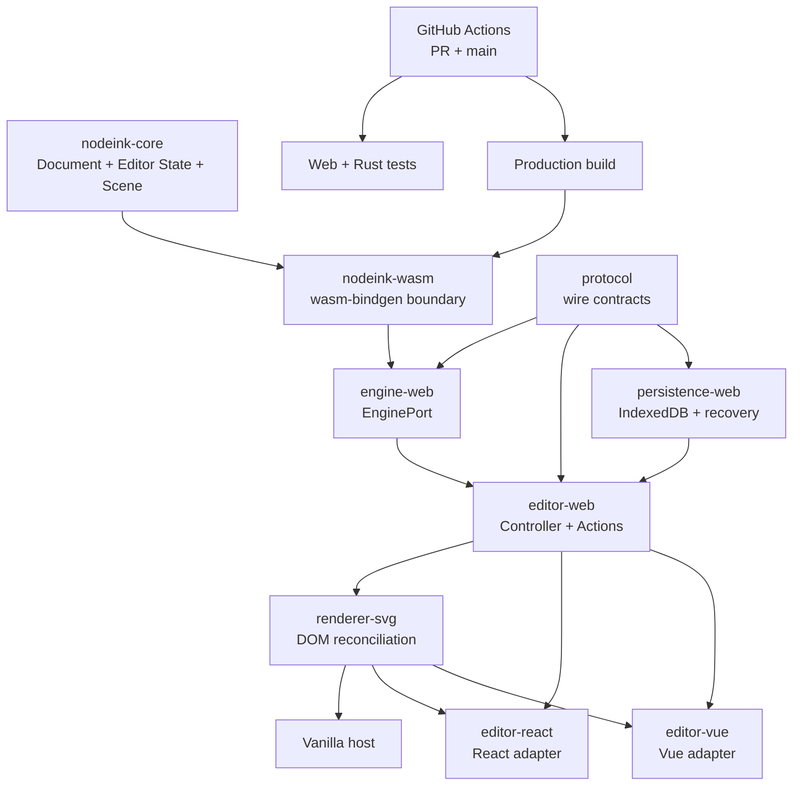

# Project Structure



NodeInk is a pnpm/Cargo monorepo. Rust owns persistent editor semantics; TypeScript adapts that engine to browser events and DOM rendering; framework hosts remain replaceable leaves.

## Directory Layout

```text
apps/playground/            React, Vue, and Vanilla integration hosts
.github/workflows/          Pull request and main-branch CI
crates/nodeink-core/        Document, commands, history, transient Editor State, geometry, Scene resolution
crates/nodeink-wasm/        wasm-bindgen API over nodeink-core
packages/protocol/          TypeScript wire types and runtime parsing
packages/engine-web/        Generated WASM loading and EnginePort implementation
packages/editor-web/        Framework-neutral Controller and editor actions
packages/renderer-svg/      Framework-neutral SVG DOM renderer
packages/persistence-web/   Framework-neutral IndexedDB persistence and recovery
packages/editor-react/      Optional React adapter
packages/editor-vue/        Optional Vue adapter
scripts/                    Cargo/WASM orchestration and target-dir policy
docs/                       Product, architecture, decisions, plans, and repo memory
```

## Startup Path

1. `pnpm exec vp run wasm:build` invokes [scripts/build-wasm.sh#L1](../scripts/build-wasm.sh#L1) and regenerates the ignored browser package.
2. [apps/playground/src/create-controller.ts#L1](../apps/playground/src/create-controller.ts#L1) opens the local snapshot catalog and independent Camera session store, acquires a document lease, verifies or migrates the selected snapshot, and only then creates the real EnginePort.
3. [packages/persistence-web/src/local-document.ts#L1](../packages/persistence-web/src/local-document.ts#L1) owns local-document recovery selection and the debounced save coordinator.
4. [packages/editor-web/src/index.ts#L1](../packages/editor-web/src/index.ts#L1) owns host-neutral actions, normalized pointer/keyboard input, Camera/viewport mapping, subscriptions, lifecycle, and derived persistence presentation.
5. [crates/nodeink-core/src/selection.rs#L1](../crates/nodeink-core/src/selection.rs#L1) owns transient Selection, semantic hit testing and selection bounds without adding them to Document persistence or history.
6. [packages/renderer-svg/src/index.ts#L1](../packages/renderer-svg/src/index.ts#L1) reconciles resolved Scene nodes and non-interactive Editor overlays into SVG.
7. `/`, `/vue.html`, and `/vanilla.html` independently mount React, Vue, and framework-free hosts over the same contracts.

## Ownership Rules

- [crates/nodeink-core/src/lib.rs#L1](../crates/nodeink-core/src/lib.rs#L1) is the current persistent semantic truth source; the Rust crate also owns platform-neutral transient Editor State while keeping it outside serialization and Undo history.
- `nodeink-wasm` converts values at the language boundary but does not fork engine behavior.
- `protocol` defines the TypeScript view of wire contracts; wire casing is camelCase.
- `editor-web` may depend on browser APIs, but not component frameworks.
- `renderer-svg` paints resolved nodes and explicit overlays; it does not infer Document semantics or SVG-hit-test elements.
- `persistence-web` owns IndexedDB transactions, SHA-256 read-back verification, stable snapshot recovery, save scheduling, single-writer leases, and the separate per-document Camera store; it does not mutate Document semantics.
- `editor-web` exposes save/access/recovery state without storing a second Document copy.
- `editor-react` and `editor-vue` can be replaced independently without changing engine, controller, persistence, or renderer packages.

## Build Boundaries

- [vite.config.ts#L1](../vite.config.ts#L1) is the Vite+ check/test/task entry.
- [.github/workflows/ci.yml#L1](../.github/workflows/ci.yml#L1) runs Web tests, Rust checks/tests and the real WASM production build for pull requests and `main` pushes.
- Cargo commands remain directly runnable and authoritative for Rust failures.
- Web dependencies come from the root official-registry `.npmrc`; exact tool versions live in manifests and lockfiles.
- Rust task output defaults outside the repository to avoid the observed macOS extended-attribute failure. `NODEINK_CARGO_TARGET_DIR` is the supported override.
- WASM release build uses wasm-pack for Cargo/wasm-bindgen and lockfile-pinned Binaryen 117 for `-Oz`; optimization writes a fresh sibling file before replacing the generated WASM, avoiding the observed wasm-pack/provenance replacement failure.

---
*Last updated: 2026-07-22 | Reason: record the Rust-owned Selection and framework-neutral overlay path*
