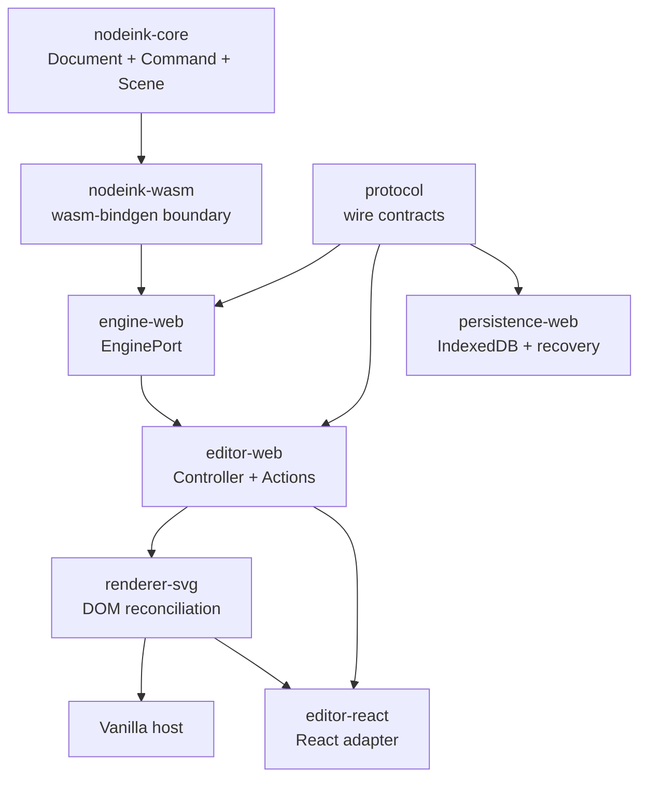

# Project Structure



NodeInk is a pnpm/Cargo monorepo. Rust owns persistent editor semantics; TypeScript adapts that engine to browser events and DOM rendering; framework hosts remain replaceable leaves.

## Directory Layout

```text
apps/playground/            React and Vanilla integration host
crates/nodeink-core/        Document, commands, revisions, history, Scene resolution
crates/nodeink-wasm/        wasm-bindgen API over nodeink-core
packages/protocol/          TypeScript wire types and runtime parsing
packages/engine-web/        Generated WASM loading and EnginePort implementation
packages/editor-web/        Framework-neutral Controller and editor actions
packages/renderer-svg/      Framework-neutral SVG DOM renderer
packages/persistence-web/   Framework-neutral IndexedDB persistence and recovery
packages/editor-react/      Optional React adapter
scripts/                    Cargo/WASM orchestration and target-dir policy
docs/                       Product, architecture, decisions, plans, and repo memory
```

## Startup Path

1. `pnpm exec vp run wasm:build` invokes [scripts/build-wasm.sh#L1](../scripts/build-wasm.sh#L1) and regenerates the ignored browser package.
2. The playground creates the real EnginePort in [apps/playground/src/create-controller.ts#L1](../apps/playground/src/create-controller.ts#L1).
3. [packages/editor-web/src/index.ts#L1](../packages/editor-web/src/index.ts#L1) owns host-neutral actions, subscriptions, and lifecycle.
4. [packages/renderer-svg/src/index.ts#L1](../packages/renderer-svg/src/index.ts#L1) reconciles resolved Scene nodes into SVG.
5. `/` mounts the React adapter; `/vanilla.html` mounts the same contracts without React.

## Ownership Rules

- [crates/nodeink-core/src/lib.rs#L1](../crates/nodeink-core/src/lib.rs#L1) is the current persistent semantic truth source; schema validation and migration remain in the Rust crate.
- `nodeink-wasm` converts values at the language boundary but does not fork engine behavior.
- `protocol` defines the TypeScript view of wire contracts; wire casing is camelCase.
- `editor-web` may depend on browser APIs, but not component frameworks.
- `renderer-svg` paints resolved nodes; it does not infer Document semantics.
- `persistence-web` owns IndexedDB transactions, SHA-256 read-back verification and stable snapshot recovery; it does not mutate Document semantics.
- `editor-react` can be replaced without changing engine, controller, or renderer packages.

## Build Boundaries

- [vite.config.ts#L1](../vite.config.ts#L1) is the Vite+ check/test/task entry.
- Cargo commands remain directly runnable and authoritative for Rust failures.
- Web dependencies come from the root official-registry `.npmrc`; exact tool versions live in manifests and lockfiles.
- Rust task output defaults outside the repository to avoid the observed macOS extended-attribute failure. `NODEINK_CARGO_TARGET_DIR` is the supported override.

---
*Last updated: 2026-07-22 | Reason: add the S7 persistence-web ownership boundary*
